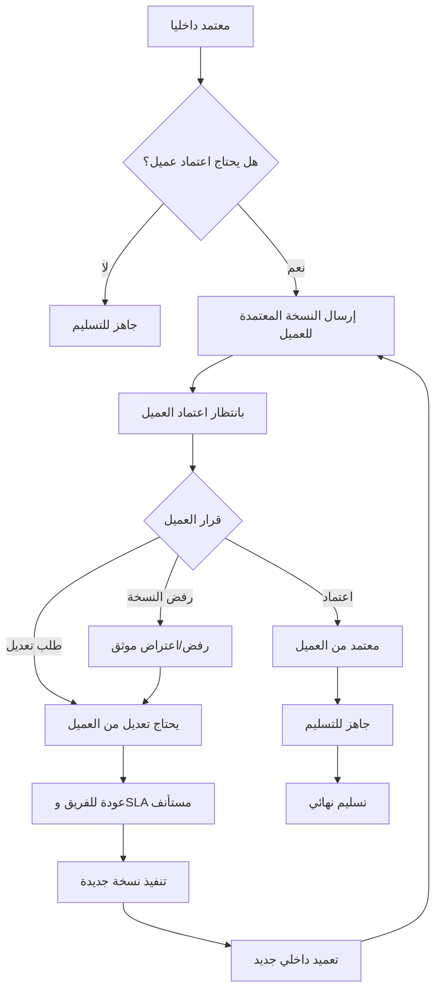

# Client Approval Flow: شريك

**المرحلة:** Phase 02 - Operating Model & Core Business Rules  
**نوع الوثيقة:** Client Approval Flow  
**الحالة:** Draft for owner review  
**آخر تحديث:** 2026-06-22  
**المنهجية المستخدمة:** Product Manager Skills + BMAD فقط  

## 1. الغرض

اعتماد العميل هو قرار خارجي موثق على نسخة أرسلت له بعد التعميد الداخلي. ليس كل مخرج يحتاج اعتماد عميل، لكن كل مخرج يظهر للعميل يجب أن يمر أولا عبر بوابة التعميد الداخلي.

هذه الوثيقة تحدد ما يراه العميل، ما يستطيع فعله، كيف يتم طلب التعديل أو الرفض، وما الأحداث التي يجب تسجيلها.

| التصنيف | النقطة |
| --- | --- |
| Confirmed | اعتماد العميل قابل للضبط حسب قالب أو نوع المخرج. |
| Confirmed | لا يظهر للعميل إلا مخرج معتمد داخليا أو ملف مسموح له. |
| Confirmed | العميل يرى النسخة المرسلة له فقط. |
| Confirmed | اعتماد العميل أو طلب التعديل أو الرفض يحتاج Audit Event. |

## 2. متى يحتاج المخرج اعتماد العميل؟

يتم تحديد `requires_client_approval` عند إنشاء المخرج أو من قالب/نوع المخرج.

| نوع القرار | المعنى | مثال | التصنيف |
| --- | --- | --- | --- |
| يحتاج اعتماد عميل | لا يسلم نهائيا قبل قرار العميل | تصميم حملة، Reel، خطة محتوى | Confirmed |
| لا يحتاج اعتماد عميل | يكتفي بالتعميد الداخلي ثم التسليم | تقرير داخلي موجه للعميل، ملف متابعة لا يتطلب موافقة | Confirmed |
| يحتاج اطلاع فقط | يظهر للعميل دون زر اعتماد رسمي بعد التعميد | تقرير حالة أو ملف مرجعي | Assumed |
| يحتاج اعتمادا متعدد الأطراف | أكثر من معتمد من جهة العميل | حملة حساسة أو جهة كبيرة | Open Question |

## 3. الأطراف في اعتماد العميل

| الطرف | دوره | يستطيع | لا يستطيع | التصنيف |
| --- | --- | --- | --- | --- |
| `client_approver` | صاحب القرار من جهة العميل | اعتماد، طلب تعديل، رفض نسخة مع سبب | رؤية الداخلي أو عملاء آخرين | Confirmed |
| `client_viewer` | متابع دون قرار | مشاهدة الملفات والحالة المصرح بها | اعتماد أو طلب تعديل رسمي | Confirmed |
| `client_admin` | إدارة مستخدمي العميل عند اعتماد الدور | إدارة ممثلي العميل حسب سياسة لاحقة | رؤية الداخلي | Assumed |
| مدير الحساب | منسق القرار | متابعة، توضيح، إرسال بعد التعميد إذا مخول | اعتماد باسم العميل كقرار أصلي | Confirmed |
| الإدارة | مالك المسار | إرسال، إغلاق، إعادة فتح، معالجة رفض العميل | اعتماد باسم العميل إلا كإدخال قرار خارجي موثق لاحقا | Confirmed |

## 4. ما يراه العميل

يرى العميل في صفحة "بانتظار موافقتي":

- اسم المخرج ووصفا مبسطا.
- النسخة المرسلة له فقط.
- الملفات المسموحة له.
- تعليق أو رسالة الإرسال.
- تاريخ الإرسال.
- أزرار القرار إذا كان `client_approver`.
- سجل قراراته الخارجية المناسبة.

لا يرى العميل:

- التعليقات الداخلية.
- النسخ غير المرسلة له.
- Checklist الجودة.
- مناقشات الفريق.
- سبب تغيير owner الداخلي.
- عملاء آخرين داخل Tenant.

| القاعدة | التصنيف |
| --- | --- |
| تبسيط تجربة العميل أعلى من عرض كل تفاصيل التشغيل | Confirmed |
| العميل لا يرى Kanban الداخلي | Confirmed |
| العميل لا يرى Audit Log الداخلي، بل سجل قرارات خارجي مناسب | Confirmed |
| هل يرى العميل delay owner؟ | Open Question |

## 5. التدفق الأساسي لاعتماد العميل

## 6. قرارات العميل

### 6.1 اعتماد

يعني أن العميل وافق على النسخة المرسلة له.

قواعده:

- القرار مرتبط بمستخدم عميل مخول.
- القرار مرتبط بنسخة محددة.
- يسجل التاريخ والوقت.
- ينتقل المخرج إلى `client_approved`.
- لا يستهلك الرصيد وحده إلا عند التسليم النهائي.
- يمكن بعدها تجهيز الملفات النهائية والتسليم.

### 6.2 طلب تعديل

يعني أن العميل يريد تغييرا على النسخة.

قواعده:

- يجب أن يكتب العميل ملاحظة أو سبب.
- ينتقل المخرج إلى `client_changes_requested`.
- يستأنف SLA على سماوة أو الفريق من وقت الطلب.
- تعليق العميل يظهر للإدارة والفريق المصرح، وليس كتعليق داخلي.
- لا يستهلك رصيد الباقة.
- بعد التعديل يجب المرور بالتعميد الداخلي مرة أخرى قبل إعادة الإرسال.

### 6.3 رفض

في V1، الرفض يعامل تشغيليا كطلب تعديل/اعتراض موثق ما لم يعتمد المالك حالة رفض مستقلة.

قواعده:

- يجب تسجيل سبب الرفض.
- لا يغلق المخرج تلقائيا.
- يعود المخرج إلى `client_changes_requested` أو يرفع للإدارة لاتخاذ قرار إلغاء/استبدال.
- إذا قررت الإدارة الإلغاء، يطبق مسار الإلغاء وإعادة الحجز.

| القاعدة | التصنيف |
| --- | --- |
| العميل يستطيع الاعتماد أو طلب تعديل | Confirmed |
| الرفض يحتاج سبب ويسجل في Audit Log | Confirmed |
| الرفض كحالة مستقلة غير مثبت بعد | Open Question |
| ترجمة الرفض إلى `client_changes_requested` مبدئيا | Assumed |

## 7. مصفوفة انتقالات اعتماد العميل

| من | إلى | الإجراء | الجهة المخولة | الشروط | أثر SLA | أثر الباقة | Audit Event | التصنيف |
| --- | --- | --- | --- | --- | --- | --- | --- | --- |
| `internally_approved` | `waiting_client_approval` | إرسال للعميل | الإدارة أو مدير حساب مخول | يحتاج اعتماد عميل، نسخة معتمدة داخليا | يتوقف بانتظار العميل | لا تغيير | `deliverable_sent_to_client`, `sla_paused_waiting_client` | Confirmed |
| `waiting_client_approval` | `client_approved` | اعتماد | `client_approver` | نسخة مرسلة، مستخدم مخول | ينهي الانتظار | لا تغيير | `client_approval_granted` | Confirmed |
| `waiting_client_approval` | `client_changes_requested` | طلب تعديل | `client_approver` | تعليق أو سبب مطلوب | يستأنف على سماوة | لا تغيير | `client_change_requested`, `sla_resumed` | Confirmed |
| `waiting_client_approval` | `client_changes_requested` | رفض نسخة | `client_approver` | سبب رفض مطلوب | يستأنف على سماوة أو يرفع للإدارة | لا تغيير | `client_rejection_recorded`, `sla_resumed` | Assumed |
| `client_changes_requested` | `in_progress` | بدء معالجة ملاحظات العميل | owner أو إدارة | ملاحظات واضحة أو مفسرة | يستمر على سماوة | لا تغيير | `client_rework_started` | Confirmed |
| `client_approved` | `ready_for_delivery` | تجهيز التسليم | الإدارة أو مدير حساب مخول | لا موانع مفتوحة | يستمر حتى التسليم | لا تغيير | `ready_for_delivery_marked` | Confirmed |
| `ready_for_delivery` | `delivered` | تسليم نهائي | الإدارة أو مفوض | نسخة نهائية محددة | completed | يستهلك الرصيد | `deliverable_delivered`, `package_credit_consumed` | Confirmed |

## 8. قواعد الملفات والإصدارات للعميل

| القاعدة | التصنيف |
| --- | --- |
| العميل يرى النسخة المرسلة له فقط | Confirmed |
| النسخة المرسلة يجب أن تكون معتمدة داخليا | Confirmed |
| الملفات الداخلية لا تظهر للعميل | Confirmed |
| الملفات النهائية تظهر بعد التسليم أو حسب رؤية الملف | Confirmed |
| ملف يرفعه العميل يصنف كملف عميل ويظهر للفريق المصرح | Confirmed |
| إذا أرسلت نسخة جديدة للعميل، يجب تسجيلها كإرسال جديد | Confirmed |

## 9. تعليقات العميل

تعليق العميل يمكن أن يكون:

- ملاحظة عامة على المخرج.
- سبب طلب تعديل.
- سبب رفض النسخة.
- تعليق مرفق بالاعتماد.

قواعده:

- يظهر للإدارة والفريق المصرح.
- لا يمنح العميل رؤية للتعليقات الداخلية.
- يرتبط بالمخرج وبالنسخة عند الحاجة.
- إذا كان جزءا من طلب تعديل أو رفض، يجب أن ينشئ Audit Event.

| القاعدة | التصنيف |
| --- | --- |
| تعليق العميل لا يساوي تعليقا داخليا | Confirmed |
| تعليقات العميل تظهر للفريق المصرح حسب الحاجة | Confirmed |
| هل يستطيع `client_viewer` كتابة تعليق غير رسمي؟ | Open Question |

## 10. اعتماد العميل والمخرج الذي لا يحتاج اعتمادا

إذا كان `requires_client_approval = false`:

1. ينفذ الفريق المخرج.
2. يراجع داخليا.
3. يعمد داخليا.
4. ينتقل إلى `ready_for_delivery`.
5. يسلم نهائيا.
6. يستهلك الرصيد عند التسليم.

لا يجوز استخدام هذا المسار لتجاوز العميل في مخرج يتطلب موافقته حسب الاتفاق.

| القاعدة | التصنيف |
| --- | --- |
| اعتماد العميل قابل للضبط حسب نوع أو قالب المخرج | Confirmed |
| التعميد الداخلي يبقى إلزاميا للمخرجات الموجهة للعميل | Confirmed |
| تغيير `requires_client_approval` بعد بدء العمل يحتاج صلاحية وسبب | Assumed |

## 11. إدخال قرار عميل خارج المنصة

قد يحدث في التجربة الأولى أن يوافق العميل عبر واتساب أو بريد. هذا ليس المسار المثالي، لكنه قد يكون لازما مؤقتا.

قواعد مقترحة:

- لا يسجل كاعتماد عميل أصلي إلا إذا أدخله مستخدم إداري مخول مع دليل أو ملاحظة.
- يجب تمييزه كقرار مدخل بواسطة سماوة نيابة عن قناة خارجية.
- يجب السعي لتقليل هذا المسار في مؤشرات النجاح.

| النقطة | التصنيف |
| --- | --- |
| الهدف أن تتم 70%+ من الاعتمادات من المنصة في التجربة | Confirmed |
| إدخال قرار خارجي يدوي كمسار انتقالي | Assumed |
| هل يقبل المالك اعتمادا خارجيا مدخلا يدويا في MVP؟ | Open Question |

## 12. Audit Events في اعتماد العميل

| الحدث | متى يحدث؟ | الحد الأدنى من البيانات | التصنيف |
| --- | --- | --- | --- |
| `deliverable_sent_to_client` | إرسال النسخة للعميل | النسخة، المرسل، المستلمون، الوقت | Confirmed |
| `sla_paused_waiting_client` | انتظار قرار العميل | سبب التوقف، وقت البداية | Confirmed |
| `client_viewed_deliverable` | عند فتح العميل للمخرج إذا تقرر تتبعها | العميل، الوقت، المخرج | Assumed |
| `client_comment_added` | تعليق عميل | المستخدم، المخرج، النسخة إن وجدت | Confirmed |
| `client_approval_granted` | اعتماد العميل | المعتمد، النسخة، الوقت | Confirmed |
| `client_change_requested` | طلب تعديل | السبب، النسخة، المستخدم | Confirmed |
| `client_rejection_recorded` | رفض/اعتراض | السبب، النسخة، المستخدم | Assumed |
| `sla_resumed` | عودة العمل لسماوة | وقت الاستئناف، سبب العودة | Confirmed |
| `external_client_decision_recorded` | إدخال قرار خارجي يدويا | القناة، المدخل، الدليل/الملاحظة | Assumed |

## 13. الاستثناءات

### 13.1 اعتماد متعدد من العميل

قد تحتاج بعض الجهات أكثر من معتمد. في V1، النموذج الأبسط هو معتمد واحد أو صلاحية اعتماد واحدة.

| النقطة | التصنيف |
| --- | --- |
| معتمد واحد يكفي كبداية تشغيلية | Assumed |
| اعتماد متعدد المستويات من العميل | Open Question |

### 13.2 انتهاء مهلة انتظار العميل

إذا طال انتظار العميل:

- يبقى SLA متوقفا كمسؤولية عميل.
- تظهر الحالة للإدارة كـ `paused_waiting_client`.
- يمكن التصعيد أو التذكير حسب سياسة لاحقة.
- لا يحسب التأخير على سماوة.

| النقطة | التصنيف |
| --- | --- |
| انتظار العميل لا يحسب على سماوة | Confirmed |
| التصعيد بعد مدة معينة يحتاج قواعد SLA | Confirmed |
| مدة التصعيد الأولى | Open Question |

### 13.3 إلغاء بسبب رفض العميل

إذا رفض العميل النسخة وقرر عدم المضي:

- لا يغلق النظام تلقائيا.
- تراجع الإدارة السبب.
- إما تعيد العمل للتعديل.
- أو تلغي المخرج وتعيد الحجز إذا لم يتم التسليم.
- أو تستبدله بمخرج آخر.

## 14. أمثلة واقعية

### 14.1 عيادة النور تعتمد تصميما

1. سماوة ترسل نسخة معتمدة داخليا من تصميم حملة لعيادة النور.
2. يظهر التصميم في "بانتظار موافقتي" لدى `client_approver`.
3. العميل يعتمد النسخة.
4. ينتقل المخرج إلى `client_approved`.
5. الإدارة تسلم النسخة النهائية.
6. عند التسليم يستهلك الرصيد من الباقة.

### 14.2 متجر روافد يرفض نسخة تقرير

1. سماوة ترسل تقرير أداء لمتجر روافد.
2. العميل يرفض النسخة لأن أرقام قناة معينة ناقصة.
3. الرفض يسجل كاعتراض/طلب تعديل بسبب واضح.
4. SLA يستأنف على سماوة عند عودة العمل.
5. الفريق يحدث التقرير.
6. الإدارة تعمد داخليا نسخة جديدة.
7. ترسل النسخة الجديدة للعميل أو تسلم حسب نوع المخرج.

## 15. Business Rules

| ID | القاعدة | التصنيف |
| --- | --- | --- |
| BR-CA-01 | لا يرى العميل مخرجا قبل التعميد الداخلي. | Confirmed |
| BR-CA-02 | اعتماد العميل مرتبط بنسخة محددة. | Confirmed |
| BR-CA-03 | طلب تعديل العميل يعيد العمل لسماوة ويستأنف SLA. | Confirmed |
| BR-CA-04 | client_viewer لا يعتمد ولا يطلب تعديلا رسميا. | Confirmed |
| BR-CA-05 | المخرج الذي لا يحتاج اعتماد عميل لا يتجاوز التعميد الداخلي. | Confirmed |
| BR-CA-06 | رفض العميل لا يغلق المخرج تلقائيا في V1. | Assumed |
| BR-CA-07 | القرار الخارجي المدخل يدويا يجب أن يميز عن قرار العميل من داخل المنصة. | Assumed |

## 16. Open Questions

| السؤال | سبب الحاجة |
| --- | --- |
| هل يعتمد المالك حالة رفض مستقلة أم يكتفي بطلب تعديل/إلغاء إداري؟ | يؤثر على حالات المخرج. |
| هل يوجد اعتماد متعدد من جهة العميل في V1؟ | يؤثر على الصلاحيات والواجهة. |
| هل يسمح بإدخال قرار عميل خارجي يدويا في التجربة الأولى؟ | يؤثر على نجاح التبني والقياس. |
| هل يستطيع client_viewer كتابة تعليق غير رسمي؟ | يؤثر على بوابة العميل. |
| ما مدة الانتظار قبل تصعيد تأخر العميل؟ | يؤثر على SLA والتقارير. |
