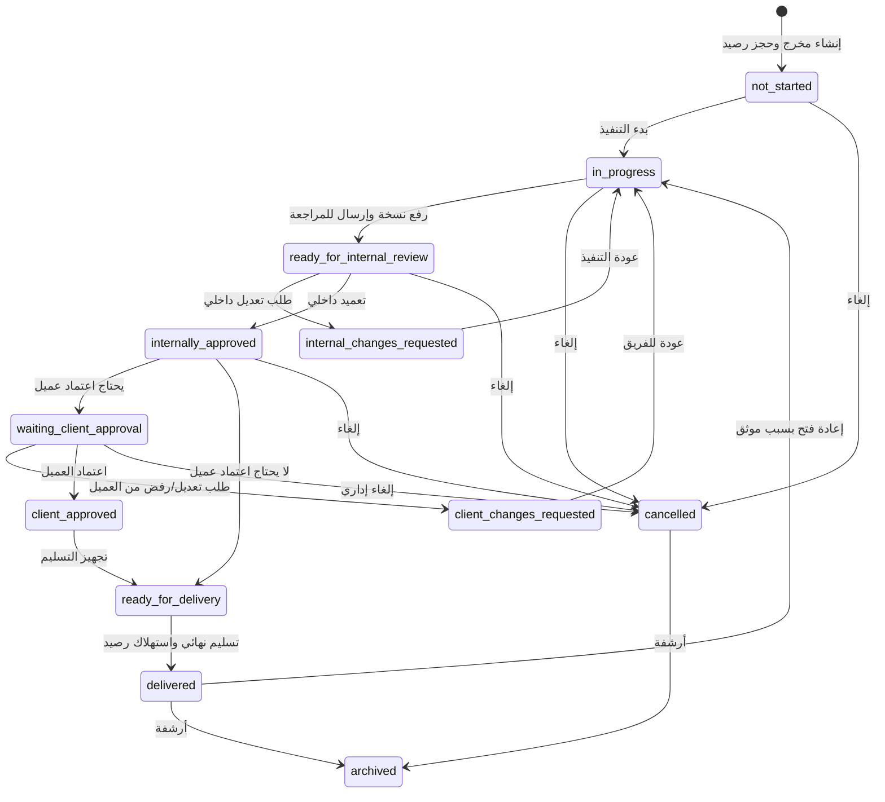

# Deliverables Lifecycle: شريك

**المرحلة:** Phase 02 - Operating Model & Core Business Rules  
**نوع الوثيقة:** Deliverables Lifecycle  
**الحالة:** Draft for owner review  
**آخر تحديث:** 2026-06-22  
**المنهجية المستخدمة:** Product Manager Skills + BMAD فقط  

## 1. الغرض

هذه الوثيقة تحدد رحلة المخرج من التخطيط حتى التسليم والإغلاق. المخرج هو وحدة التشغيل الأساسية في شريك، ولا يجب تحويله إلى Request أو Ticket. يبدأ المخرج من اتفاق أو باقة أو عقد، ثم يدخل دورة تنفيذ ومراجعة واعتماد وتسليم.

| التصنيف | النقطة |
| --- | --- |
| Confirmed | المخرج هو الكيان التشغيلي الأساسي في V1. |
| Confirmed | المخرج لا يبدأ كطلب عشوائي من العميل. |
| Confirmed | كل انتقال حالة حساس يحتاج Audit Event. |
| Confirmed | التقدم مشتق من الحالة ولا يعتمد فقط على نسبة يدوية. |

## 2. تعريف المخرج تشغيليا

المخرج هو تسليمة متفق عليها يمكن أن تكون منشورا، Reel، Story، تقريرا، خطة محتوى، تصميما، فيديو، حملة، مقالا، صفحة هبوط، اجتماعا، استشارة، أو أي خدمة مستقبلية.

الحد الأدنى لسياق المخرج:

- Tenant المشغل.
- العميل.
- العقد أو الباقة عند وجودهما.
- النوع والقالب.
- هل يحتاج تعميدا داخليا.
- هل يحتاج اعتماد عميل.
- owner ومساهمون.
- تواريخ تشغيل وتسليم.
- حالة المخرج.
- حالة SLA.
- ملفات ونسخ وتعليقات.
- Audit Events.

## 3. حالات المخرج

| الحالة | الاسم العربي | المعنى | التقدم المقترح | التصنيف |
| --- | --- | --- | --- | --- |
| `not_started` | لم يبدأ | المخرج مخطط أو منشأ ولم يبدأ التنفيذ | 0% | Confirmed |
| `in_progress` | قيد التنفيذ | بدأ الفريق العمل على المخرج | 30% | Confirmed |
| `ready_for_internal_review` | جاهز للمراجعة الداخلية | تم رفع نسخة أو تجهيز عمل ينتظر مراجعة الإدارة | 50% | Confirmed |
| `internal_changes_requested` | يحتاج تعديل داخلي | الإدارة أعادت العمل للفريق بملاحظات داخلية | 45% | Confirmed |
| `internally_approved` | معتمد داخليا | الإدارة اعتمدت النسخة داخليا | 70% | Confirmed |
| `waiting_client_approval` | بانتظار اعتماد العميل | النسخة المعتمدة داخليا أرسلت للعميل وتنتظر قراره | 80% | Confirmed |
| `client_changes_requested` | يحتاج تعديل من العميل | العميل طلب تعديلا أو رفض النسخة مع سبب | 65% | Confirmed |
| `client_approved` | معتمد من العميل | العميل وافق على النسخة المرسلة | 90% | Confirmed |
| `ready_for_delivery` | جاهز للتسليم | المخرج مؤهل للتسليم النهائي | 95% | Confirmed |
| `delivered` | تم التسليم | تم تسليم المخرج وإغلاقه تشغيليا | 100% | Confirmed |
| `cancelled` | ملغي | تم إيقاف المخرج قبل التسليم | لا يحتسب كتقدم | Confirmed |
| `archived` | مؤرشف | مخرج مغلق أو قديم محفوظ للرجوع | لا يحتسب كتقدم | Confirmed |

## 4. الرحلة القياسية

## 5. مصفوفة انتقالات الحالة

| من | إلى | المشغل | الجهة المخولة | شروط الانتقال | أثر SLA | أثر الباقة | Audit Event | التصنيف |
| --- | --- | --- | --- | --- | --- | --- | --- | --- |
| لا يوجد | `not_started` | إنشاء مخرج | الإدارة أو مدير حساب مخول | عميل محدد، نوع، مسؤول، وربط باقة عند الحاجة | لا يبدأ بعد | يحجز الرصيد إذا مرتبط بباقة | `deliverable_created`, `package_credit_reserved` | Confirmed |
| `not_started` | `in_progress` | بدء التنفيذ | owner أو مدير حساب أو إدارة حسب الصلاحية | وجود owner وموعد وSLA | يبدأ SLA | لا تغيير | `deliverable_started`, `sla_started` | Confirmed |
| `in_progress` | `ready_for_internal_review` | إرسال للمراجعة | owner أو مساهم مخول | وجود نسخة أو ملف عمل أو وصف جاهز للمراجعة | يستمر SLA | لا تغيير | `submitted_for_internal_review` | Confirmed |
| `ready_for_internal_review` | `internal_changes_requested` | طلب تعديل داخلي | الإدارة أو مراجع مفوض | تعليق داخلي يوضح المطلوب | يستمر SLA على سماوة | لا تغيير | `internal_change_requested` | Confirmed |
| `internal_changes_requested` | `in_progress` | استلام التعديل | owner أو إدارة | قبول عودة العمل للتنفيذ | يستمر SLA | لا تغيير | `internal_rework_started` | Confirmed |
| `ready_for_internal_review` | `internally_approved` | تعميد داخلي | الإدارة أو مفوض صريح | مراجعة النسخة، وعدم وجود مانع جودة | يستمر SLA أو ينتقل لانتظار قرار لاحق | لا تغيير | `internal_approval_granted` | Confirmed |
| `internally_approved` | `waiting_client_approval` | إرسال للعميل | الإدارة أو مدير حساب مخول | `requires_client_approval = true` ونسخة معتمدة داخليا | يتوقف SLA بانتظار العميل | لا تغيير | `deliverable_sent_to_client`, `sla_paused_waiting_client` | Confirmed |
| `internally_approved` | `ready_for_delivery` | تخطي اعتماد العميل حسب النوع | الإدارة أو مفوض | `requires_client_approval = false` | يستمر أو يقترب من الاكتمال حسب السياسة | لا تغيير | `client_approval_not_required` | Confirmed |
| `waiting_client_approval` | `client_changes_requested` | طلب تعديل أو رفض نسخة | client_approver | تعليق العميل مطلوب، النسخة محددة | يستأنف SLA على سماوة | لا تغيير | `client_change_requested`, `sla_resumed` | Confirmed |
| `client_changes_requested` | `in_progress` | بدء معالجة ملاحظات العميل | owner أو إدارة | ملاحظات العميل واضحة أو موضحة داخليا | يستمر SLA على سماوة | لا تغيير | `client_rework_started` | Confirmed |
| `waiting_client_approval` | `client_approved` | اعتماد العميل | client_approver | النسخة المرسلة ظاهرة للعميل، قرار مؤكد | ينتهي انتظار العميل | لا تغيير | `client_approval_granted` | Confirmed |
| `client_approved` | `ready_for_delivery` | تجهيز التسليم | الإدارة أو مدير حساب مخول | الملفات النهائية محددة | يستمر حتى التسليم أو يكتمل حسب السياسة | لا تغيير | `ready_for_delivery_marked` | Confirmed |
| `ready_for_delivery` | `delivered` | التسليم النهائي | الإدارة أو مفوض تسليم | ملف نهائي أو إثبات تسليم، لا مانع مفتوح | SLA يصبح completed | يتحول الحجز إلى استهلاك | `deliverable_delivered`, `package_credit_consumed`, `sla_completed` | Confirmed |
| أي حالة قبل `delivered` | `cancelled` | إلغاء | الإدارة | سبب إلغاء موثق | SLA يصبح cancelled | يعود الحجز إذا لم يسلم | `deliverable_cancelled`, `package_credit_released` | Confirmed |
| `delivered` | `in_progress` | إعادة فتح | الإدارة | سبب موثق، تحديد هل تعديل ضمن التسليم أو عمل جديد | يستأنف حسب سبب الفتح | لا يغير الرصيد إلا بقرار | `deliverable_reopened` | Confirmed |
| `delivered` | `archived` | أرشفة | الإدارة | التسليم مكتمل ولا توجد متابعة نشطة | completed | لا تغيير | `deliverable_archived` | Assumed |

## 6. قواعد الملفات والنسخ داخل الرحلة

| القاعدة | التصنيف |
| --- | --- |
| كل نسخة أو ملف يجب أن يرتبط بمخرج وعميل ورؤية واضحة | Confirmed |
| النسخ الداخلية لا تظهر للعميل | Confirmed |
| النسخة التي ترسل للعميل يجب أن تكون معتمدة داخليا | Confirmed |
| العميل يرى النسخة المرسلة له فقط وليس كل تاريخ النسخ | Confirmed |
| النسخة النهائية تظهر عند التسليم أو حسب رؤية الملف | Confirmed |
| رقم نسخة بسيط يكفي مبدئيا ما لم يعتمد المالك versioning متقدم | Assumed |

### أثر الملفات على الحالة

- رفع ملف داخلي لا يغير الحالة وحده.
- إرسال نسخة للمراجعة الداخلية يغير الحالة إلى `ready_for_internal_review`.
- اعتماد داخلي يثبت النسخة الحالية كنسخة معتمدة داخليا.
- إرسال للعميل يثبت النسخة المرسلة في سجل القرار.
- التسليم النهائي يحدد النسخة النهائية.

## 7. قواعد التعليقات داخل الرحلة

| نوع التعليق | من يكتبه؟ | من يراه؟ | أثره على الحالة | التصنيف |
| --- | --- | --- | --- | --- |
| تعليق داخلي | الفريق أو الإدارة | الفريق والإدارة المصرح لهم | لا يغير الحالة وحده | Confirmed |
| تعليق تعديل داخلي | الإدارة | الفريق والإدارة فقط | ينقل إلى `internal_changes_requested` | Confirmed |
| تعليق عميل | العميل المخول | العميل، الإدارة، الفريق المصرح | لا يغير الحالة وحده إلا إذا كان ضمن طلب تعديل | Confirmed |
| تعليق اعتماد | معتمد داخلي أو عميل | حسب سياق القرار | يرفق بقرار اعتماد أو تعديل | Confirmed |
| تعليق نظام | النظام/التشغيل | حسب السياق | يسجل انتقالات وقرارات | Confirmed |

## 8. قواعد الإلغاء وإعادة الفتح والاستبدال

### 8.1 الإلغاء

يسمح بالإلغاء قبل التسليم النهائي إذا تغير الاتفاق أو لم يعد المخرج مطلوبا.

| القاعدة | التصنيف |
| --- | --- |
| الإلغاء يحتاج سبب واضح | Confirmed |
| الإلغاء قبل التسليم يعيد الرصيد المحجوز | Confirmed |
| الإلغاء بعد إرسال المخرج للعميل يحتاج توضيح إداري | Confirmed |
| العميل لا يملك إلغاء المخرج مباشرة في V1؛ يمكنه طلب إلغاء أو رفض نسخة | Assumed |

### 8.2 إعادة الفتح

إعادة الفتح بعد التسليم استثناء، وليست مسارا عاديا.

| القاعدة | التصنيف |
| --- | --- |
| إعادة الفتح تحتاج سبب ومخول إداري | Confirmed |
| إذا كان السبب خطأ داخلي في التسليم، يمكن إعادة الفتح دون استهلاك رصيد جديد | Assumed |
| إذا كان السبب طلبا جديدا من العميل، الأفضل إنشاء مخرج جديد أو استبدال موثق | Assumed |
| هل يعاد فتح SLA الأصلي أم ينشأ SLA جديد؟ | Open Question |

### 8.3 الاستبدال

الاستبدال يعني أن مخرجا مخططا يحل محله مخرج آخر.

| القاعدة | التصنيف |
| --- | --- |
| الاستبدال قبل التسليم يمكن أن ينقل الحجز من المخرج القديم للجديد | Assumed |
| الاستبدال بعد التسليم يحتاج قرارا إداريا لأنه قد يستهلك رصيدا جديدا | Assumed |
| كل استبدال يحتاج Audit Event | Confirmed |

## 9. قواعد تغيير المسؤول

| القاعدة | التصنيف |
| --- | --- |
| كل مخرج نشط يجب أن يكون له owner | Confirmed |
| تغيير owner بعد بدء التنفيذ يحتاج سبب أو ملاحظة | Confirmed |
| تغيير owner لا يغير حالة المخرج تلقائيا | Confirmed |
| تغيير owner لا يمحو مسؤولية الفترات السابقة | Confirmed |
| إذا كان التغيير بسبب ضغط فريق أو تصعيد SLA، يجب أن يظهر في Audit Log | Confirmed |

## 10. أمثلة واقعية

### 10.1 عيادة النور: تصميم حملة

1. سماوة تنشئ مخرج "تصميم حملة العودة" ضمن باقة عيادة النور.
2. يحجز المخرج وحدة تصميم.
3. المصمم يبدأ التنفيذ، فيبدأ SLA.
4. يرفع نسخة ويرسلها للمراجعة الداخلية.
5. مدير المشروع يطلب تعديلا داخليا؛ التعليق لا يظهر للعميل.
6. المصمم يعالج التعديل ويرسل نسخة جديدة.
7. الإدارة تعتمد داخليا.
8. لأن نوع المخرج يحتاج اعتماد عميل، يرسل للعميل ويتوقف SLA بانتظار العميل.
9. العميل يعتمد.
10. الإدارة تسلم النسخة النهائية.
11. يتحول الحجز إلى استهلاك.

### 10.2 متجر روافد: تقرير أداء لا يحتاج اعتماد عميل

1. سماوة تنشئ مخرج "تقرير أداء مايو 2026".
2. القالب مضبوط بأنه يحتاج تعميدا داخليا ولا يحتاج اعتماد عميل.
3. محلل الأداء ينفذ ويرفع التقرير.
4. مدير التسويق يعتمد داخليا.
5. ينتقل المخرج إلى جاهز للتسليم.
6. عند التسليم النهائي يستهلك من الباقة.

## 11. Business Rules

| ID | القاعدة | التصنيف |
| --- | --- | --- |
| BR-DL-01 | لا يظهر مخرج للعميل قبل التعميد الداخلي إذا كان موجها للعميل. | Confirmed |
| BR-DL-02 | لا ينتقل مخرج إلى `waiting_client_approval` دون `internally_approved`. | Confirmed |
| BR-DL-03 | لا ينتقل مخرج إلى `delivered` دون اعتماد عميل إذا كان يتطلب اعتماد عميل. | Confirmed |
| BR-DL-04 | المخرج الذي لا يتطلب اعتماد عميل يمكن أن ينتقل من `internally_approved` إلى `ready_for_delivery`. | Confirmed |
| BR-DL-05 | إنشاء مخرج مرتبط بباقة يحجز الرصيد ولا يستهلكه. | Confirmed |
| BR-DL-06 | التسليم النهائي يستهلك الرصيد. | Confirmed |
| BR-DL-07 | الإلغاء قبل التسليم يعيد الحجز. | Confirmed |
| BR-DL-08 | كل تغيير حالة يسجل Audit Event. | Confirmed |
| BR-DL-09 | طلب تعديل العميل يستأنف SLA على سماوة. | Confirmed |
| BR-DL-10 | رفض العميل للنسخة يعامل كطلب تعديل أو مسار إلغاء إداري إلى أن يعتمد المالك حالة رفض مستقلة. | Assumed |

## 12. Open Questions

| السؤال | سبب الحاجة |
| --- | --- |
| هل يحتاج الرفض من العميل حالة مستقلة أم يكفي `client_changes_requested` مع سبب "رفض"؟ | يؤثر على بساطة الحالات. |
| هل توجد أوزان استهلاك مختلفة للمخرج حسب النوع؟ | يؤثر على الحجز والاستهلاك. |
| هل إعادة الفتح بعد التسليم تعيد SLA الأصلي أو تنشئ دورة SLA جديدة؟ | يؤثر على التقارير والعدالة. |
| هل يسمح بمخرج خارج باقة في V1؟ | يؤثر على ضبط العقود والباقات. |
