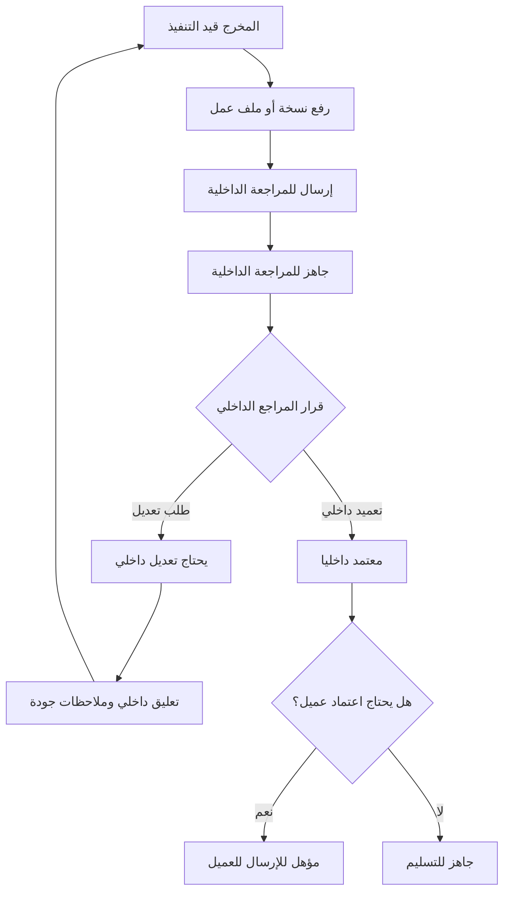

# Internal Approval Flow: شريك

**المرحلة:** Phase 02 - Operating Model & Core Business Rules  
**نوع الوثيقة:** Internal Approval Flow  
**الحالة:** Draft for owner review  
**آخر تحديث:** 2026-06-22  
**المنهجية المستخدمة:** Product Manager Skills + BMAD فقط  

## 1. الغرض

التعميد الداخلي هو بوابة الجودة الإلزامية قبل ظهور أي مخرج موجه للعميل. هدفه حماية العميل من رؤية مسودات أو تعليقات داخلية، وحماية فريق سماوة من إرسال عمل غير جاهز، وحفظ سجل قرار واضح: من راجع؟ ماذا راجع؟ ما النسخة؟ وما القرار؟

| التصنيف | النقطة |
| --- | --- |
| Confirmed | التعميد الداخلي إلزامي للمخرجات الموجهة للعميل. |
| Confirmed | العميل لا يرى النسخ أو الملاحظات الداخلية. |
| Confirmed | لا إرسال للعميل قبل التعميد الداخلي. |
| Confirmed | كل تعميد أو طلب تعديل داخلي يحتاج Audit Event. |

## 2. نطاق التعميد الداخلي

ينطبق التعميد الداخلي على:

- كل مخرج سيظهر للعميل.
- كل مخرج سيحسب كتسليم رسمي.
- كل ملف نهائي أو نسخة ستصبح مرجعا لاعتماد العميل.
- المخرجات التي لا تحتاج اعتماد عميل لكنها ستسلم للعميل أو تحتسب ضمن الباقة.

لا يعني التعميد الداخلي:

- اعتماد العميل.
- استهلاك رصيد الباقة.
- إغلاق المخرج.
- السماح بنشر اجتماعي مباشر.

| القاعدة | التصنيف |
| --- | --- |
| التعميد الداخلي شرط قبل اعتماد العميل | Confirmed |
| التعميد الداخلي لا يستهلك رصيد الباقة وحده | Confirmed |
| التعميد الداخلي لا يعني أن المخرج سلم نهائيا | Confirmed |
| يمكن لاحقا تحديد قوالب Checklist حسب نوع المخرج | Assumed |

## 3. الأطراف داخل التعميد

| الطرف | دوره في التدفق | ما يستطيع فعله | ما لا يستطيع فعله افتراضيا | التصنيف |
| --- | --- | --- | --- | --- |
| عضو فريق العمل | ينفذ ويرفع النسخة | رفع ملف، كتابة تعليق داخلي، إرسال للمراجعة | اعتماد داخلي أو إرسال للعميل | Confirmed |
| owner | مسؤول التنفيذ الأساسي | تجهيز النسخة، توضيح الملاحظات، إعادة الرفع | تجاوز المراجعة الداخلية | Confirmed |
| مدير الحساب | ينسق ويتابع | توزيع، متابعة، توضيح سياق العميل، إرسال للعميل بعد التعميد إذا مخول | اعتماد نهائي إلا بصلاحية صريحة | Confirmed |
| مدير المشروع/التسويق | مراجع ومعتمد | طلب تعديل داخلي، اعتماد داخلي، إرسال للعميل أو التسليم | لا يعتمد باسم العميل | Confirmed |
| الإدارة العليا | حسم الاستثناءات | تفويض، تجاوز موثق، إلغاء أو إعادة فتح | لا تلغي Audit Log | Confirmed |
| العميل | خارج هذا التدفق | لا دور قبل الإرسال | لا يرى التعميد الداخلي | Confirmed |

## 4. التدفق الأساسي

## 5. شروط الدخول إلى المراجعة الداخلية

لا ينتقل المخرج إلى `ready_for_internal_review` إلا إذا توفر الحد الأدنى:

| الشرط | السبب | التصنيف |
| --- | --- | --- |
| وجود owner للمخرج | وضوح المسؤولية | Confirmed |
| وجود نسخة أو ملف أو محتوى قابل للمراجعة | منع مراجعة فارغة | Confirmed |
| وجود وصف أو سياق للمخرج | فهم المطلوب | Confirmed |
| عدم وجود نقص واضح يمنع المراجعة | تقليل دورات مراجعة غير مفيدة | Assumed |
| وجود ملفات مرجعية عند الحاجة | جودة التنفيذ | Assumed |

## 6. قرارات المراجع الداخلي

### 6.1 طلب تعديل داخلي

يستخدم عندما تكون النسخة غير جاهزة للإرسال أو التسليم.

قواعده:

- يجب كتابة ملاحظة داخلية توضح المطلوب.
- ينتقل المخرج إلى `internal_changes_requested`.
- لا تظهر الملاحظة للعميل.
- لا ترسل النسخة للعميل.
- يظل الرصيد محجوزا ولا يستهلك.
- يستمر SLA على سماوة لأن العمل ما زال داخليا.

### 6.2 التعميد الداخلي

يستخدم عندما يقرر المراجع أن النسخة صالحة للخطوة التالية.

قواعده:

- يثبت قرار التعميد على نسخة محددة.
- ينقل المخرج إلى `internally_approved`.
- يتيح الإرسال للعميل إذا كان المخرج يتطلب اعتماد عميل.
- يتيح التسليم أو التجهيز للتسليم إذا كان لا يتطلب اعتماد عميل.
- لا يستهلك الرصيد وحده.

### 6.3 طلب توضيح دون تغيير حالة

يمكن للمراجع أن يطلب توضيحا داخليا دون إعادة الحالة إذا كانت المسألة بسيطة.

| القاعدة | التصنيف |
| --- | --- |
| طلب التوضيح لا يستخدم كبديل عن طلب تعديل فعلي | Assumed |
| إذا كان التوضيح يمنع الإرسال، يجب تحويله إلى تعديل داخلي | Confirmed |

## 7. مصفوفة انتقالات التعميد الداخلي

| من | إلى | الإجراء | الجهة المخولة | الشروط | Audit Event | التصنيف |
| --- | --- | --- | --- | --- | --- | --- |
| `in_progress` | `ready_for_internal_review` | إرسال للمراجعة | owner أو عضو مخول | نسخة مرفوعة أو محتوى جاهز | `submitted_for_internal_review` | Confirmed |
| `ready_for_internal_review` | `internal_changes_requested` | طلب تعديل داخلي | مدير مشروع/تسويق أو مراجع مخول | تعليق داخلي مطلوب | `internal_change_requested` | Confirmed |
| `internal_changes_requested` | `in_progress` | بدء معالجة التعديل | owner أو عضو مخول | استلام الملاحظات | `internal_rework_started` | Confirmed |
| `ready_for_internal_review` | `internally_approved` | تعميد داخلي | مدير مشروع/تسويق أو مفوض صريح | نسخة محددة وقابلة للإرسال | `internal_approval_granted` | Confirmed |
| `internally_approved` | `ready_for_internal_review` | سحب التعميد قبل الإرسال | الإدارة | سبب موثق | `internal_approval_revoked` | Assumed |
| `internally_approved` | `waiting_client_approval` | إرسال للعميل | الإدارة أو مدير حساب مخول | يحتاج اعتماد عميل | `deliverable_sent_to_client` | Confirmed |
| `internally_approved` | `ready_for_delivery` | تجهيز للتسليم دون اعتماد عميل | الإدارة | لا يحتاج اعتماد عميل | `ready_for_delivery_marked` | Confirmed |

## 8. Checklist الجودة

Checklist الجودة في V1 يجب أن تبقى خفيفة ومساعدة لا معقدة.

الحد الأدنى المقترح:

- هل النسخة تطابق وصف المخرج؟
- هل الملفات الصحيحة مرفوعة؟
- هل التعليقات الداخلية الحرجة عولجت؟
- هل النسخة مناسبة للعميل؟
- هل الرؤية صحيحة: داخلي/عميل/نهائي؟
- هل يحتاج المخرج اعتماد عميل؟

| النقطة | التصنيف |
| --- | --- |
| وجود Checklist جودة مدعوم في التعميد الداخلي | Confirmed |
| إلزامية Checklist لكل نوع مخرج في V1 | Open Question |
| اختلاف Checklist حسب نوع المخرج | Assumed |

## 9. الملفات والإصدارات

قواعد الملفات في التعميد الداخلي:

| القاعدة | التصنيف |
| --- | --- |
| كل رفع نسخة يسجل كحدث نشاط | Confirmed |
| النسخة التي تعتمد داخليا يجب أن تكون محددة بوضوح | Confirmed |
| لا تظهر النسخ الداخلية للعميل | Confirmed |
| يمكن وجود أكثر من نسخة داخلية قبل التعميد | Confirmed |
| النسخة المعتمدة داخليا هي المرشحة للإرسال أو التسليم | Confirmed |
| إذا رفعت نسخة جديدة بعد التعميد، يحتاج المخرج مراجعة/تعميد جديد قبل إرسالها | Confirmed |

## 10. التعليقات الداخلية

قواعد التعليقات:

- ملاحظات المراجع الداخلي تحفظ كتعليقات داخلية.
- تعليقات الجودة لا تظهر للعميل.
- يمكن لفريق العمل الرد داخليا على ملاحظات الإدارة.
- عند طلب تعديل داخلي، يجب تمييز التعليق كسبب قرار لا كمحادثة عادية فقط.

| القاعدة | التصنيف |
| --- | --- |
| `internal_comment` لا يظهر للعميل أبدا | Confirmed |
| تعليق طلب التعديل الداخلي يجب أن يكون واضحا وموجها للتنفيذ | Confirmed |
| يمكن ربط التعليق بنسخة محددة عند الحاجة | Assumed |

## 11. مدير الحساب في التعميد الداخلي

مدير الحساب يملك سياق العميل، لكنه ليس معتمدا نهائيا افتراضيا.

قواعده:

| القاعدة | التصنيف |
| --- | --- |
| مدير الحساب ينسق ويوزع ويتابع | Confirmed |
| مدير الحساب يمكنه إرسال المخرج للعميل بعد التعميد إذا كان مخولا | Confirmed |
| مدير الحساب لا يعتمد داخليا أو نهائيا إلا بصلاحية صريحة | Confirmed |
| إذا منح مدير الحساب صلاحية تعميد داخلي، يجب أن تكون محددة بالنوع أو العميل أو المستوى | Assumed |
| أي تعميد من مدير حساب مفوض يسجل بنفس صرامة تعميد الإدارة | Confirmed |

## 12. Audit Events في التعميد الداخلي

| الحدث | متى يحدث؟ | الحد الأدنى من البيانات | التصنيف |
| --- | --- | --- | --- |
| `file_uploaded` | رفع نسخة | المخرج، الرافع، الرؤية، رقم النسخة | Confirmed |
| `submitted_for_internal_review` | إرسال للمراجعة | المخرج، الفاعل، النسخة | Confirmed |
| `internal_comment_added` | إضافة تعليق داخلي | المخرج، الفاعل، الرؤية | Confirmed |
| `internal_change_requested` | طلب تعديل داخلي | المراجع، السبب، النسخة | Confirmed |
| `internal_rework_started` | عودة التنفيذ | الفاعل، الحالة السابقة | Confirmed |
| `internal_approval_granted` | تعميد داخلي | المعتمد، النسخة، الوقت | Confirmed |
| `internal_approval_revoked` | سحب تعميد | السبب، الفاعل | Assumed |
| `approval_permission_used` | استخدام صلاحية استثنائية | الدور، سبب التفويض | Assumed |

## 13. الاستثناءات

### 13.1 تجاوز التعميد الداخلي

القاعدة العامة: لا تجاوز.

إذا قرر المالك أو الإدارة العليا مستقبلا السماح بتجاوز محدود:

- يجب أن يكون استثناء وليس مسارا عاديا.
- يحتاج صلاحية صريحة.
- يحتاج سبب.
- يسجل Audit Event.
- يجب أن يظهر كمخاطرة تشغيلية في التقارير.

| النقطة | التصنيف |
| --- | --- |
| التجاوز غير معتمد كمسار عادي في V1 | Confirmed |
| إمكانية وجود تجاوز إداري موثق لاحقا | Assumed |

### 13.2 اعتماد داخلي متعدد المستويات

قد تحتاج مخرجات حساسة لأكثر من موافقة داخلية، لكنه يزيد تعقيد V1.

| النقطة | التصنيف |
| --- | --- |
| التعميد الداخلي الواحد يكفي كنموذج أساسي في V1 | Assumed |
| اعتماد داخلي متعدد المستويات للمخرجات الحساسة | Open Question |

## 14. أمثلة واقعية

### 14.1 تعديل داخلي لا يظهر للعميل

سماوة تعمل على Reel لعيادة النور. يرفع الموشن نسخة أولى. مدير التسويق يلاحظ أن النص الافتتاحي يحتاج تصحيحا، فيطلب تعديلا داخليا. تبقى النسخة والتعليق داخل سماوة ولا يظهران لعيادة النور. بعد رفع نسخة ثانية، يتم التعميد الداخلي ثم الإرسال.

| القاعدة | التصنيف |
| --- | --- |
| تعليق التعديل الداخلي لا يظهر للعميل | Confirmed |
| النسخة الأولى غير المعتمدة لا تظهر للعميل | Confirmed |

### 14.2 مدير حساب مفوض

مدير حساب متجر روافد لديه صلاحية إرسال للعميل بعد التعميد، لكنه لا يملك صلاحية التعميد. عندما يعتمد مدير المشروع التقرير داخليا، يستطيع مدير الحساب إرساله للعميل. إذا حاول اعتماد نسخة داخليا دون تفويض، يجب منع القرار.

| القاعدة | التصنيف |
| --- | --- |
| مدير الحساب يرسل بعد التعميد إذا مخول | Confirmed |
| مدير الحساب لا يعتمد نهائيا إلا بصلاحية صريحة | Confirmed |

## 15. Business Rules

| ID | القاعدة | التصنيف |
| --- | --- | --- |
| BR-IA-01 | لا إرسال للعميل قبل التعميد الداخلي للمخرجات الموجهة للعميل. | Confirmed |
| BR-IA-02 | طلب التعديل الداخلي يجب أن يكون تعليقا داخليا لا يظهر للعميل. | Confirmed |
| BR-IA-03 | التعميد الداخلي يرتبط بنسخة محددة. | Confirmed |
| BR-IA-04 | رفع نسخة جديدة بعد التعميد يحتاج مراجعة/تعميد جديد قبل إرسالها. | Confirmed |
| BR-IA-05 | مدير الحساب لا يعتمد داخليا أو نهائيا إلا بصلاحية صريحة. | Confirmed |
| BR-IA-06 | التعميد الداخلي لا يستهلك رصيد الباقة وحده. | Confirmed |
| BR-IA-07 | كل طلب تعديل أو تعميد داخلي يحتاج Audit Event. | Confirmed |

## 16. Open Questions

| السؤال | سبب الحاجة |
| --- | --- |
| هل Checklist الجودة إلزامي قبل كل تعميد داخلي أم اختياري في MVP؟ | يؤثر على سرعة التشغيل وجودة المراجعة. |
| هل توجد مخرجات تحتاج اعتمادا داخليا متعدد المستويات؟ | يؤثر على الحالات والصلاحيات. |
| هل يسمح بتجاوز التعميد الداخلي في حالات طارئة؟ | القاعدة الحالية تمنعه كمسار عادي. |
| ما أنواع المخرجات التي تحتاج Checklist خاص من اليوم الأول؟ | يؤثر على تدريب الفريق. |
