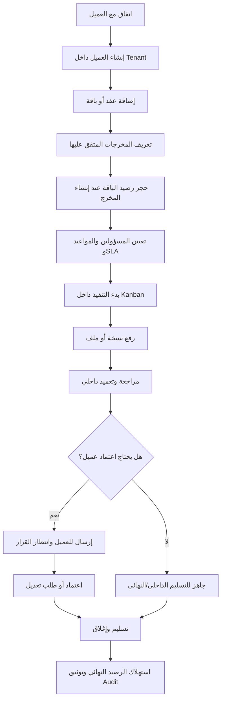

# Operating Model: شريك

**المرحلة:** Phase 02 - Operating Model & Core Business Rules  
**نوع الوثيقة:** Operating Model  
**الحالة:** Draft for owner review  
**آخر تحديث:** 2026-06-22  
**المنهجية المستخدمة:** Product Manager Skills + BMAD فقط  

## 1. الغرض

هذه الوثيقة تثبت نموذج التشغيل التجاري والعملي لمنصة شريك قبل الانتقال إلى الأدوار التفصيلية أو نموذج البيانات أو Specs. هي ليست Spec تقني، وليست ADR، ولا تحتوي قرارات قاعدة بيانات أو RLS أو Supabase.

الهدف هو تحويل الرؤية المعتمدة إلى قواعد أعمال واضحة يستطيع مالك المنتج والإدارة وفريق سماوة مراجعتها قبل البناء.

| التصنيف | النقطة |
| --- | --- |
| Confirmed | هذه المرحلة Product/Operating Model فقط. |
| Confirmed | لا كود، لا Specs، لا ADRs، ولا مخططات معمارية تقنية في هذه المرحلة. |
| Confirmed | سيتم استخدام Product Manager Skills لصياغة قواعد المنتج وBMAD لمراجعة القرار من زوايا Analyst/PM/UX/QA دون اتخاذ قرارات تقنية. |
| Assumed | سيتم تحويل هذه الوثائق لاحقا إلى Specs بعد اعتماد المالك. |

## 2. القرارات المؤسسة

| القرار | التصنيف | أثره على نموذج التشغيل |
| --- | --- | --- |
| شريك SaaS خارجي، مع إطلاق داخلي أولا لدى سماوة | Confirmed | يجب أن يكون النموذج قابلا للتعميم على وكالات وجهات تشغيل أخرى، مع اعتبار سماوة أول Tenant تشغيلي. |
| Tenant يمثل الوكالة أو الجهة المشغلة | Confirmed | سماوة Tenant أول، ويمكن مستقبلا وجود Tenants آخرين مثل وكالة تسويق أخرى. |
| كل Tenant يدير عدة عملاء مع عزل كامل بينهم | Confirmed | العميل داخل Tenant لا يرى عميل آخر، حتى لو كانا تحت نفس الوكالة. |
| التعميد الداخلي إلزامي للمخرجات الموجهة للعميل | Confirmed | لا يرسل مخرج للعميل قبل مراجعة واعتماد داخلي. |
| اعتماد العميل قابل للضبط حسب قالب أو نوع المخرج | Confirmed | ليست كل المخرجات تحتاج اعتماد عميل، لكن كل مخرج موجه للعميل يحتاج تعميدا داخليا قبل الظهور. |
| مدير الحساب ينسق ويوزع ويتابع | Confirmed | مدير الحساب ليس صاحب اعتماد نهائي افتراضي. |
| مدير الحساب لا يعتمد نهائيا إلا بصلاحية صريحة | Confirmed | أي صلاحية اعتماد لمدير الحساب يجب أن تكون مفوضة ومحددة. |
| المخرج يحجز من الباقة عند إنشائه | Confirmed | يتم منع الإفراط غير المرئي في استهلاك الباقة منذ بداية التشغيل. |
| المخرج يستهلك من الباقة عند التسليم النهائي | Confirmed | الحجز لا يعني الاستهلاك النهائي. الاستهلاك يحدث عند الإغلاق/التسليم. |
| يلغى الحجز عند إلغاء المخرج | Confirmed | الإلغاء يعيد الرصيد المحجوز ما لم توجد سياسة إدارية مختلفة لاحقا. |
| SLA يبدأ عند بدء التنفيذ | Confirmed | لا يبدأ SLA لمجرد التخطيط إذا لم يبدأ العمل فعليا. |
| SLA يتوقف عند انتظار العميل ويستأنف عند رده | Confirmed | تأخير العميل لا يحسب على سماوة. |

## 3. حدود المرحلة

يدخل في هذه المرحلة:

- تعريف الأطراف الثلاثة ومسؤولياتهم.
- علاقة Tenant بالعملاء والمستخدمين.
- قواعد إضافة العملاء والعقود والباقات والمخرجات المتفق عليها.
- رحلة المخرج من التخطيط حتى التسليم والإغلاق.
- قواعد الأعمال لحجز واستهلاك رصيد الباقة.
- قواعد SLA التشغيلية.
- قواعد Audit Events للإجراءات الحساسة.
- الاستثناءات التشغيلية: الإلغاء، إعادة الفتح، الاستبدال، تجاوز الباقة، تغيير المسؤول.

لا يدخل في هذه المرحلة:

- تصميم قاعدة البيانات.
- RLS أو API أو Server Actions.
- Spec Kit أو `spec.md`.
- ADR.
- جدولة السوشيال أو النشر المباشر.
- CRM أو فوترة متقدمة.
- قرارات مكتبات أو بنية تقنية.

| التصنيف | النقطة |
| --- | --- |
| Confirmed | شريك ليس نظام Requests أو Tickets؛ نقطة البداية هي مخرج متفق عليه ضمن عقد أو باقة أو اتفاق. |
| Confirmed | social scheduling وCRM والفوترة المتقدمة خارج V1. |
| Confirmed | لا يتم اتخاذ قرارات تقنية في هذه الوثيقة. |

## 4. الأطراف الثلاثة

### 4.1 العميل

العميل هو الجهة التي تتلقى المخرجات وتحتاج رؤية مبسطة لما تم وما ينتظر قرارها وما تبقى من الاتفاق.

يرى العميل:

- مخرجاته فقط.
- المخرجات المرسلة له بعد التعميد الداخلي.
- الملفات النهائية أو المسموحة له.
- تعليقات العميل والتعليقات العامة الموجهة له.
- حالة مبسطة للعقد أو الباقة.
- ما ينتظر موافقته إذا كان المخرج يتطلب اعتماد عميل.

لا يرى العميل:

- التعليقات الداخلية.
- Checklist الجودة الداخلية.
- النسخ غير المرسلة له.
- بيانات عملاء آخرين داخل نفس Tenant.
- Kanban الداخلي.
- قرارات الإدارة الداخلية غير الموجهة له.

### 4.2 فريق العمل

فريق العمل ينفذ المخرجات داخل مساحة تشغيل داخلية. يشمل كاتب المحتوى، المصمم، الموشن، أخصائي التسويق، محلل الأداء، والناشر اليدوي إذا وجد.

يرى الفريق:

- المخرجات المسندة له أو المصرح له بها.
- الملفات اللازمة للتنفيذ.
- التعليقات الداخلية.
- تعليقات العميل المرتبطة بالمخرج إذا كان مخولا.
- حالة SLA والتواريخ المرتبطة بالتنفيذ.

لا يستطيع الفريق افتراضيا:

- إرسال العمل للعميل مباشرة.
- التعميد الداخلي النهائي.
- اعتماد العميل.
- تعديل العقد أو الباقة.
- حذف أو إلغاء مخرج رئيسي.

### 4.3 الإدارة

الإدارة تشمل مدير المشروع، مدير التسويق، الإدارة العليا، ومن يفوض لهم المالك صلاحيات مراجعة أو تعميد أو إغلاق.

ترى الإدارة:

- العملاء المصرح بهم داخل Tenant.
- العقود والباقات.
- كل المخرجات ضمن نطاق صلاحيتها.
- ما ينتظر الفريق.
- ما ينتظر المراجعة الداخلية.
- ما ينتظر العميل.
- SLA والتأخيرات والتصعيد.
- سجل التدقيق والقرارات.

تستطيع الإدارة:

- إنشاء العملاء.
- إضافة العقود والباقات.
- إدخال المخرجات المتفق عليها.
- توزيع المسؤوليات.
- طلب تعديل داخلي.
- التعميد الداخلي.
- إرسال المخرج للعميل بعد التعميد.
- التسليم والإغلاق.
- الإلغاء أو إعادة الفتح أو الاستبدال وفق سياسة واضحة.

## 5. علاقة Tenant بالعملاء والمستخدمين

Tenant في شريك يمثل الوكالة أو الجهة المشغلة للمنصة. سماوة هي أول Tenant.

داخل Tenant واحد توجد:

- إدارة Tenant.
- فريق العمل.
- عدة عملاء.
- مستخدمون تابعون لكل عميل.
- عقود وباقات لكل عميل.
- مخرجات مرتبطة بعملاء محددين.

العزل المطلوب:

- عميل داخل Tenant لا يرى عميل آخر داخل نفس Tenant.
- فريق العمل لا يرى إلا ما تسمح به صلاحيات Tenant والإسناد.
- الإدارة ترى عبر العملاء حسب صلاحياتها.
- Audit Events تحفظ سياق Tenant والعميل والمخرج والفاعل.

| العنصر | التعريف التجاري | التصنيف |
| --- | --- | --- |
| Tenant | الوكالة أو الجهة المشغلة، مثل سماوة | Confirmed |
| Client | عميل تديره الوكالة داخل Tenant | Confirmed |
| Tenant user | مستخدم تابع للوكالة: إدارة أو فريق | Confirmed |
| Client user | مستخدم تابع للعميل: معتمد أو مشاهد أو مدير عميل | Confirmed |
| Cross-client isolation | منع رؤية عميل لبيانات عميل آخر | Confirmed |
| Cross-tenant isolation | منع تداخل وكالة مع وكالة أخرى عند التوسع | Confirmed |
| Super Admin خارج سماوة | مالك منتج يدير Tenants متعددة | Open Question |

## 6. كيف يبدأ التشغيل

تبدأ دورة العمل من اتفاق، لا من طلب عشوائي.

التسلسل التشغيلي:

1. يتم الاتفاق مع العميل خارج المنصة أو داخلها لاحقا.
2. الإدارة أو المستخدم المخول ينشئ العميل داخل Tenant.
3. الإدارة تضيف عقدا أو باقة.
4. الإدارة تحدد بنود الباقة: أنواع المخرجات والكميات أو الرصيد المتفق عليه.
5. الإدارة أو مدير الحساب المخول ينشئ المخرجات المتفق عليها.
6. عند إنشاء المخرج المرتبط بباقة يتم حجز رصيد مناسب.
7. يتم تعيين owner ومساهمين ومواعيد وSLA.
8. يبدأ التنفيذ عندما ينتقل المخرج إلى قيد التنفيذ.
9. يتابع الفريق العمل عبر Kanban داخلي.
10. لا يظهر المخرج للعميل إلا بعد التعميد الداخلي.

## 7. قواعد العقود والباقات والمخرجات

### 7.1 العقد أو الباقة

العقد أو الباقة يمثلان نطاق العمل المتفق عليه. لا تهدف V1 إلى فوترة متقدمة، بل إلى تتبع ما تم الاتفاق عليه وما تم حجزه وما تم تسليمه.

الحد الأدنى تشغيليا:

- العميل المرتبط.
- فترة العقد أو الباقة.
- أنواع المخرجات أو وحدات الرصيد.
- الكمية المتفق عليها.
- المحجوز.
- المستهلك.
- المتبقي.
- حالة العقد أو الباقة.

### 7.2 إضافة المخرجات المتفق عليها

عند إنشاء مخرج:

- يجب اختيار العميل.
- يجب اختيار نوع المخرج.
- يجب تحديد هل يرتبط بعقد/باقة.
- يجب تحديد هل يتطلب اعتماد عميل حسب القالب أو النوع.
- يجب تحديد المسؤول الأساسي.
- يجب تحديد مواعيد داخلية وعميل/نهائية حسب الحاجة.
- إذا كان مرتبطا بباقة، يتم حجز الرصيد عند الإنشاء.

| القاعدة | التصنيف | ملاحظات |
| --- | --- | --- |
| لا يبدأ التشغيل من طلب عميل عشوائي | Confirmed | يمكن تسجيل مخرج جديد فقط إذا قبلته الإدارة ضمن نطاق العمل. |
| ربط المخرج بعقد أو باقة مطلوب عند وجود اتفاق كمي | Confirmed | يسمح بمخرج خارج باقة فقط كاستثناء إداري موثق. |
| الحجز يحدث عند إنشاء المخرج | Confirmed | يمنع إنشاء مخرجات تتجاوز الرصيد دون قرار. |
| الاستهلاك يحدث عند التسليم النهائي | Confirmed | لا يستهلك الرصيد عند التعميد الداخلي أو اعتماد العميل فقط. |
| الإلغاء يعيد الرصيد المحجوز | Confirmed | ما لم توجد سياسة إدارية لاحقة لتكاليف جزئية. |
| المخرج خارج الباقة يحتاج سبب وتصنيف | Assumed | مثال: عمل مجاني، استثناء إداري، خدمة إضافية. |
| هل توجد وحدات وزن مختلفة لكل نوع مخرج؟ | Open Question | مثلا Reel يساوي وحدتين وتصميم يساوي وحدة. |

## 8. قواعد حجز واستهلاك رصيد الباقة

### 8.1 حالات الرصيد

| الحالة | المعنى | التصنيف |
| --- | --- | --- |
| Available | رصيد متاح لإنشاء مخرجات جديدة | Confirmed |
| Reserved | رصيد محجوز لمخرج تم إنشاؤه ولم يسلم بعد | Confirmed |
| Consumed | رصيد مستهلك بعد التسليم النهائي | Confirmed |
| Released | رصيد أعيد بعد إلغاء المخرج | Confirmed |
| Overridden | تجاوز إداري موثق للرصيد | Assumed |

### 8.2 قواعد الرصيد

| الإجراء | أثره على الرصيد | الجهة المخولة | Audit Event | التصنيف |
| --- | --- | --- | --- | --- |
| إنشاء مخرج مرتبط بباقة | يحجز وحدة أو كمية حسب نوع المخرج | الإدارة أو مدير الحساب المخول | `package_credit_reserved` | Confirmed |
| بدء التنفيذ | لا يغير الرصيد | الفريق أو الإدارة حسب الصلاحية | `deliverable_started` | Confirmed |
| اعتماد داخلي | لا يستهلك الرصيد | الإدارة أو مفوض | `internal_approval_granted` | Confirmed |
| إرسال للعميل | لا يستهلك الرصيد | الإدارة أو مدير حساب مخول | `deliverable_sent_to_client` | Confirmed |
| اعتماد العميل | لا يستهلك وحده إلا إذا تم التسليم مباشرة ضمن السياسة | العميل المخول | `client_approval_granted` | Confirmed |
| التسليم النهائي | يحول الحجز إلى استهلاك | الإدارة أو مفوض تسليم | `package_credit_consumed` | Confirmed |
| إلغاء قبل التسليم | يعيد الرصيد المحجوز | الإدارة | `package_credit_released` | Confirmed |
| استبدال مخرج | ينقل الحجز أو يحرر القديم ويحجز الجديد | الإدارة | `deliverable_replaced` | Assumed |
| تجاوز الباقة | يحتاج موافقة إدارية وسبب | الإدارة العليا أو صلاحية صريحة | `package_overage_approved` | Confirmed |

### 8.3 تجاوز الباقة

إذا لم يوجد رصيد كاف عند إنشاء المخرج:

1. لا ينشأ المخرج كعمل عادي دون تنبيه.
2. تختار الإدارة أحد المسارات:
   - رفض الإنشاء حتى تحديث الباقة.
   - إنشاء مخرج خارج الباقة بسبب موثق.
   - الموافقة على تجاوز الباقة كاستثناء.
3. يسجل Audit Event يوضح من وافق ولماذا.

## 9. المسؤوليات العليا

| العملية | العميل | فريق العمل | مدير الحساب | الإدارة | التصنيف |
| --- | --- | --- | --- | --- | --- |
| إنشاء العميل | لا | لا | لا أو محدود | نعم | Confirmed |
| إضافة عقد/باقة | لا | لا | لا أو محدود | نعم | Confirmed |
| إنشاء مخرج متفق عليه | لا | لا افتراضيا | نعم حسب الصلاحية | نعم | Confirmed |
| توزيع العمل | لا | لا | نعم | نعم | Confirmed |
| بدء التنفيذ | لا | نعم حسب الإسناد | نعم حسب الصلاحية | نعم | Confirmed |
| رفع نسخة عمل | لا | نعم | نعم | نعم | Confirmed |
| طلب تعديل داخلي | لا | لا | لا إلا بتفويض | نعم | Confirmed |
| التعميد الداخلي | لا | لا | لا إلا بصلاحية صريحة | نعم | Confirmed |
| إرسال للعميل | لا | لا | نعم بعد التعميد إذا مخول | نعم | Confirmed |
| اعتماد العميل | نعم إذا كان client_approver | لا | لا | لا بالنيابة إلا كإدخال قرار خارجي موثق لاحقا | Confirmed |
| التسليم النهائي | لا | لا | حسب الصلاحية | نعم | Confirmed |
| إلغاء أو إعادة فتح | لا | لا | لا إلا بتفويض | نعم | Confirmed |

## 10. Audit Events المطلوبة

أي إجراء حساس يجب أن يترك أثرا قابلا للمراجعة. الحد الأدنى للأحداث:

| الحدث | متى يحدث؟ | بيانات الحدث تجاريا | التصنيف |
| --- | --- | --- | --- |
| `client_created` | إنشاء عميل | Tenant، العميل، الفاعل، الوقت | Confirmed |
| `contract_or_package_created` | إضافة عقد/باقة | العميل، النطاق، الفاعل | Confirmed |
| `deliverable_created` | إنشاء مخرج | العميل، النوع، الباقة، المسؤول | Confirmed |
| `package_credit_reserved` | حجز رصيد | المخرج، الباقة، الكمية | Confirmed |
| `owner_changed` | تغيير المسؤول | القديم، الجديد، السبب | Confirmed |
| `status_changed` | انتقال حالة | من/إلى، الفاعل، السبب إن وجد | Confirmed |
| `file_uploaded` | رفع ملف أو نسخة | المخرج، الرؤية، رقم النسخة | Confirmed |
| `internal_comment_added` | تعليق داخلي | المخرج، الفاعل، الرؤية | Confirmed |
| `client_comment_added` | تعليق عميل | المخرج، العميل، النسخة إن وجدت | Confirmed |
| `internal_change_requested` | طلب تعديل داخلي | السبب، النسخة، المراجع | Confirmed |
| `internal_approval_granted` | تعميد داخلي | المراجع، النسخة، checklist إن وجدت | Confirmed |
| `deliverable_sent_to_client` | إرسال للعميل | النسخة المرسلة، المستلمين | Confirmed |
| `sla_paused_waiting_client` | توقف SLA لانتظار العميل | وقت التوقف، السبب | Confirmed |
| `client_approval_granted` | اعتماد العميل | المعتمد، الوقت، النسخة | Confirmed |
| `client_change_requested` | طلب تعديل العميل | الملاحظة، النسخة، المعتمد | Confirmed |
| `sla_resumed` | استئناف SLA | السبب، الفاعل، الحالة الجديدة | Confirmed |
| `deliverable_delivered` | التسليم النهائي | النسخة النهائية، الفاعل | Confirmed |
| `package_credit_consumed` | استهلاك الرصيد | الباقة، الكمية، المخرج | Confirmed |
| `deliverable_cancelled` | إلغاء المخرج | السبب، أثر الرصيد | Confirmed |
| `package_credit_released` | إعادة الحجز | الباقة، الكمية | Confirmed |
| `deliverable_reopened` | إعادة فتح مخرج | السبب، الحالة السابقة | Confirmed |
| `package_overage_approved` | تجاوز الباقة | السبب، الموافق | Confirmed |

## 11. الاستثناءات التشغيلية

### 11.1 الإلغاء

يستخدم عندما يتوقف العمل على مخرج قبل التسليم النهائي.

قواعده:

- لا يلغى مخرج دون سبب.
- الإلغاء يعيد الرصيد المحجوز إذا لم يتم التسليم.
- إذا كان قد تم رفع ملفات أو صرف جهد، يمكن للإدارة لاحقا تعريف سياسة تكلفة جزئية، لكنها خارج V1 ما لم يعتمدها المالك.
- يسجل الإلغاء في Audit Log.

### 11.2 إعادة الفتح

تستخدم بعد التسليم إذا ظهرت حاجة موثقة لتعديل أو تصحيح.

قواعدها:

- لا يعاد فتح مخرج دون سبب.
- إعادة الفتح لا تعني تلقائيا حجز رصيد جديد.
- إذا كان التعديل خارج نطاق التسليم الأصلي، قد ينشأ مخرج جديد أو استبدال.
- يجب تمييز هل إعادة الفتح بسبب خطأ داخلي، طلب عميل جديد، أو تصحيح تسليم.

### 11.3 الاستبدال

يستخدم عند إلغاء مخرج مخطط واستبداله بمخرج آخر داخل نفس الباقة.

قواعده:

- الاستبدال يجب أن يحافظ على أثر الرصيد بوضوح.
- إذا كان المخرج القديم لم يسلم، يمكن نقل الحجز أو تحريره ثم حجز الجديد.
- إذا كان القديم سلم، فالاستبدال مخرج جديد أو قرار إداري خاص.

### 11.4 تجاوز الباقة

يحدث عندما تطلب الإدارة أو العميل مخرجا يفوق الرصيد المتاح.

قواعده:

- لا يتم بصمت.
- يحتاج موافقة إدارية.
- يظهر كمخرج خارج الباقة أو كتجاوز موثق.
- لا يتحول إلى فوترة متقدمة في V1.

### 11.5 تغيير المسؤول

تغيير owner أو المساهمين يؤثر على المساءلة وSLA.

قواعده:

- يسجل owner القديم والجديد.
- يوضح السبب إذا كان التغيير بعد بدء التنفيذ.
- لا يغير حالة المخرج وحده.
- لا يعيد ضبط SLA إلا إذا وجدت سياسة إدارية واضحة لاحقا.

## 12. أمثلة واقعية

### مثال 1: سماوة تدير عميلين داخل Tenant واحد

| العنصر | المثال | التصنيف |
| --- | --- | --- |
| Tenant | سماوة | Confirmed |
| Client A | عيادة النور | Assumed |
| Client B | متجر روافد | Assumed |
| القاعدة | عيادة النور لا ترى مخرجات متجر روافد والعكس | Confirmed |

سيناريو:

1. سماوة تنشئ باقة لعيادة النور: 8 تصاميم و4 Reels.
2. سماوة تنشئ باقة لمتجر روافد: 12 منشورا و2 تقرير أداء.
3. مدير الحساب ينشئ مخرج "تصميم حملة العودة" لعيادة النور.
4. يتم حجز وحدة تصميم من باقة عيادة النور.
5. مصمم سماوة ينفذ ويرفع نسخة داخلية.
6. مدير المشروع يطلب تعديلا داخليا لا يظهر للعميل.
7. بعد التعديل، يتم التعميد الداخلي وإرسال النسخة للعميل.
8. عيادة النور تطلب تعديلا؛ يتوقف وقت انتظارها عن احتساب SLA على سماوة ثم يستأنف عند الطلب.
9. بعد اعتماد العميل والتسليم النهائي، تستهلك وحدة من الباقة.

### مثال 2: مخرج لا يحتاج اعتماد عميل

سيناريو:

1. سماوة تنشئ مخرج "تقرير أداء داخلي شهري" لمتجر روافد.
2. نوع المخرج مضبوط بأنه لا يحتاج اعتماد عميل، لكنه يحتاج تعميدا داخليا.
3. بعد التنفيذ والمراجعة، يعتمد مدير التسويق التقرير داخليا.
4. إذا كان التقرير موجها للعميل كملف نهائي، يرسل أو يسلم حسب السياسة دون انتظار زر اعتماد العميل.
5. يستهلك الرصيد عند التسليم النهائي.

| القاعدة | التصنيف |
| --- | --- |
| التعميد الداخلي إلزامي لأن المخرج موجه للعميل أو للتسليم الرسمي | Confirmed |
| اعتماد العميل قابل للإيقاف حسب نوع المخرج | Confirmed |
| الاستهلاك عند التسليم لا عند التعميد | Confirmed |

## 13. مراجعة BMAD المختصرة

| زاوية BMAD | المراجعة | النتيجة |
| --- | --- | --- |
| Analyst | هل المشكلة محددة؟ | نعم: تشتت المخرجات، الاعتماد، SLA، الملفات، العزل. |
| PM | هل القواعد تخدم V1؟ | نعم: كل قاعدة مرتبطة بالمخرج أو الباقة أو الاعتماد أو SLA أو Audit. |
| UX | هل العميل محمي من التعقيد؟ | نعم: العميل يرى القرار والملفات والحالة فقط. |
| QA | هل توجد نقاط قابلة للتحقق؟ | نعم: كل انتقال حساس له شرط، جهة مخولة، وAudit Event. |
| Architecture | هل اتخذت الوثيقة قرارات تقنية؟ | لا. تم إبقاء Tenant كتعريف منتج فقط دون تصميم تقني. |

## 14. Business Rules Summary

| ID | القاعدة | التصنيف |
| --- | --- | --- |
| BR-OM-01 | شريك يبدأ من مخرجات متفق عليها، وليس Requests أو Tickets. | Confirmed |
| BR-OM-02 | Tenant يمثل الوكالة أو الجهة المشغلة، وسماوة أول Tenant. | Confirmed |
| BR-OM-03 | كل Tenant يدير عدة عملاء مع عزل كامل بينهم. | Confirmed |
| BR-OM-04 | العميل لا يرى الداخلي ولا يرى عملاء آخرين. | Confirmed |
| BR-OM-05 | التعميد الداخلي إلزامي قبل ظهور المخرج الموجه للعميل. | Confirmed |
| BR-OM-06 | اعتماد العميل قابل للضبط حسب نوع أو قالب المخرج. | Confirmed |
| BR-OM-07 | مدير الحساب ينسق ويوزع ويتابع ولا يعتمد نهائيا إلا بصلاحية صريحة. | Confirmed |
| BR-OM-08 | المخرج المرتبط بباقة يحجز الرصيد عند الإنشاء. | Confirmed |
| BR-OM-09 | التسليم النهائي يستهلك الرصيد. | Confirmed |
| BR-OM-10 | الإلغاء قبل التسليم يعيد الرصيد المحجوز. | Confirmed |
| BR-OM-11 | SLA يبدأ عند بدء التنفيذ ويتوقف عند انتظار العميل. | Confirmed |
| BR-OM-12 | كل قرار حساس يحتاج Audit Event. | Confirmed |

## 15. الأسئلة المفتوحة للمالك

| السؤال | سبب الحاجة للقرار | الأولوية |
| --- | --- | --- |
| هل يوجد Super Admin للمنتج خارج سماوة في V1 أم لاحقا؟ | يؤثر على إدارة Tenants كمنتج SaaS خارجي | متوسطة |
| هل توجد أوزان مختلفة لاستهلاك الباقة حسب نوع المخرج؟ | يؤثر على قواعد الحجز والاستهلاك | عالية |
| هل يسمح بمخرج خارج عقد/باقة في V1؟ | يؤثر على ضبط النطاق والتقارير | عالية |
| هل إعادة الفتح بعد التسليم تستهلك رصيدا جديدا في بعض الحالات؟ | يؤثر على عدالة الباقة | متوسطة |
| هل يحتاج العميل رؤية سبب التأخير أم ترى الإدارة ذلك فقط؟ | يؤثر على شفافية SLA في بوابة العميل | متوسطة |
| هل يعتمد "رفض العميل" كحالة مستقلة أم يترجم إلى طلب تعديل/إلغاء إداري؟ | يؤثر على نموذج الاعتماد | عالية |
