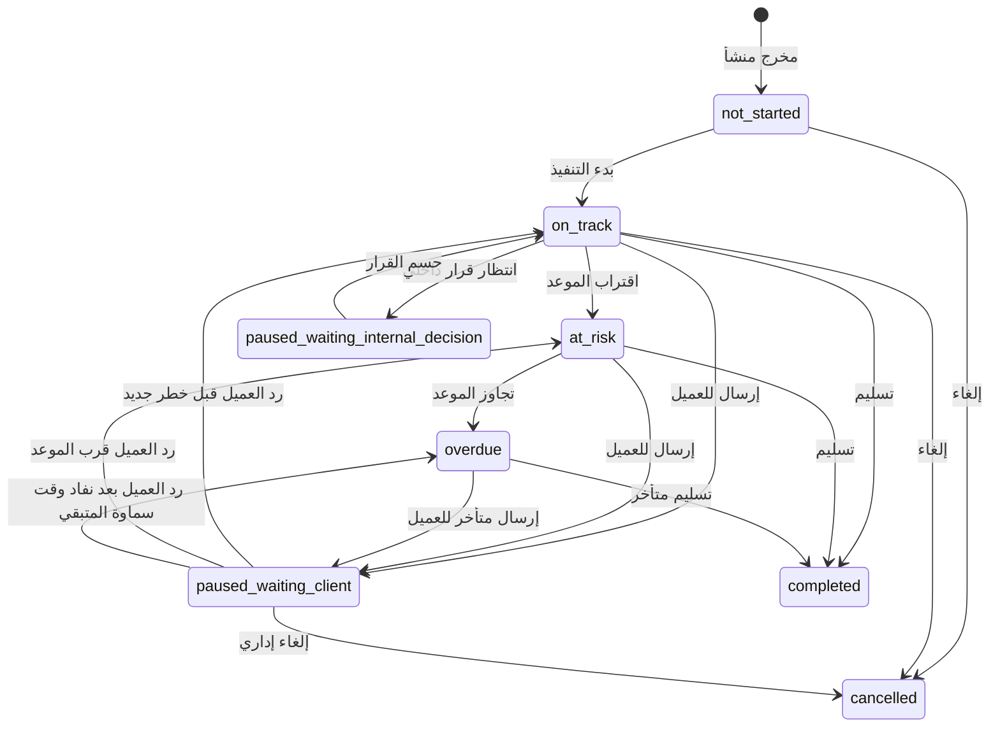

# SLA Flow: شريك

**المرحلة:** Phase 02 - Operating Model & Core Business Rules  
**نوع الوثيقة:** SLA Flow  
**الحالة:** Draft for owner review  
**آخر تحديث:** 2026-06-22  
**المنهجية المستخدمة:** Product Manager Skills + BMAD فقط  

## 1. الغرض

SLA في شريك ليس مؤشرا جانبيا، بل جزء أساسي من عدالة التشغيل. يجب أن يوضح هل التأخير على سماوة، على العميل، على قرار داخلي، أو على استثناء تشغيلي. هذه الوثيقة تحدد متى يبدأ SLA، متى يتوقف، متى يستأنف، كيف يصنف الخطر والتأخير، وما أحداث التدقيق المطلوبة.

| التصنيف | النقطة |
| --- | --- |
| Confirmed | SLA موجود في V1. |
| Confirmed | SLA يبدأ عند بدء التنفيذ. |
| Confirmed | SLA يتوقف عند انتظار العميل. |
| Confirmed | SLA يستأنف عند رد العميل بطلب تعديل أو عودة العمل للفريق. |
| Confirmed | تأخير العميل لا يحتسب على سماوة. |

## 2. حالات SLA

| الحالة | الاسم العربي | المعنى | مالك الوقت | التصنيف |
| --- | --- | --- | --- | --- |
| `not_started` | لم يبدأ | لم يبدأ التنفيذ بعد | لا يوجد | Assumed |
| `on_track` | ضمن المسار | العمل يسير ضمن الوقت المتوقع | سماوة | Confirmed |
| `at_risk` | معرض للخطر | اقترب الموعد أو ظهرت مؤشرات تأخير | سماوة أو حسب الحالة | Confirmed |
| `overdue` | متأخر | تجاوز الموعد المحسوب على سماوة | سماوة | Confirmed |
| `paused_waiting_client` | متوقف بانتظار العميل | أرسل للعميل وينتظر قراره | العميل | Confirmed |
| `paused_waiting_internal_decision` | متوقف بانتظار قرار داخلي | ينتظر قرار إدارة أو حسم نطاق | سماوة/الإدارة | Confirmed |
| `completed` | مكتمل | تم التسليم أو الإغلاق بنجاح | لا يوجد | Confirmed |
| `cancelled` | ملغي | ألغي المخرج | لا يوجد | Confirmed |

## 3. متى يبدأ SLA؟

القاعدة المعتمدة: يبدأ SLA عند بدء التنفيذ، وليس عند إنشاء المخرج فقط.

| الحدث | هل يبدأ SLA؟ | السبب | التصنيف |
| --- | --- | --- | --- |
| إنشاء المخرج | لا | المخرج قد يكون مخططا فقط | Confirmed |
| تعيين owner | لا وحده | المسؤولية توضحت لكن العمل لم يبدأ | Confirmed |
| نقل الحالة إلى `in_progress` | نعم | بدأ التنفيذ فعليا | Confirmed |
| رفع ملف قبل تغيير الحالة | لا وحده | قد يكون ملفا مرجعيا | Assumed |
| إعادة فتح مخرج مسلم | حسب سبب إعادة الفتح | يحتاج سياسة | Open Question |

## 4. متى يتوقف SLA؟

يتوقف SLA عندما لا تكون الكرة عند سماوة أو الفريق.

| الحالة | سبب التوقف | الحالة الناتجة | مالك الوقت | Audit Event | التصنيف |
| --- | --- | --- | --- | --- | --- |
| إرسال للعميل لاعتماد مطلوب | انتظار قرار العميل | `paused_waiting_client` | العميل | `sla_paused_waiting_client` | Confirmed |
| انتظار ملف أو معلومة من العميل | العميل لم يقدم مدخلا مطلوبا | `paused_waiting_client` | العميل | `sla_paused_waiting_client_input` | Assumed |
| انتظار قرار إداري داخلي | الإدارة لم تحسم قرارا | `paused_waiting_internal_decision` | سماوة/الإدارة | `sla_paused_waiting_internal_decision` | Confirmed |
| توقف بسبب إلغاء محتمل | قرار نطاق غير محسوم | `paused_waiting_internal_decision` أو يبقى حسب السياسة | سماوة/الإدارة | `sla_exception_recorded` | Assumed |

## 5. متى يستأنف SLA؟

| الحدث | كيف يستأنف؟ | مالك الوقت بعد الاستئناف | Audit Event | التصنيف |
| --- | --- | --- | --- | --- |
| العميل يطلب تعديلا | يعود المخرج إلى `client_changes_requested` ثم التنفيذ | سماوة | `sla_resumed` | Confirmed |
| العميل يرفض النسخة بسبب محدد | يعامل كطلب تعديل/اعتراض | سماوة أو قرار إداري | `sla_resumed` | Assumed |
| العميل يرفع الملف المطلوب | تعود الكرة لسماوة | سماوة | `sla_resumed` | Assumed |
| الإدارة تحسم قرارا داخليا | يعود العمل للفريق أو ينتقل خطوة | سماوة | `sla_resumed` | Confirmed |
| إعادة فتح بعد التسليم | يبدأ أو يستأنف حسب سبب الفتح | Open | `sla_reopened` | Open Question |

## 6. مخطط حالات SLA

## 7. التمييز بين تأخير سماوة وتأخير العميل

### 7.1 تأخير سماوة

يحسب على سماوة عندما يكون المخرج:

- قيد التنفيذ.
- يحتاج تعديل داخلي.
- يحتاج تعديل من العميل وعاد للفريق.
- جاهز للمراجعة الداخلية وينتظر الإدارة.
- معتمد داخليا لكنه لم يرسل للعميل دون سبب خارجي.
- جاهز للتسليم ولم يسلم.

### 7.2 تأخير العميل

يحسب على العميل عندما يكون المخرج:

- بانتظار اعتماد العميل.
- بانتظار تعليق أو قرار عميل.
- بانتظار ملف أو مدخل مطلوب من العميل.

### 7.3 تأخير داخلي إداري

هو تأخير داخل سماوة لكنه ليس على فريق التنفيذ مباشرة، مثل:

- انتظار مراجعة مدير مشروع.
- انتظار قرار مدير تسويق.
- انتظار قرار تجاوز باقة.
- انتظار حسم إلغاء أو استبدال.

| القاعدة | التصنيف |
| --- | --- |
| انتظار العميل لا يحسب على سماوة | Confirmed |
| انتظار الإدارة الداخلية يحسب ضمن مسؤولية سماوة لكن يميز كقرار داخلي | Confirmed |
| delay owner يجب أن يظهر للإدارة | Confirmed |
| هل يظهر delay owner للعميل؟ | Open Question |

## 8. الخطر والتأخير والتصعيد

### 8.1 `at_risk`

الحالة `at_risk` تعني أن المخرج لم يتأخر بعد، لكنه قريب من التأخير أو يحتاج تدخل.

أسباب محتملة:

- قرب موعد التسليم الداخلي.
- مخرج عالق في مراجعة داخلية.
- مخرج عاد من العميل بتعديل قرب الموعد النهائي.
- owner تغير قرب الموعد.
- ملفات ناقصة.

### 8.2 `overdue`

الحالة `overdue` تعني أن الوقت المحسوب على سماوة تجاوز الموعد المتفق أو الداخلي حسب نوع SLA.

لا يكون المخرج `overdue` بسبب أيام انتظار العميل إذا كان في `paused_waiting_client`.

### 8.3 التصعيد

التصعيد يجب أن يكون عمليًا:

| المستوى | متى يحدث؟ | من يرى؟ | الإجراء المقترح | التصنيف |
| --- | --- | --- | --- | --- |
| تنبيه owner | عند دخول `at_risk` | owner ومدير الحساب | مراجعة الأولوية | Assumed |
| تنبيه مدير الحساب | عند انتظار العميل لمدة طويلة | مدير الحساب والإدارة | تذكير العميل | Assumed |
| تنبيه الإدارة | عند `overdue` على سماوة | الإدارة | إعادة توزيع أو تدخل | Confirmed |
| تصعيد مالك | عند تجاوز باقة أو تأخير حرج | الإدارة العليا | قرار استثناء | Assumed |

| السؤال | التصنيف |
| --- | --- |
| ما عتبة `at_risk` حسب نوع المخرج؟ | Open Question |
| ما مدة انتظار العميل قبل تذكير أو تصعيد؟ | Open Question |
| هل SLA يحسب بأيام عمل أم أيام تقويمية؟ | Open Question |

## 9. مصفوفة SLA حسب حالة المخرج

| حالة المخرج | حالة SLA الافتراضية | مالك الوقت | ملاحظات | التصنيف |
| --- | --- | --- | --- | --- |
| `not_started` | `not_started` | لا يوجد | لا يبدأ قبل التنفيذ | Confirmed |
| `in_progress` | `on_track` أو `at_risk` أو `overdue` | سماوة | حسب الوقت المتبقي | Confirmed |
| `ready_for_internal_review` | `on_track` أو `at_risk` أو `overdue` | سماوة/الإدارة | مراجعة داخلية ضمن مسؤولية سماوة | Confirmed |
| `internal_changes_requested` | `on_track` أو `at_risk` أو `overdue` | سماوة | العمل عاد للفريق | Confirmed |
| `internally_approved` | `on_track` أو `at_risk` | سماوة | ينتظر إرسال أو تسليم | Confirmed |
| `waiting_client_approval` | `paused_waiting_client` | العميل | لا يحسب على سماوة | Confirmed |
| `client_changes_requested` | `on_track` أو `at_risk` أو `overdue` | سماوة | عاد بسبب ملاحظات العميل | Confirmed |
| `client_approved` | `on_track` أو `at_risk` | سماوة | ينتظر تجهيز التسليم | Confirmed |
| `ready_for_delivery` | `on_track` أو `at_risk` أو `overdue` | سماوة | لا يكتمل حتى التسليم | Confirmed |
| `delivered` | `completed` | لا يوجد | يغلق SLA | Confirmed |
| `cancelled` | `cancelled` | لا يوجد | يغلق SLA | Confirmed |

## 10. أمثلة زمنية

### 10.1 انتظار عميل لا يحسب على سماوة

مخرج "تصميم حملة العودة" لعيادة النور:

- بدأ التنفيذ: 1 يوليو 2026.
- أرسل للعميل بعد التعميد الداخلي: 5 يوليو 2026.
- رد العميل بطلب تعديل: 9 يوليو 2026.

النتيجة:

- الفترة من 5 يوليو إلى 9 يوليو تصنف كـ `paused_waiting_client`.
- لا تحسب هذه الأيام كتأخير على سماوة.
- عند طلب التعديل في 9 يوليو يستأنف SLA على سماوة.

| النقطة | التصنيف |
| --- | --- |
| وقت انتظار العميل يعزل في التقارير | Confirmed |
| طلب تعديل العميل يعيد المسؤولية لسماوة | Confirmed |

### 10.2 تأخير داخلي في المراجعة

مخرج "Reel تعريفي" لمتجر روافد:

- الفريق أرسل للمراجعة الداخلية: 3 يوليو 2026.
- بقي دون قرار داخلي حتى 7 يوليو 2026.

النتيجة:

- التأخير ليس على العميل.
- يظهر كمسؤولية داخلية، غالبا `paused_waiting_internal_decision` أو `at_risk/overdue` حسب سياسة الحساب.
- يحتاج Audit Event عند إيقاف أو توصيف الانتظار الداخلي.

### 10.3 اعتماد عميل ثم تأخر التسليم النهائي

مخرج "تقرير أداء" اعتمده العميل يوم 12 يوليو 2026، لكن لم يسلم نهائيا حتى بعد الموعد.

النتيجة:

- لا يوجد توقف بانتظار العميل بعد الاعتماد.
- أي تأخير في تجهيز التسليم النهائي يحسب على سماوة.
- يظل الرصيد محجوزا حتى التسليم، ثم يستهلك.

## 11. Audit Events الخاصة بـSLA

| الحدث | متى يحدث؟ | بيانات الحدث تجاريا | التصنيف |
| --- | --- | --- | --- |
| `sla_started` | عند بدء التنفيذ | المخرج، الفاعل، وقت البداية | Confirmed |
| `sla_status_changed` | تغير status | القديم، الجديد، السبب | Confirmed |
| `sla_paused_waiting_client` | إرسال للعميل أو انتظار مدخل منه | وقت التوقف، سبب التوقف | Confirmed |
| `sla_paused_waiting_internal_decision` | انتظار قرار إداري | القرار المنتظر، الفاعل | Confirmed |
| `sla_resumed` | عودة العمل لسماوة | سبب الاستئناف، وقت الاستئناف | Confirmed |
| `sla_marked_at_risk` | دخول الخطر | سبب الخطر | Assumed |
| `sla_marked_overdue` | التأخير | الموعد المتجاوز، مالك التأخير | Confirmed |
| `sla_completed` | التسليم النهائي | وقت الاكتمال | Confirmed |
| `sla_cancelled` | الإلغاء | سبب الإلغاء | Confirmed |
| `sla_escalated` | تصعيد | المستوى والسبب | Assumed |

## 12. Business Rules

| ID | القاعدة | التصنيف |
| --- | --- | --- |
| BR-SLA-01 | SLA يبدأ عند انتقال المخرج إلى بدء التنفيذ. | Confirmed |
| BR-SLA-02 | SLA لا يبدأ عند إنشاء المخرج فقط. | Confirmed |
| BR-SLA-03 | SLA يتوقف عندما ينتظر المخرج العميل. | Confirmed |
| BR-SLA-04 | انتظار العميل لا يحسب كتأخير على سماوة. | Confirmed |
| BR-SLA-05 | طلب تعديل العميل يستأنف SLA على سماوة. | Confirmed |
| BR-SLA-06 | انتظار القرار الداخلي يجب تمييزه عن انتظار العميل. | Confirmed |
| BR-SLA-07 | المخرج لا يصبح `completed` إلا عند التسليم النهائي أو الإلغاء حسب الحالة. | Confirmed |
| BR-SLA-08 | كل pause/resume يحتاج Audit Event. | Confirmed |
| BR-SLA-09 | at-risk thresholds تحدد لاحقا حسب نوع المخرج أو سياسة Tenant. | Open Question |
| BR-SLA-10 | SLA لا يعالج فوترة أو غرامات في V1. | Confirmed |

## 13. علاقة SLA بالباقة

SLA والباقة مرتبطان بالمخرج لكنهما لا يعنيان الشيء نفسه:

- الحجز يحدث عند إنشاء المخرج.
- SLA يبدأ عند بدء التنفيذ.
- SLA يتوقف عند انتظار العميل.
- الاستهلاك يحدث عند التسليم النهائي.
- التأخير لا يغير رصيد الباقة تلقائيا.
- الإلغاء يعيد الحجز إذا لم يسلم المخرج.

| القاعدة | التصنيف |
| --- | --- |
| SLA لا يستهلك الرصيد | Confirmed |
| التسليم النهائي يستهلك الرصيد | Confirmed |
| الإلغاء قبل التسليم يعيد الرصيد | Confirmed |
| هل يؤدي التأخير الشديد إلى سياسة تعويض أو رصيد إضافي؟ | Open Question |

## 14. مراجعة BMAD المختصرة

| زاوية BMAD | المراجعة | النتيجة |
| --- | --- | --- |
| Analyst | هل يميز النموذج مصدر التأخير؟ | نعم: سماوة، العميل، قرار داخلي. |
| PM | هل يحمي القيمة الأساسية؟ | نعم: عدالة SLA وسجل التدقيق. |
| UX | هل يمكن تبسيطه للعميل؟ | نعم: يمكن إظهار "بانتظارك" بدلا من تفاصيل داخلية. |
| QA | هل توجد حالات قابلة للاختبار؟ | نعم: start, pause, resume, overdue, completed. |

## 15. Open Questions

| السؤال | سبب الحاجة |
| --- | --- |
| هل يحسب SLA بأيام عمل أم أيام تقويمية؟ | يؤثر على كل مؤشرات التأخير. |
| ما عتبة at-risk لكل نوع مخرج؟ | يؤثر على التصعيد والتنبيهات. |
| هل يظهر delay owner للعميل أم للإدارة فقط؟ | يؤثر على شفافية بوابة العميل. |
| ما مدة انتظار العميل قبل التذكير أو التصعيد؟ | يؤثر على تجربة العميل ومدير الحساب. |
| كيف يعالج SLA عند إعادة فتح مخرج بعد التسليم؟ | يؤثر على التقارير والعدالة. |
| هل توجد سياسات تعويض أو رصيد عند تأخير سماوة؟ | خارج V1 غالبا، لكنه يحتاج قرارا لاحقا. |
