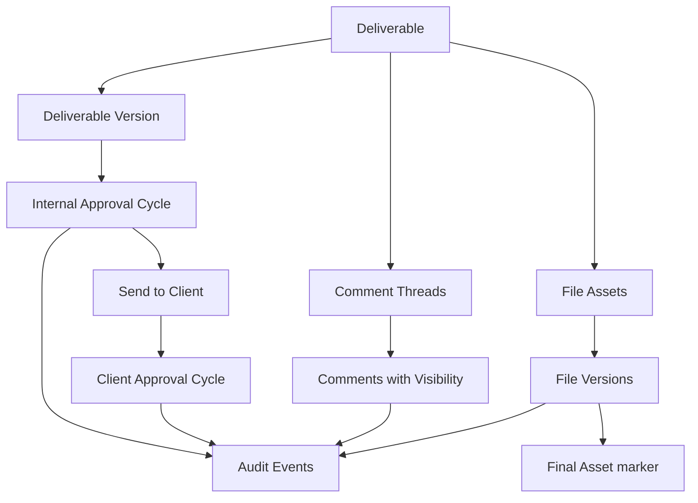

# Approvals, Comments, and Files Model: شريك

**المرحلة:** Phase 04 - Core Domain Model, Conceptual Data Model & Business Invariants  
**نوع الوثيقة:** Conceptual Collaboration Model  
**الحالة:** Draft for owner review  
**آخر تحديث:** 2026-06-22  

## 1. الغرض

هذه الوثيقة تفصل بين Internal Approval وClient Approval والتعليقات والملفات. الهدف أن يكون الاعتماد مرتبطا بنسخة محددة، وأن تبقى الرؤية مستقلة عن مجرد وجود الملف أو التعليق.

## 2. النموذج المختصر

## 3. Internal Approval

| العنصر | القاعدة |
| --- | --- |
| متى يبدأ؟ | عند طلب مراجعة داخلية على نسخة أو محتوى قابل للمراجعة. |
| من يقرر؟ | PM/MM/Quality Reviewer أو مفوض صريح. |
| على ماذا يقرر؟ | نسخة محددة من المخرج. |
| النتائج | Internal Approval Granted أو Internal Changes Requested أو Revoked. |
| أثر العميل | لا يظهر للعميل إلا بعد الإرسال الصريح. |

## 4. Client Approval

| العنصر | القاعدة |
| --- | --- |
| متى يبدأ؟ | بعد إرسال نسخة معتمدة داخليا للعميل. |
| من يقرر؟ | Client Approver ضمن Client/Deliverable scope. |
| على ماذا يقرر؟ | النسخة المرسلة له فقط. |
| النتائج | Client Approval Granted أو Client Changes Requested أو Rejection Recorded كاعتراض. |
| أثر SLA | يتوقف عند الانتظار ويستأنف عند طلب التعديل. |

## 5. Approval Policy and Cycle

| المفهوم | الدور |
| --- | --- |
| Approval Policy | يحدد هل يحتاج المخرج تعميدا داخليا واعتماد عميل ومن يملك القرار. |
| Approval Cycle | جولة قرار على نسخة محددة. |
| Approval Decision | نتيجة موثقة داخل Cycle. |
| Change Request | Decision يطلب تعديل ولا يمحو القرارات السابقة. |

## 6. قواعد النسخ والاعتماد

| ID | القاعدة | التصنيف |
| --- | --- | --- |
| BR-ACF-01 | الاعتماد مرتبط بنسخة محددة. | Confirmed |
| BR-ACF-02 | تعديل النسخة بعد اعتمادها يبطل أهلية الإرسال أو يبدأ دورة جديدة حسب السياسة. | Confirmed |
| BR-ACF-03 | لا تتم الكتابة فوق النسخة المعتمدة. | Confirmed |
| BR-ACF-04 | طلب التعديل لا يمحو قرار الاعتماد السابق. | Confirmed |
| BR-ACF-05 | كل دورة اعتماد لها تاريخ مستقل. | Confirmed |
| BR-ACF-06 | سحب اعتماد داخلي قبل الإرسال يحتاج سبب وAudit. | Assumed |
| BR-ACF-07 | سحب اعتماد بعد الإرسال أو بعد اعتماد العميل Open Question. | Open Question |

## 7. التعليقات

| نوع التعليق | من يكتبه | من يراه | أثره |
| --- | --- | --- | --- |
| Internal Comment | الفريق/الإدارة | الفريق والإدارة ضمن scope | لا يظهر للعميل. |
| Client Comment | العميل أو من يرد بوضوح للعميل | العميل والإدارة والفريق المصرح | لا يمنح رؤية داخلي. |
| System Comment | النظام كتفسير عرضي | حسب السياق | لا يستبدل Audit. |
| Approval Comment | مع قرار اعتماد أو تعديل | حسب نوع القرار | جزء من سجل القرار. |

## 8. مستويات الرؤية

| Visibility | يرى | لا يرى | ملاحظات |
| --- | --- | --- | --- |
| Internal Only | الإدارة والفريق المصرح | كل أدوار العميل | غير قابل للظهور للعميل. |
| Management Only | الإدارة أو مفوض | الفريق العادي والعميل | للماليات والتقارير الحساسة. |
| Client Visible | العميل المعني والفريق المصرح | عملاء آخرون | لا يعني Final. |
| Client Final | العميل بعد التسليم أو اعتماد نهائي | عملاء آخرون والداخلي غير المخول | يحتاج Mark Final. |
| Restricted | أدوار محددة بسبب حساس | الجميع إلا بتفويض | Support/Audit export. |
| Audit Only | يظهر كسجل تدقيق | لا يستخدم كمحتوى تشغيل | Append-only. |

## 9. File Asset and File Version

| المفهوم | القاعدة |
| --- | --- |
| File Asset | أصل ملف مرتبط بTenant/Client/Deliverable/Contract conceptually. |
| File Version | رفع جديد أو نسخة جديدة من أصل الملف. |
| Final Asset | تعليم مستقل لنسخة كنهائية. |
| Client Uploaded | ملف رفعه العميل ويظهر للفريق المصرح. |
| Visibility Change | أمر حساس مستقل عن رفع الملف. |

## 10. قواعد الملفات

| ID | القاعدة | التصنيف |
| --- | --- | --- |
| BR-FILE-01 | العميل يرى فقط الملفات المصرح بها ضمن Client scope. | Confirmed |
| BR-FILE-02 | Internal Only لا يتحول للعميل دون Permission وتسجيل. | Confirmed |
| BR-FILE-03 | تحديد Final Asset إجراء منفصل عن رفع الملف. | Confirmed |
| BR-FILE-04 | حذف ملف أو تعليق لا يمحو Audit أو القرارات المرتبطة. | Confirmed |
| BR-FILE-05 | ملف مرتبط بقرار اعتماد لا يستبدل بصمت. | Confirmed |
| BR-FILE-06 | يمكن ربط تعليق بمخرج أو نسخة أو ملف أو موضع محدد مستقبلا. | Assumed |

## 11. أمثلة

### اعتماد نسخة ثم رفع نسخة جديدة

1. المصمم يرفع نسخة v1.
2. PM يعتمد v1 داخليا.
3. المصمم يرفع v2 بعد الاعتماد.
4. v2 لا تصبح مرسلة للعميل تلقائيا.
5. يجب فتح مراجعة داخلية جديدة أو سحب اعتماد v1 حسب القرار.

### تعليق داخلي يتحول لملاحظة عميل

إذا كتب PM داخليا "النبرة ضعيفة"، لا ينقل النص للعميل. إذا أراد طلب ملاحظة من العميل يكتب تعليق Client Visible جديدا بصياغة مناسبة.

