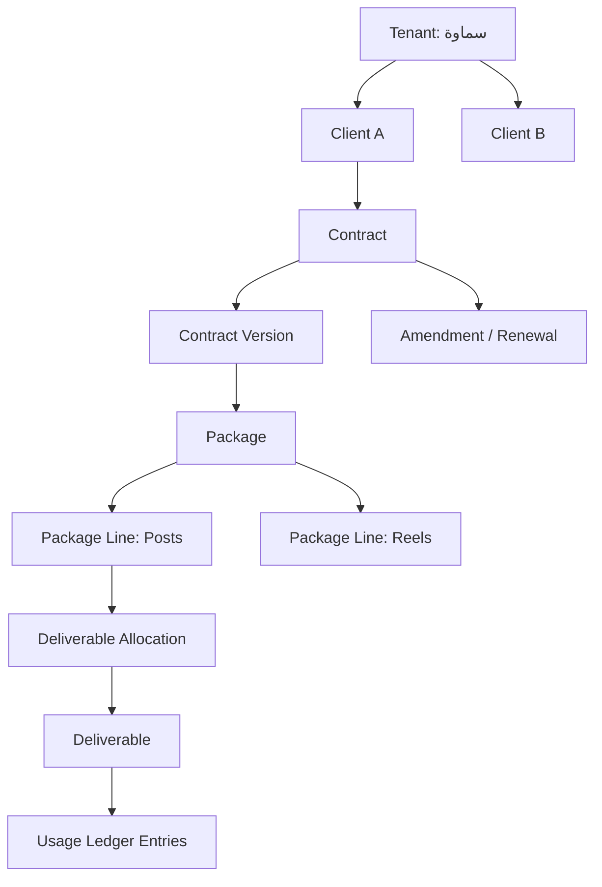

# Clients, Contracts, and Packages Model: شريك

**المرحلة:** Phase 04 - Core Domain Model, Conceptual Data Model & Business Invariants  
**نوع الوثيقة:** Conceptual Commercial Model  
**الحالة:** Draft for owner review  
**آخر تحديث:** 2026-06-22  

## 1. الغرض

هذه الوثيقة توضح علاقة Client بالعقد والباقة والبنود والمخرجات دون الدخول في فوترة مالية متقدمة أو تصميم قاعدة بيانات.

## 2. المفاهيم الأساسية

| المفهوم | التعريف | لا يعني | الحالة |
| --- | --- | --- | --- |
| Client | شركة عميلة داخل Tenant. | Tenant مستقل. | Confirmed |
| Contract | اتفاق زمني أو تجاري مع Client. | فاتورة أو نظام محاسبة. | Confirmed |
| Contract Version | لقطة تاريخية من العقد بعد إنشاء أو تعديل. | ملف PDF فقط. | Assumed |
| Package | تجميع بنود والتزامات ضمن عقد أو فترة. | اشتراك مالي متقدم. | Confirmed |
| Package Template | قالب لإعداد باقة متكررة. | باقة عميل فعلية. | Assumed |
| Contract Line | بند التزام في عقد. | جدول تقني. | Assumed |
| Package Line | وحدة كمية أو خدمة داخل باقة. | نوع مخرج فقط. | Assumed |
| Commercial Commitment | وعد تسليم قابل للتتبع. | مطالبة مالية. | Confirmed |
| Deliverable Allocation | ربط مخرج ببند أو Commitment. | استهلاك نهائي. | Assumed |
| Approved Extra Deliverable | مخرج خارج الباقة بموافقة إدارية. | تجاوز صامت. | Assumed |
| Amendment | تعديل عقد أو باقة يحفظ التاريخ. | تعديل مباشر للتاريخ السابق. | Assumed |
| Renewal | بدء فترة أو نسخة عقد جديدة. | تمديد بلا أثر تاريخي. | Assumed |

## 3. العلاقة المفاهيمية

## 4. أسئلة النموذج وإجابات V1

| السؤال | إجابة V1 المفاهيمية | التصنيف |
| --- | --- | --- |
| هل يمكن أن يكون للعميل أكثر من عقد؟ | نعم، يمكن تاريخيا أو حسب فترات مختلفة. | Assumed |
| هل يمكن وجود أكثر من عقد نشط؟ | يسمح فقط عند وجود سبب واضح مثل عقدين لخدمتين منفصلتين؛ وإلا يفضل عقد نشط رئيسي. | Open Question |
| هل يمكن للمخرج الارتباط ببند واحد أم عدة بنود؟ | الافتراضي بند واحد؛ الربط بعدة بنود يؤجل حتى توجد قاعدة تجارية. | Assumed |
| كيف نتعامل مع الخدمات الكمية؟ | Package Line لها Unit وQuantity وحجز واستهلاك. | Confirmed |
| كيف نتعامل مع الخدمات غير الكمية؟ | تعامل كCommercial Commitment أو Milestone بدون Ledger كمي مباشر. | Assumed |
| كيف نعامل خطة المحتوى أو التقرير الواحد؟ | Unit مستقلة مثل "خطة" أو "تقرير" بكمية واحدة. | Confirmed |
| كيف نعامل خدمة مستمرة مثل إدارة حساب؟ | Commitment مستمر يقاس بمراحل أو فترة، وليس منشورات فقط. | Open Question |
| كيف يحدث التجديد؟ | Renewal ينشئ فترة/نسخة Commitment جديدة ولا يمحو السابق. | Assumed |
| كيف تتغير الكميات دون تغيير التاريخ؟ | Amendment أو Package Adjustment مع سبب. | Confirmed |
| كيف نحفظ نسخة العقد التي أُنشئ المخرج على أساسها؟ | Deliverable Allocation يشير إلى Contract Version المفاهيمية. | Assumed |
| ماذا يحدث للمخرجات عند انتهاء العقد؟ | المفتوح يبقى تاريخيا ويحتاج قرار إكمال/إلغاء/نقل لفترة جديدة. | Assumed |
| ماذا يحدث عند تعديل العقد أثناء التنفيذ؟ | لا يغير مخرجات مفتوحة بصمت؛ يحتاج أثر واضح على كل Allocation. | Confirmed |

## 5. قواعد العقود والباقات

| ID | القاعدة | التصنيف |
| --- | --- | --- |
| BR-CCP-01 | كل Contract وPackage يتبع Client داخل Tenant محدد. | Confirmed |
| BR-CCP-02 | لا يمكن ربط Deliverable بعقد من Client آخر. | Confirmed |
| BR-CCP-03 | لا يتم تغيير الكميات التاريخية بصمت؛ يستخدم Amendment أو Adjustment. | Confirmed |
| BR-CCP-04 | لا نستخدم أوزان تحويل عامة بين أنواع المخرجات في V1. | Assumed من طلب المرحلة |
| BR-CCP-05 | كل Package Line له Unit وQuantity خاصان به. | Assumed من طلب المرحلة |
| BR-CCP-06 | المخرج الإضافي يحتاج Approved Extra Deliverable وAudit. | Assumed |
| BR-CCP-07 | المخرج الإضافي لا يستهلك باقة تلقائيا إلا إذا ربط رسميا ببند أو Amendment. | Assumed |
| BR-CCP-08 | الفوترة المالية المتقدمة خارج V1. | Confirmed |

## 6. أثر التعديلات

| الحالة | الأثر على التاريخ | الأثر على المخرجات المفتوحة |
| --- | --- | --- |
| زيادة كمية بند | تضاف كAmendment أو Adjustment. | يمكن حجز مخرجات جديدة، ولا يعاد حساب القديم بصمت. |
| تخفيض كمية بند | يحتاج قرار حول Reservations المفتوحة. | لا يلغى مخرج قائم تلقائيا. |
| تجديد شهر جديد | فترة جديدة أو نسخة Commitment جديدة. | مخرجات الشهر السابق تبقى مرتبطة بتاريخها. |
| إضافة خدمة غير كمية | Commitment جديد. | قد ينشئ Deliverable غير كمي أو Milestone. |
| مخرج خارج الباقة | يسجل Approved Extra Deliverable. | لا يؤثر على الرصيد إلا بربط رسمي. |

## 7. أمثلة

### Client A

- عقد شهري.
- 20 منشورا.
- 4 Reels.
- تقرير شهري.
- خطة محتوى.

عند إنشاء مخرج "منشور إطلاق حملة":

1. يرتبط بClient A وContract Version الحالي.
2. يخصص إلى Package Line "منشورات".
3. يرسل أمر إلى Usage Ledger لحجز 1 منشور.
4. لا يستهلك حتى التسليم النهائي.

### Client B

- 12 منشورا.
- فيديوهان.
- 5 تصاميم.
- تقرير واحد.

عند إضافة فيديو ثالث خارج الباقة:

1. لا يحجز من بند "فيديوهان" إذا لا يوجد رصيد.
2. يحتاج Approved Extra Deliverable.
3. يسجل سبب وموافقة إدارية.
4. إذا عُدل العقد لاحقا لإضافة فيديو ثالث، يمكن ربطه رسميا بAmendment.

## 8. Open Questions

| السؤال | التأثير | توصية V1 |
| --- | --- | --- |
| هل يوجد أكثر من عقد نشط لكل Client؟ | يؤثر على Allocation واختيار العقد. | اسمح فقط إذا كانت الخدمات منفصلة بوضوح. |
| هل الخدمات المستمرة تستهلك رصيدا؟ | يؤثر على Ledger. | عاملها كCommitment غير كمي في V1. |
| هل يسمح برصيد سالب؟ | يؤثر على الحجز. | Deny، إلا Approved Overage. |
| هل العميل يرى تفاصيل مالية؟ | يؤثر على Client Portal. | يعرض كميات وحالة فقط. |

