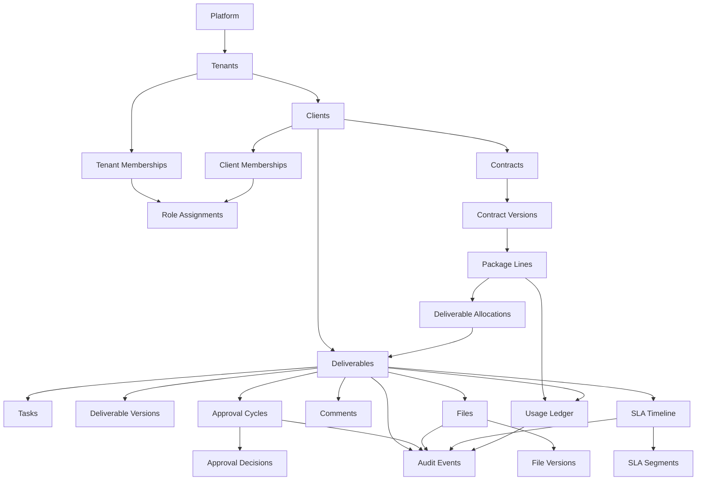

# Conceptual Relationships and Traceability: شريك

**المرحلة:** Phase 04 - Core Domain Model, Conceptual Data Model & Business Invariants  
**نوع الوثيقة:** Conceptual Relationships & Traceability Matrix  
**الحالة:** Draft for owner review  
**آخر تحديث:** 2026-06-22  

## 1. الغرض

هذه الوثيقة تربط متطلبات المنتج وقواعد التشغيل والصلاحيات بنموذج المجال. لا تستخدم أسماء جداول أو أعمدة، بل علاقات مفاهيمية بين كيانات المجال.

## 2. Conceptual Relationship Model

## 3. Traceability Matrix

| Product Requirement | Operating Rule | Permission ID | Domain Context | Entity/Aggregate | Invariant | Domain Event | State Machine | Open Question |
| --- | --- | --- | --- | --- | --- | --- | --- | --- |
| Multi-Tenant Isolation | Tenant يمثل الوكالة وسماوة أول Tenant | PERM.CLIENT.VIEW scoped | Tenant & Membership | Tenant، Membership | INV-001، INV-004 | TenantCreated، RoleAssigned | Tenant Membership | Platform roles content access |
| Client Isolation | العميل داخل Tenant ولا يرى غيره | PERM.CLIENT.VIEW، PERM.DELIV.VIEW | Client Management | Client، Client Membership | INV-001، INV-004 | ClientCreated | Client | Multi-client client user |
| Internal Comment Protection | internal_comment لا يظهر للعميل | PERM.COMMENT.INTERNAL_VIEW | Approvals & Collaboration | Comment Thread | INV-019 | CommentAdded | File/Comment Visibility | هل يعلق Client Viewer؟ |
| Internal Approval | لا إرسال قبل التعميد | PERM.APPROVAL.INTERNAL_GRANT | Approvals | Approval Cycle | INV-005، INV-006 | InternalApprovalGranted | Internal Approval | multi-level internal approval |
| Client Approval | الاعتماد على نسخة مرسلة | PERM.APPROVAL.CLIENT_GRANT | Approvals | Client Approval Cycle | INV-007 | ClientApprovalGranted | Client Approval | multi-approver |
| SLA Pause/Resume | انتظار العميل لا يحسب على سماوة | PERM.SLA.TIMER_CONTROL | SLA & Escalation | SLA Timeline | INV-015، INV-017 | SLAPaused، SLAResumed | SLA | أيام عمل/تقويم |
| Package Reservation/Consumption | الحجز عند الإنشاء والاستهلاك عند التسليم | PERM.DELIV.CREATE، PERM.DELIV.DELIVER | Usage & Balance | Usage Ledger | INV-011، INV-014 | PackageQuantityReserved، Consumed | Package Reservation | partial delivery |
| File Visibility | Internal Only لا يظهر للعميل | PERM.FILE.MARK_CLIENT_VISIBLE | Files & Assets | File Asset | INV-020، INV-021 | FileVisibilityChanged | File Visibility | file deletion policy |
| Temporary Delegation | تفويض مؤقت محدد | PERM.APPROVAL.DELEGATE | Membership | Temporary Delegation | INV-003 | TemporaryDelegationStarted | Temporary Delegation | self-service delegation |
| Auditability | كل قرار حساس له Audit | PERM.AUDIT.* | Audit & Activity | Audit Event Stream | INV-022 | AuditEntryRecorded | كل الحالات | Audit export |
| Reopening | إعادة فتح بسبب وأثر واضح | PERM.DELIV.REOPEN | Deliverables | Deliverable، SLA، Ledger | INV-028 | DeliverableReopened | Deliverable، SLA | SLA جديد أم استئناف؟ |
| Cancellation | إلغاء لا يستهلك رصيد غير مسلم | PERM.DELIV.CANCEL | Deliverables/Usage | Deliverable، Ledger | INV-012 | DeliverableCancelled، Released | Deliverable، Ledger | إلغاء بعد استهلاك |
| Contract Amendment | تعديل لا يمحو التاريخ | PERM.CONTRACT.MANAGE | Contracts | Contract Version | INV-014 | ContractAmended | Contract | أثر المخرجات المفتوحة |

## 4. Scenario Traceability Catalog

| # | Scenario | Actors | Aggregates | Commands | Preconditions | Events | State Changes | SLA Effects | Package Effects | Visibility Effects | Audit Events | Expected Outcome |
| --- | --- | --- | --- | --- | --- | --- | --- | --- | --- | --- | --- | --- |
| 1 | إنشاء مخرج وحجز كمية | PM | Deliverable، Ledger | CreateDeliverable، ReserveQuantity | Client/Package Line valid | DeliverableCreated، PackageQuantityReserved | none -> not_started | not_started | Reserved +1 | internal only | yes | مخرج جاهز للتنفيذ ورصيد محجوز |
| 2 | تحويل المخرج إلى مهام | PM/Owner | Deliverable، Task | CreateTasks | deliverable exists | TaskCreated | tasks planned | none | none | internal | yes | مهام داخلية مرتبطة بالمخرج |
| 3 | رفع كاتب المحتوى نسخة | Content Writer | File، Version | UploadVersion | assigned scope | FileUploaded، FileVersionCreated | no deliverable change | none | none | internal only | yes | نسخة داخلية قابلة للمراجعة |
| 4 | رفع المصمم تصميم | Designer | File Asset | UploadInternalFile | assigned scope | FileUploaded | none | none | none | internal only | yes | ملف تصميم داخلي |
| 5 | طلب مراجعة داخلية | Owner | Approval Cycle | RequestInternalReview | version exists | InternalReviewRequested | in_progress -> ready_for_internal_review | running | none | internal | yes | يظهر للإدارة |
| 6 | إعادة العمل للتعديل | PM/MM | Approval Cycle | RequestInternalChanges | reason | InternalChangesRequested | ready -> internal_changes_requested | running | none | hidden from client | yes | يعود للفريق |
| 7 | التعميد الداخلي | PM/MM | Approval Cycle | GrantInternalApproval | version reviewed | InternalApprovalGranted | ready -> internally_approved | running | none | not client-visible yet | yes | مؤهل للإرسال |
| 8 | إرسال النسخة للعميل | PM/AM | Deliverable، Approval | SendToClient | internally_approved | DeliverableSentToClient | internally_approved -> waiting_client_approval | paused waiting client | none | client sees sent version | yes | العميل يرى النسخة فقط |
| 9 | توقف SLA بانتظار العميل | System | SLA Timeline | PauseSLA | sent to client | SLAPaused | running -> paused | owner=client | none | status simplified | yes | لا يحسب على سماوة |
| 10 | طلب العميل تعديلا | Client Approver | Client Approval | RequestChanges | pending client | ClientChangesRequested | waiting -> client_changes_requested | resume | none | client comment visible | yes | يعود العمل للفريق |
| 11 | استئناف SLA بعد رد العميل | System | SLA Timeline | ResumeSLA | paused segment exists | SLAResumed | paused -> running | owner=team | none | management sees owner | yes | الوقت يعود لسماوة |
| 12 | اعتماد العميل | Client Approver | Client Approval | ClientApprove | sent version | ClientApprovalGranted | waiting -> client_approved | waiting ends | none | external decision visible | yes | جاهز للتسليم |
| 13 | التسليم النهائي | PM/MM | Deliverable، File | Deliver | approvals satisfied | DeliverableDelivered | ready -> delivered | completed | consume reservation | final visible | yes | المخرج مغلق |
| 14 | تحويل الحجز لاستهلاك | System | Usage Ledger | Consume | delivered + reservation | PackageQuantityConsumed | reserved -> consumed | none | Consumed +1 | client sees delivered count | yes | الرصيد مشتق صحيح |
| 15 | إلغاء مخرج وإعادة الرصيد | PM | Deliverable، Ledger | Cancel، Release | not delivered | DeliverableCancelled، Released | active -> cancelled | cancelled | reservation released | hide active work | yes | الرصيد يعود |
| 16 | مخرج خارج الباقة | Executive/PM | Deliverable | ApproveExtraDeliverable | reason | PackageOverageApproved، DeliverableCreated | none -> not_started | not_started | no auto consumption | internal until approved | yes | مخرج extra موثق |
| 17 | تعديل عقد أثناء وجود مخرجات مفتوحة | PM/Executive | Contract، Ledger | AmendContract | reason | ContractAmended | contract active/amended | open SLA assessed | adjustment/carry rules | client summary updated | yes | التاريخ محفوظ |
| 18 | إعادة فتح مخرج مسلم | PM/Executive | Deliverable، SLA | ReopenDeliverable | reason | DeliverableReopened | delivered -> in_progress via reopen | new/resumed segment per policy | no auto change | internal until resent | yes | معالجة موثقة |
| 19 | مغادرة موظف وإعادة إسناد | Tenant Admin/PM | Membership، Deliverable | TransferResponsibility | open work exists | ResponsibilityTransferred، MembershipSuspended | owners changed | delay owner may change | none | internal | yes | لا مخرجات بلا owner |
| 20 | محاولة عميل الوصول لبيانات عميل آخر | Client User | Permission/Audit | ViewResource | cross-client link | AccessDeniedCrossClient | no state change | none | none | denied | yes if policy | الوصول مرفوض |

## 5. Traceability Coverage Assessment

| المجال | التغطية |
| --- | --- |
| Tenant/Client isolation | مغطى في glossary، context map، tenancy model، invariants، scenarios. |
| Deliverable/Task/Kanban separation | مغطى في work model وstate machines. |
| Approvals linked to versions | مغطى في approvals model وstate machines. |
| SLA Timeline/Segments | مغطى في SLA model وevents. |
| Package Ledger | مغطى في ledger model وscenarios. |
| Files/Comments visibility | مغطى في approvals/files model وinvariants. |
| Permissions mapping | مغطى بتتبع Permission IDs من Phase 03. |
| Open Questions | مربوطة بملف المخاطر والأسئلة. |

