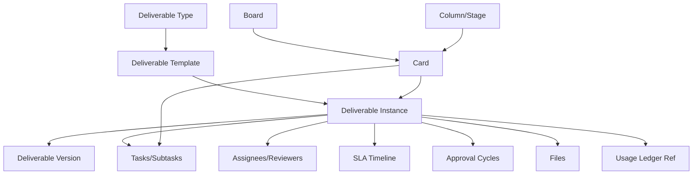

# Deliverables, Tasks, and Kanban Model: شريك

**المرحلة:** Phase 04 - Core Domain Model, Conceptual Data Model & Business Invariants  
**نوع الوثيقة:** Conceptual Work Model  
**الحالة:** Draft for owner review  
**آخر تحديث:** 2026-06-22  

## 1. الغرض

هذه الوثيقة تثبت الفرق بين المخرج والمهمة والكارت واللوحة. الهدف أن تبقى قواعد الأعمال داخل المخرج والاعتماد وSLA، وألا يتحول Kanban Stage إلى الحالة الوحيدة للنظام.

## 2. التعاريف الحاسمة

| المفهوم | التعريف | ليس |
| --- | --- | --- |
| Deliverable | نتيجة أو مخرج متفق عليه مع العميل. | مهمة داخلية أو كارت UI. |
| Task | عمل داخلي مطلوب لإنتاج المخرج. | التزام تجاري مع العميل. |
| Kanban Card | تمثيل مرئي لمخرج أو مهمة داخل لوحة. | Aggregate تجاري افتراضي. |
| Board | تنظيم تشغيلي للعمل. | عقد أو Workflow قانوني. |
| Column / Stage | موضع تشغيلي. | مصدر الحقيقة لكل حالات المجال. |

## 3. نموذج مفاهيمي

## 4. حالات المخرج التجارية

| الحالة | المعنى | Progress |
| --- | --- | --- |
| not_started | منشأ ولم يبدأ التنفيذ. | 0% |
| in_progress | بدأ التنفيذ. | 30% |
| ready_for_internal_review | ينتظر مراجعة داخلية. | 50% |
| internal_changes_requested | عاد للفريق بملاحظات داخلية. | 45% |
| internally_approved | نسخة محددة معتمدة داخليا. | 70% |
| waiting_client_approval | نسخة مرسلة للعميل. | 80% |
| client_changes_requested | العميل طلب تعديلا. | 65% |
| client_approved | العميل وافق. | 90% |
| ready_for_delivery | جاهز للتسليم النهائي. | 95% |
| delivered | تم التسليم. | 100% |
| cancelled | ألغي بسبب موثق. | لا يحتسب كتقدم |
| archived | محفوظ تاريخيا. | لا يحتسب كتقدم |

## 5. حالات المهمة التشغيلية

| الحالة | المعنى | علاقة بالمخرج |
| --- | --- | --- |
| planned | مهمة مخططة. | لا تبدأ SLA وحدها. |
| active | يعمل عليها شخص. | قد تدعم `in_progress`. |
| blocked | متوقفة بسبب مانع. | قد يؤثر على SLA/Delay Owner. |
| review_needed | تحتاج مراجعة داخلية مصغرة. | لا تساوي Internal Approval بالضرورة. |
| done | اكتملت المهمة. | لا تعني تسليم المخرج. |
| archived | أغلقت أو لم تعد نشطة. | تحفظ تاريخها. |

## 6. قواعد الربط

| ID | القاعدة | التصنيف |
| --- | --- | --- |
| BR-DTK-01 | كل Task داخل Deliverable يجب أن يرث Tenant/Client scope من المخرج. | Confirmed |
| BR-DTK-02 | نقل كارت لا يكفي لتجاوز Internal Approval. | Confirmed |
| BR-DTK-03 | نقل كارت إلى waiting_client_approval يتطلب internally_approved. | Confirmed |
| BR-DTK-04 | نقل كارت إلى delivered يتطلب Client Approval إذا كان مطلوبا أو سياسة no-client-approval. | Confirmed |
| BR-DTK-05 | تغيير المسؤول لا يغير الحالة أو SLA تلقائيا. | Confirmed |
| BR-DTK-06 | Deliverable Template يمكن أن ينشئ Tasks افتراضية، لكنها لا تستهلك رصيدا. | Assumed |
| BR-DTK-07 | Parent/Child Deliverables تستخدم فقط عند وجود تسليمات حقيقية فرعية، لا لمهام داخلية. | Assumed |

## 7. ما الذي يغير Progress؟

| المؤثر | يغير Progress؟ | السبب |
| --- | --- | --- |
| حالة المخرج التجارية | نعم | المصدر الأساسي. |
| اكتمال مهمة داخلية | لا مباشرة | قد يسمح بانتقال حالة لاحق. |
| رفع ملف | لا وحده | قد يؤهل للمراجعة. |
| تعميد داخلي | نعم | ينقل إلى 70%. |
| إرسال للعميل | نعم | ينقل إلى انتظار العميل. |
| تعليق داخلي | لا | محادثة لا قرار. |
| طلب تعديل العميل | نعم | يعيد Progress إلى مرحلة معالجة. |
| التسليم | نعم | 100%. |

## 8. ما الذي يمنع التسليم؟

- عدم وجود تعميد داخلي.
- مخرج يتطلب اعتماد عميل ولم يعتمد.
- عدم تحديد نسخة نهائية أو Final Asset عند الحاجة.
- وجود حجز باقة غير محسوم أو مخرج خارج الباقة بلا موافقة.
- ملف Internal Only يحاول الظهور كFinal.
- SLA أو تأخير لا يمنع التسليم بذاته، لكنه يظهر للإدارة ويتطلب تفسير إذا كان Overdue.

## 9. أثر نقل الكارت

| الحركة | القرار المفاهيمي |
| --- | --- |
| داخل مراحل التنفيذ | يسمح إذا كان الفاعل ضمن scope. |
| إلى جاهز للمراجعة الداخلية | يحتاج نسخة أو محتوى قابل للمراجعة. |
| إلى معتمد داخليا | لا يسمح بمجرد drag؛ يحتاج Approval Decision. |
| إلى بانتظار العميل | يحتاج Internal Approval وPermission SEND_CLIENT. |
| إلى تم التسليم | يحتاج Delivery command وشروطه. |
| حركة فاشلة | rollback في UI وتسجيل محاولة عند الحساسية. |

## 10. تجنب تكرار الحالة

| خطر | الحماية |
| --- | --- |
| حالة المخرج تكرر Stage حرفيا | Stage يعرض الحالة ولا يملكها. |
| Task done يجعل المخرج delivered | ممنوع؛ delivery command مستقل. |
| Card moved يجعل العميل يرى المخرج | ممنوع دون Visibility/Approval. |
| Progress يدوي يناقض الحالة | Progress مشتق من policy. |

## 11. أمثلة

### تحويل المخرج إلى مهام داخلية

مخرج Client A "Reel افتتاحي" ينتج عنه:

- Task كتابة السكربت.
- Task تصميم ستوريبورد.
- Task مونتاج.
- Task مراجعة جودة داخلية.

اكتمال هذه المهام لا يرسل المخرج للعميل. فقط عند رفع نسخة وطلب مراجعة داخلية ثم تعميد داخلي يصبح مؤهلا للإرسال.

### مغادرة موظف

إذا غادر مصمم يملك ثلاث مهام:

1. تعلق Membership أو تزال بعد نقل المسؤوليات.
2. كل Task نشطة تحصل على Assignee جديد.
3. Deliverable owner يتغير فقط إذا كان المصمم هو Owner.
4. لا يمحى تاريخ الملفات والتعليقات التي رفعها.

