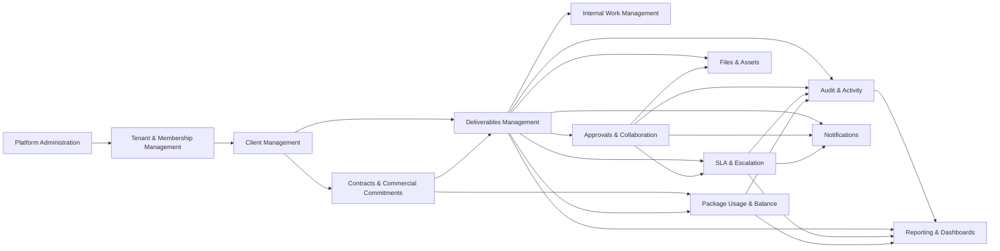

# Domain Context Map: شريك

**المرحلة:** Phase 04 - Core Domain Model, Conceptual Data Model & Business Invariants  
**نوع الوثيقة:** Bounded Context Map  
**الحالة:** Draft for owner review  
**آخر تحديث:** 2026-06-22  

## 1. الغرض

هذه الوثيقة تقسم شريك إلى مجالات مفهومية واضحة. الهدف ليس بناء Microservices أو Containers، بل تحديد من يملك اللغة والقواعد والأحداث حتى لا يبتلع Context واحد كل شيء.

## 2. الخريطة المختصرة

## 3. تصنيف المجالات

| Context | التصنيف | الغرض | يمتلك | يصدر أحداث | يستقبل أحداث | يتكامل مع | لا يجب أن يمتلك | مخاطر الدمج |
| --- | --- | --- | --- | --- | --- | --- | --- | --- |
| Platform Administration | Generic | حوكمة المنصة وTenants دون محتوى يومي | Platform، Platform Role | TenantCreated، PlatformUserCreated | AuditExportRequested | Tenant، Audit | مخرجات العملاء أو ملفاتهم | تحويل Platform Admin إلى content superuser |
| Tenant & Membership Management | Supporting | إدارة Tenant والعضويات والأدوار والنطاقات | Tenant، Membership، Role Assignment، Delegation | TenantMembershipInvited، RoleAssigned | ClientCreated، DeliverableAssigned | Permissions، Audit | قرارات الاعتماد أو الرصيد | خلط User Identity بالدور الثابت |
| Client Management | Supporting | تعريف Client وعزل نطاقه داخل Tenant | Client، Client Membership | ClientCreated، ClientMemberInvited | ContractActivated | Contracts، Deliverables، Files | أن يصبح Tenant مستقلًا | كسر cross-client isolation |
| Contracts & Commercial Commitments | Supporting | حفظ الاتفاقات والباقات والبنود والنسخ | Contract، Contract Version، Package Line، Amendment | ContractCreated، ContractAmended، PackageLineCreated | DeliverableDelivered | Usage Ledger، Deliverables | حساب الرصيد كعداد نهائي | فقد تاريخ التعديلات |
| Deliverables Management | Core | إدارة المخرج كقلب النظام ودورة حياته | Deliverable، Deliverable Version، Progress Policy | DeliverableCreated، WorkStarted، DeliverableDelivered | ClientApprovalGranted، SLABreached | Approvals، SLA، Files، Tasks، Usage | التعليقات الداخلية أو الملفات كملكية مباشرة كاملة | Aggregate ضخم يملك كل شيء |
| Internal Work Management | Supporting | تشغيل مهام الفريق والKanban | Task، Board، Stage، Card | TaskCompleted، CardMoved | DeliverableAssigned | Deliverables، SLA | تجاوز قواعد المخرج بمجرد سحب كارت | تحويل Stage إلى business state وحيد |
| Approvals & Collaboration | Core | التعميد الداخلي واعتماد العميل والتعليقات | Approval Cycle، Approval Decision، Comment Thread | InternalApprovalGranted، ClientChangesRequested | DeliverableSentToClient | Deliverables، Files، SLA، Audit | استهلاك الباقة أو إغلاق المخرج وحده | خلط Internal Approval مع Client Approval |
| SLA & Escalation | Core | حساب الزمن والخطر والتوقف والتصعيد | SLA Policy، SLA Timeline، SLA Segment، Escalation | SLAStarted، SLAPaused، SLABreached | WorkStarted، DeliverableSentToClient | Deliverables، Approvals، Reporting | حالة المخرج التجارية | تعديل SLA لإخفاء التأخير |
| Files & Assets | Supporting | إدارة الملفات والنسخ والرؤية النهائية | File Asset، File Version، Final Asset | FileUploaded، FileVisibilityChanged | InternalApprovalGranted، DeliverableDelivered | Approvals، Deliverables، Audit | قرار الاعتماد نفسه | تسرب Internal Only للعميل |
| Package Usage & Balance | Supporting | حفظ تاريخ الحجز والاستهلاك والتحرير | Usage Ledger، Reservation، Consumption، Adjustment | PackageQuantityReserved، PackageQuantityConsumed | DeliverableCreated، DeliverableCancelled | Contracts، Deliverables، Reporting | العقد التجاري بالكامل | عدادات غير قابلة للتدقيق |
| Audit & Activity | Supporting | تسجيل من فعل ماذا ومتى وبأي Scope | Audit Event، Activity View | AuditEntryRecorded | كل الأحداث الحساسة | كل المجالات | أن يكون مصدر الحالة الوحيد | بناء الحالة من audit فقط |
| Notifications | Generic | تنبيه المستخدمين دون امتلاك قرار المجال | Notification Event، Preference | NotificationQueued | Domain Events | Approvals، SLA، Tasks | تغيير حالة مخرج | إشعارات تصبح Workflow |
| Reporting & Dashboards | Generic | Read Models ومؤشرات للعميل والإدارة | Projection، Metric، Dashboard View | ReportViewed | Domain/Audit Events | كل المجالات | قواعد الأعمال الأصلية | اختلاف التقرير عن مصدر الحقيقة |

## 4. Core / Supporting / Generic

| التصنيف | Contexts |
| --- | --- |
| Core Domain | Deliverables Management، Approvals & Collaboration، SLA & Escalation |
| Supporting Domain | Tenant & Membership، Client Management، Contracts & Commercial Commitments، Internal Work Management، Files & Assets، Package Usage & Balance، Audit & Activity |
| Generic Domain | Platform Administration، Notifications، Reporting & Dashboards |

## 5. قواعد التكامل بين المجالات

- Deliverables Management يحتفظ بحالة المخرج، لكنه يشير إلى Approval Cycle وSLA Timeline وUsage Ledger بالهوية لا بالامتلاك الكامل.
- Approvals & Collaboration لا يعتمد نسخة غير موجودة أو غير معتمدة داخليا في حالة Client Approval.
- Internal Work Management لا يسمح لحركة Kanban بتجاوز Invariants الخاصة بالمخرج.
- Files & Assets لا تغير Visibility إلى Client Final دون Permission وقرار صريح.
- Usage Ledger يستقبل أوامر من Deliverable/Contract، لكنه لا يعدل العقد أو المخرج مباشرة.
- Audit & Activity يسجل الأثر ولا يصبح مصدر الحقيقة الوحيد لحالة المجال.

## 6. BMAD Review

| زاوية | النتيجة |
| --- | --- |
| Analyst | الحدود تمنع الخلط بين Tenant/Client وDeliverable/Task. |
| PM | Core Domain مطابق لقلب V1: المخرج، الاعتماد، SLA. |
| UX | Reporting وClient Portal يمكن أن يكونا Views لا يملكان قواعد المجال. |
| QA | كل Context يصدر Events قابلة للتحويل لاحقا لاختبارات قبول. |
| Security | العزل والرؤية تظهر كمسؤولية مشتركة بين Contexts، لا كطبقة UI فقط. |

