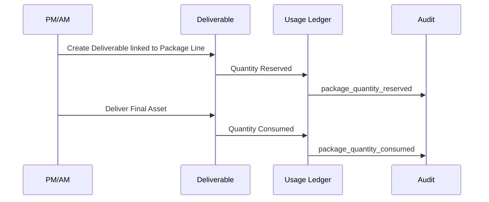

# Package Balance and Usage Ledger: شريك

**المرحلة:** Phase 04 - Core Domain Model, Conceptual Data Model & Business Invariants  
**نوع الوثيقة:** Conceptual Ledger Model  
**الحالة:** Draft for owner review  
**آخر تحديث:** 2026-06-22  

## 1. الغرض

هذه الوثيقة تمنع الاعتماد على عداد mutable مثل `remaining_posts = 12` كمصدر حقيقة. الرصيد في شريك يجب أن يكون مشتقا من Usage Ledger قابل للتدقيق.

## 2. المعادلة المفاهيمية

```text
Available = Committed - Reserved - Consumed + Released ± Adjustments
```

المعادلة عرض مشتق، وليست مصدر التاريخ. المصدر هو Entries متتابعة لها سبب وActor وScope.

## 3. Ledger Events

| الحدث | متى يحدث؟ | الأثر | عكسي؟ |
| --- | --- | --- | --- |
| Commitment Added | عند إنشاء بند باقة أو تعديل عقد. | يزيد committed. | عبر Amendment/Adjustment |
| Quantity Reserved | عند إنشاء مخرج مرتبط ببند. | يزيد reserved. | Reservation Released |
| Reservation Released | عند إلغاء مخرج غير مسلم أو استبدال قبل الاستهلاك. | ينقص reserved أو يزيد released. | Quantity Reserved جديد |
| Quantity Consumed | عند التسليم النهائي. | ينقل من reserved إلى consumed. | Consumption Reversed |
| Consumption Reversed | عند تصحيح إداري بعد استهلاك. | يعكس استهلاك بسبب موثق. | Quantity Consumed |
| Administrative Adjustment | تصحيح أو قرار مالك. | موجب أو سالب. | Adjustment معاكس |
| Contract Amendment | تعديل رسمي في الكمية. | Entry تاريخي جديد. | Amendment جديد |
| Carry Forward | ترحيل رصيد. | ينقل بين فترات. | Adjustment |
| Expiration | انتهاء رصيد فترة. | يقلل available للفترة. | Adjustment إذا أعيد |

## 4. قواعد الحجز والاستهلاك

| السؤال | القاعدة | التصنيف |
| --- | --- | --- |
| متى يحدث الحجز؟ | عند إنشاء Deliverable مرتبط بPackage Line. | Confirmed |
| متى يتحول الحجز لاستهلاك؟ | عند التسليم النهائي. | Confirmed |
| ماذا عند الإلغاء؟ | يحرر الحجز إذا لم يستهلك. | Confirmed |
| ماذا عند الاستبدال؟ | يحرر القديم ويحجز الجديد أو ينقل الحجز بحدثين واضحين. | Assumed |
| ماذا عند إعادة الفتح؟ | لا يغير الرصيد تلقائيا؛ يحتاج سبب وسياسة. | Open Question |
| ماذا عند تسليم جزئي؟ | يحتاج Partial Delivery policy؛ يؤجل إلا إذا اعتمده المالك. | Open Question |
| ماذا عند زيادة العقد؟ | Contract Amendment أو Commitment Added. | Confirmed |
| ماذا عند انتهاء الفترة؟ | Expiration أو Carry Forward حسب سياسة العقد. | Open Question |
| هل يسمح بالرصيد السالب؟ | لا، إلا Approved Overage. | Assumed |
| من يملك Adjustment؟ | Executive/Tenant Owner/PM بتفويض حسب الحساسية. | Assumed |
| ماذا يظهر للعميل؟ | committed، delivered/consumed، remaining مبسط، لا تفاصيل داخلية حساسة. | Assumed |

## 5. علاقة Ledger بالمخرج



## 6. مثال Client A داخل Tenant سماوة

### الالتزام

| Package Line | Committed |
| --- | --- |
| منشورات | 20 |
| Reels | 4 |
| تقرير شهري | 1 |
| خطة محتوى | 1 |

### سيناريو حسابي

| الخطوة | الحدث | Posts Available | Reels Available | ملاحظات |
| --- | --- | --- | --- | --- |
| 1 | Commitment Added: 20 posts, 4 reels | 20 | 4 | بداية العقد الشهري |
| 2 | Reserve post for Deliverable P1 | 19 | 4 | حجز لا استهلاك |
| 3 | Reserve reel for Deliverable R1 | 19 | 3 | حجز Reel |
| 4 | Cancel P1 before delivery | 20 | 3 | تحرير حجز المنشور |
| 5 | Deliver R1 | 20 | 3 available, 1 consumed | الحجز تحول لاستهلاك |
| 6 | Add extra post approved outside package | 20 | 3 | لا يستهلك posts تلقائيا |

## 7. مثال Client B داخل Tenant سماوة

### الالتزام

| Package Line | Committed |
| --- | --- |
| منشورات | 12 |
| فيديوهات | 2 |
| تصاميم | 5 |
| تقرير | 1 |

### سيناريو حسابي

| الخطوة | الحدث | Designs Available | Videos Available | ملاحظات |
| --- | --- | --- | --- | --- |
| 1 | Commitment Added | 5 | 2 | بداية الفترة |
| 2 | Reserve 2 designs | 3 | 2 | مخرجان تصميم مفتوحان |
| 3 | Deliver design D1 | 3 available, 1 consumed | 2 | D1 استهلك |
| 4 | Replace design D2 with video | 4 | 1 | Release design reservation ثم reserve video |
| 5 | Request third video | 4 | 1 أو 0 حسب الحجوزات | يحتاج Overage أو Amendment |
| 6 | Contract Amendment adds 1 video | 4 | +1 committed | يحفظ التاريخ |

## 8. Invariants

| ID | القاعدة |
| --- | --- |
| BR-LEDGER-01 | لا تعديل مباشر للرصيد دون Ledger Entry. |
| BR-LEDGER-02 | كل Entry لها Scope: Tenant، Client، Contract/Package، وربما Deliverable. |
| BR-LEDGER-03 | لا استهلاك قبل التسليم النهائي. |
| BR-LEDGER-04 | تحرير الحجز لا يستخدم لعكس استهلاك؛ الاستهلاك يعكس بReversal. |
| BR-LEDGER-05 | وحدات مختلفة لا تتحول بينها دون قاعدة صريحة. |
| BR-LEDGER-06 | Approved Extra Deliverable لا يستهلك رصيد الباقة تلقائيا. |
| BR-LEDGER-07 | Contract Amendment لا يعيد كتابة entries القديمة. |

## 9. Open Questions

| السؤال | لماذا يؤثر؟ | توصية V1 |
| --- | --- | --- |
| هل يسمح Carry Forward؟ | يؤثر على انتهاء الباقات الشهرية. | Open Question |
| هل يوجد Partial Delivery؟ | يؤثر على الاستهلاك الجزئي. | يؤجل إلا إذا مطلوب تشغيليا. |
| هل إعادة الفتح تستهلك رصيدا جديدا؟ | يؤثر على عدالة العميل والفريق. | حسب سبب الفتح. |
| هل يرى العميل Ledger كامل؟ | حساسية وتبسيط UX. | يرى ملخصا فقط. |

