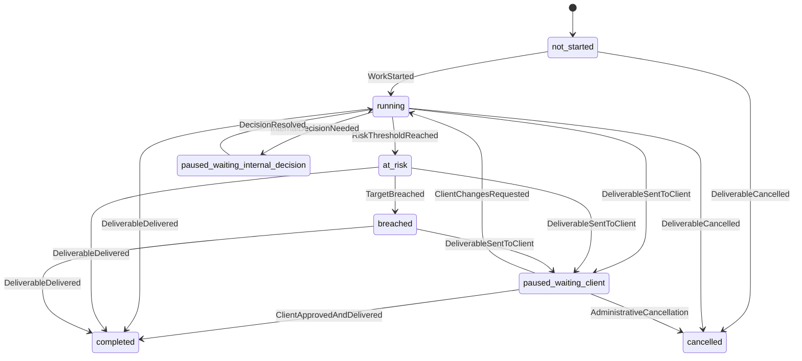

# SLA, Escalation, and Business Calendar Model: شريك

**المرحلة:** Phase 04 - Core Domain Model, Conceptual Data Model & Business Invariants  
**نوع الوثيقة:** Conceptual SLA Model  
**الحالة:** Draft for owner review  
**آخر تحديث:** 2026-06-22  

## 1. الغرض

SLA في شريك ليس موعدا نهائيا فقط. يجب أن يحفظ تاريخ الزمن على شكل Timeline وSegments حتى نستطيع فصل وقت عمل الفريق عن وقت انتظار العميل أو القرار الداخلي.

## 2. مفاهيم SLA

| المفهوم | التعريف |
| --- | --- |
| SLA Policy | قواعد الزمن حسب نوع المخرج أو Tenant. |
| SLA Target | الهدف الزمني أو التاريخ المتوقع. |
| SLA Clock | الحالة الجارية: Not Started/Running/Paused/Completed. |
| SLA Timeline | سلسلة Segments تحكي تاريخ الزمن. |
| SLA Segment | مقطع Running أو Paused أو Completed مع سبب ومالك وقت. |
| Business Calendar | أيام وساعات العمل ومنطقة Tenant. |
| Pause Reason | سبب التوقف مثل انتظار العميل. |
| Delay Owner | من يحسب عليه الوقت. |
| Risk Threshold | متى يصبح At Risk. |
| Breach | تجاوز SLA محسوب على سماوة أو جهة محددة. |
| Escalation | رفع للتدخل. |
| Resolution | إغلاق تصعيد أو تسوية سبب التأخير. |

## 3. State Diagram

## 4. متى يبدأ ويتوقف ويستأنف؟

| السؤال | القاعدة | التصنيف |
| --- | --- | --- |
| متى يبدأ SLA؟ | عند WorkStarted أو انتقال المخرج إلى التنفيذ. | Confirmed |
| هل يبدأ عند إنشاء المخرج؟ | لا، الإنشاء يحجز الرصيد ولا يبدأ الزمن. | Confirmed |
| متى يتوقف؟ | عند انتظار العميل أو قرار داخلي مصنف كPause. | Confirmed |
| من يستطيع إيقافه؟ | النظام نتيجة حدث مجال، أو PM/MM/Executive بسبب موثق. | Assumed |
| ماذا عند انتظار العميل؟ | Segment paused_waiting_client بDelay Owner = Client. | Confirmed |
| ماذا عند انتظار الإدارة؟ | paused_waiting_internal_decision بDelay Owner داخلي. | Confirmed |
| ماذا عند Blocker داخلي؟ | يبقى Running أو At Risk/Overdue حسب السياسة، مع Delay Owner داخلي. | Assumed |
| متى يستأنف؟ | عند طلب العميل تعديلا، أو عودة مدخل مطلوب، أو حسم القرار الداخلي. | Confirmed |
| ما الفرق بين At Risk وBreached؟ | At Risk تحذير قبل تجاوز الهدف؛ Breached تجاوز فعلي. | Confirmed |
| كيف تسجل المسؤولية؟ | في Segment وDelay Owner وAudit. | Confirmed |

## 5. تعديل الموعد والتجاوز

| العملية | القاعدة |
| --- | --- |
| تغيير الموعد | يحتاج سبب وصلاحية ولا يمحو التاريخ السابق. |
| SLA Override | استثناء إداري حساس يضاف كحدث، لا يبدل timeline بصمت. |
| تصحيح Pause Reason | يحتاج Audit حتى لا يستخدم لإخفاء التأخير. |
| التسوية بعد التأخير | Resolution تسجل سبب الإغلاق، ولا تمحو Breach. |

## 6. إعادة الفتح

| الخيار | المزايا | المخاطر | توصية V1 | التصنيف |
| --- | --- | --- | --- | --- |
| استئناف SLA الأصلي | يحفظ السياق | قد يظلم الفريق إن كان طلبا جديدا | فقط للتصحيح ضمن التسليم | Assumed |
| إنشاء SLA Segment جديد داخل نفس Timeline | يحفظ التاريخ ويميز فترة ما بعد التسليم | يحتاج سياسة واضحة | التوصية المفاهيمية | Assumed |
| إنشاء مخرج جديد | أوضح تجاريا للطلبات الجديدة | يزيد عدد المخرجات | عند طلب جديد خارج التسليم | Assumed |
| حسم نهائي | يحتاج قرار مالك | يؤثر على التقارير | Open Question |

## 7. Business Calendar

| العنصر | قاعدة V1 |
| --- | --- |
| Timezone | يستخدم Tenant Timezone. |
| Working Days | قابلة للتحديد على مستوى Tenant. |
| Working Hours | يدعمها النموذج مستقبلا، ويمكن تبسيطها في V1. |
| Holidays | تؤجل كإعداد متقدم لكن لا يمنع النموذج دعمها. |
| User Timezone | للعرض فقط، لا لحساب SLA الرسمي. |

## 8. Timeline Examples

### 8.1 انتظار العميل لا يحسب على سماوة

| التاريخ | الحدث | Segment | Delay Owner |
| --- | --- | --- | --- |
| 1 يوليو 2026 | WorkStarted | Running | Samawah Team |
| 5 يوليو 2026 | SentToClient | Paused | Client |
| 9 يوليو 2026 | ClientChangesRequested | Running | Samawah Team |
| 11 يوليو 2026 | Delivered | Completed | None |

المدة من 5 إلى 9 يوليو لا تحسب كتأخير على سماوة.

### 8.2 انتظار قرار داخلي

| التاريخ | الحدث | Segment | Delay Owner |
| --- | --- | --- | --- |
| 3 يوليو | ReadyForInternalReview | Running أو Paused internal حسب السياسة | Internal Decision |
| 7 يوليو | InternalApprovalGranted | Running | Samawah Team |

ينبغي أن يظهر هذا للإدارة كقرار داخلي، لا كوقت عميل.

## 9. Invariants

| ID | القاعدة |
| --- | --- |
| BR-SLA-DM-01 | لا Running وPaused في الوقت نفسه. |
| BR-SLA-DM-02 | لا Resume دون Pause مفتوح سابق. |
| BR-SLA-DM-03 | كل Pause له سبب وDelay Owner. |
| BR-SLA-DM-04 | انتظار العميل لا يحسب على سماوة. |
| BR-SLA-DM-05 | تعديل الموعد أو Override لا يمحو Segments السابقة. |
| BR-SLA-DM-06 | العميل يرى حالة مبسطة فقط ما لم يعتمد المالك تفاصيل delay owner. |

## 10. Open Questions

| السؤال | التأثير | توصية V1 |
| --- | --- | --- |
| أيام عمل أم أيام تقويمية؟ | يؤثر على كل حسابات SLA. | Business Calendar على مستوى Tenant، ولو ببساطة. |
| عتبة At Risk لكل نوع مخرج؟ | يؤثر على Escalation. | سياسة Tenant/Type لاحقا. |
| ظهور delay owner للعميل؟ | يؤثر على بوابة العميل. | حالة مبسطة فقط. |
| مدة انتظار العميل قبل التصعيد؟ | يؤثر على Notifications. | Assumed per Tenant. |

