# State Machines and Transition Matrices: شريك

**المرحلة:** Phase 04 - Core Domain Model, Conceptual Data Model & Business Invariants  
**نوع الوثيقة:** Conceptual State Machines  
**الحالة:** Draft for owner review  
**آخر تحديث:** 2026-06-22  

## 1. الغرض

هذه الوثيقة تمنع Giant Status Enum عبر فصل حالات العضوية والعميل والعقد والمخرج والمهمة والاعتماد وSLA والرصيد والملفات والدعوات والتفويض.

## 2. Tenant Membership

**الحالات:** invited، active، suspended، removed، offboarded.

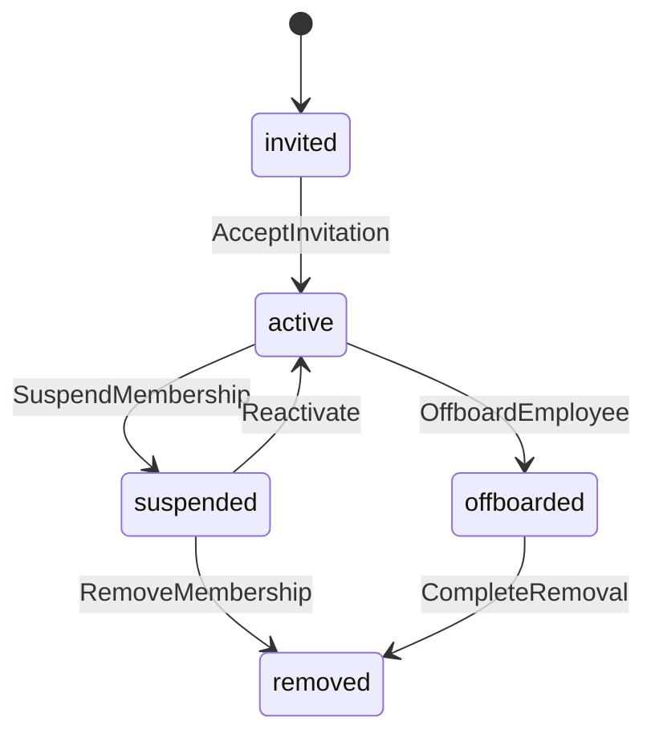

| From | To | Command | Actor/Permission | Preconditions | Invariants | Side Effects | Events | Audit | SLA | Package | Notification | Invalid Behavior |
| --- | --- | --- | --- | --- | --- | --- | --- | --- | --- | --- | --- | --- |
| invited | active | AcceptInvitation | invited user | invitation valid | scope exists | membership active | TenantMembershipActivated | Yes | None | None | welcome | Reject expired invite |
| active | suspended | SuspendMembership | PERM.USR.SUSPEND | no open ownership or transfer plan | audit retained | access denied | MembershipSuspended | Yes | reassignment may affect SLA | None | notify managers | Block if active owner no transfer |
| active | offboarded | OffboardEmployee | PERM.USR.RESPONSIBILITY_TRANSFER | responsibilities transferred | history retained | owner changes | ResponsibilityTransferred | Yes | owner-related delay recorded | None | notify team | Reject if open deliverables orphaned |

## 3. Client

**الحالات:** draft، active، paused، archived.

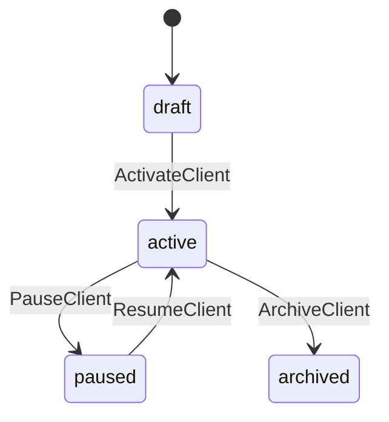

| From | To | Command | Actor/Permission | Preconditions | Invariants | Side Effects | Events | Audit | SLA | Package | Notification | Invalid Behavior |
| --- | --- | --- | --- | --- | --- | --- | --- | --- | --- | --- | --- | --- |
| draft | active | ActivateClient | PERM.CLIENT.UPDATE | tenant scope valid | client inside tenant | client usable | ClientActivated | Yes | None | None | optional | Reject cross-tenant |
| active | paused | PauseClient | Tenant Admin/PM | reason | no new work without permission | flag client | ClientPaused | Yes | active work reviewed | reservations unchanged | notify PM | Reject silent pause |
| active | archived | ArchiveClient | PERM.CLIENT.ARCHIVE | open work handled | no deletion of history | client hidden from active lists | ClientArchived | Yes | open SLA closed/handled | commitments closed/handled | notify admins | Reject with open deliverables |

## 4. Contract

**الحالات:** draft، active، amended، ended، archived.

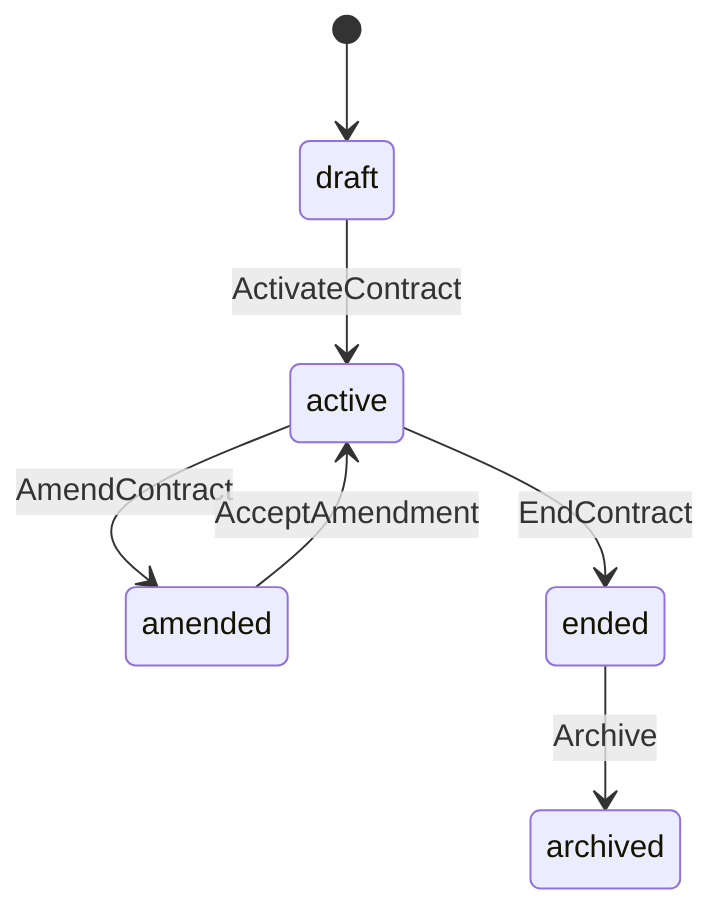

| From | To | Command | Actor/Permission | Preconditions | Invariants | Side Effects | Events | Audit | SLA | Package | Notification | Invalid Behavior |
| --- | --- | --- | --- | --- | --- | --- | --- | --- | --- | --- | --- | --- |
| draft | active | ActivateContract | PERM.CONTRACT.MANAGE | client active | contract client scope | commitments active | ContractActivated | Yes | None | CommitmentAdded | notify PM | Reject no lines |
| active | amended | AmendContract | PERM.CONTRACT.MANAGE | reason | history not overwritten | new version/amendment | ContractAmended | Yes | open work assessed | Adjustment possible | notify managers | Reject silent quantity change |
| active | ended | EndContract | PM/Executive | period ended or decision | open deliverables handled | no new normal allocation | ContractEnded | Yes | open SLA assessed | Expiration/Carry forward | notify client/admin | Reject unresolved reservations |

## 5. Deliverable Lifecycle

**الحالات:** not_started، in_progress، ready_for_internal_review، internal_changes_requested، internally_approved، waiting_client_approval، client_changes_requested، client_approved، ready_for_delivery، delivered، cancelled، archived.

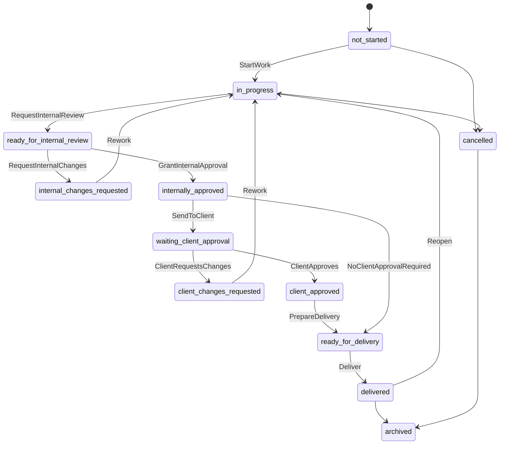

| From | To | Command | Actor/Permission | Preconditions | Invariants | Side Effects | Events | Audit | SLA | Package | Notification | Invalid Behavior |
| --- | --- | --- | --- | --- | --- | --- | --- | --- | --- | --- | --- | --- |
| none | not_started | CreateDeliverable | PERM.DELIV.CREATE | client/contract scope valid | no cross-client | create + reserve | DeliverableCreated | Yes | not started | Reserve if linked | notify owner | Reject no scope |
| not_started | in_progress | StartWork | PERM.DELIV.START | owner + dates | owner exists | active work | WorkStarted | Yes | SLAStarted | none | notify team | Reject missing owner |
| in_progress | ready_for_internal_review | RequestInternalReview | PERM.DELIV.SUBMIT_INTERNAL | version/content exists | review not empty | review cycle opens | InternalReviewRequested | Yes | running | none | notify reviewers | Reject no version |
| ready_for_internal_review | internally_approved | GrantInternalApproval | PERM.APPROVAL.INTERNAL_GRANT | reviewer authorized | version fixed | eligible send/delivery | InternalApprovalGranted | Yes | running | none | notify AM | Reject self-approval if policy denies |
| internally_approved | waiting_client_approval | SendToClient | PERM.DELIV.SEND_CLIENT | requires client approval | internal approval exists | client visibility | DeliverableSentToClient | Yes | SLAPaused | none | notify client | Reject without approval |
| waiting_client_approval | client_changes_requested | ClientRequestsChanges | PERM.DELIV.CLIENT_CHANGE_REQUEST | client approver + reason | version sent | rework needed | ClientChangesRequested | Yes | SLAResumed | none | notify team | Reject viewer |
| waiting_client_approval | client_approved | ClientApproves | PERM.DELIV.CLIENT_APPROVE | version sent | approver scope | approval recorded | ClientApprovalGranted | Yes | waiting ends | none | notify PM | Reject wrong client/version |
| ready_for_delivery | delivered | Deliver | PERM.DELIV.DELIVER | approvals satisfied + final asset | no premature consumption | close deliverable | DeliverableDelivered | Yes | completed | Consume | notify client | Reject missing approval |
| any pre-delivery | cancelled | Cancel | PERM.DELIV.CANCEL | reason | release if not consumed | close work | DeliverableCancelled | Yes | cancelled | Release reservation | notify stakeholders | Reject no reason |
| delivered | in_progress | Reopen | PERM.DELIV.REOPEN | reason + policy | history retained | follow-up work | DeliverableReopened | Yes | reopen policy | no automatic change | notify managers | Reject direct delivered->in_progress without Reopen command |

## 6. Task Lifecycle

**الحالات:** planned، active، blocked، review_needed، done، archived.

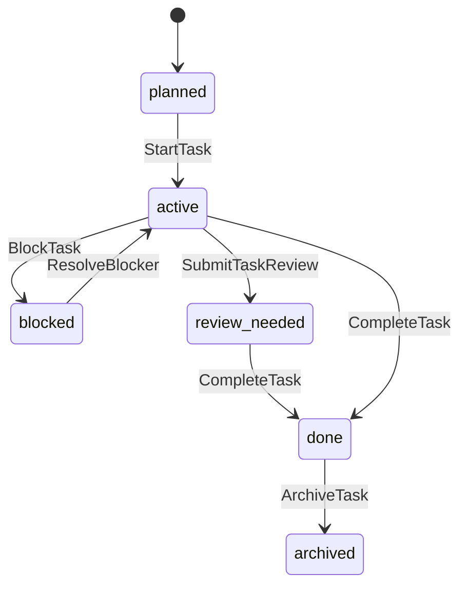

| From | To | Command | Actor/Permission | Preconditions | Invariants | Side Effects | Events | Audit | SLA | Package | Notification | Invalid Behavior |
| --- | --- | --- | --- | --- | --- | --- | --- | --- | --- | --- | --- | --- |
| planned | active | StartTask | assignee/PM | task scoped to deliverable | inherits client scope | task active | TaskStarted | Yes | may support work started | none | assignee | Reject cross-client task |
| active | blocked | BlockTask | assignee/PM | reason | blocker visible internally | delay owner candidate | TaskBlocked | Yes | may mark at risk | none | PM | Reject no reason |
| active/review_needed | done | CompleteTask | assignee/PM | work complete | does not deliver parent | task done | TaskCompleted | Yes | none | none | owner | Reject if used as delivery |

## 7. Internal Approval

**الحالات:** not_requested، pending_review، changes_requested، approved، withdrawn، superseded.

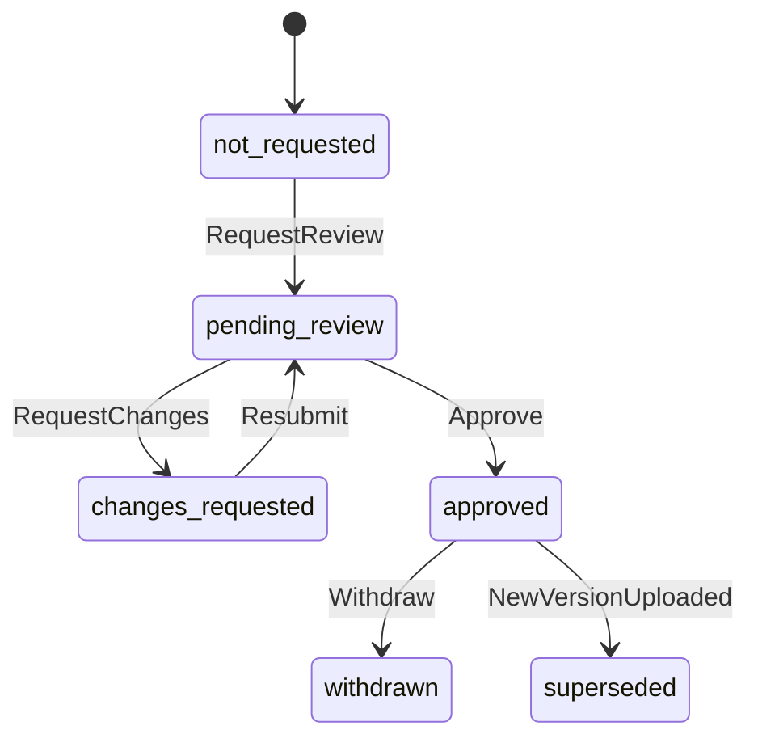

| From | To | Command | Actor/Permission | Preconditions | Invariants | Side Effects | Events | Audit | SLA | Package | Notification | Invalid Behavior |
| --- | --- | --- | --- | --- | --- | --- | --- | --- | --- | --- | --- | --- |
| not_requested | pending_review | RequestReview | PERM.APPROVAL.REQUEST_INTERNAL | version exists | version fixed | review opens | InternalReviewRequested | Yes | running | none | reviewers | Reject empty review |
| pending_review | changes_requested | RequestChanges | PM/MM/QR | internal comment | hidden from client | rework | InternalChangesRequested | Yes | running | none | team | Reject no reason |
| pending_review | approved | Approve | PM/MM/QR | policy satisfied | no self approval if required | can send | InternalApprovalGranted | Yes | running | none | AM | Reject maker/checker conflict |
| approved | superseded | NewVersionUploaded | uploader | new version | approved version not overwritten | require review | FileVersionCreated | Yes | running | none | PM | Reject silent replacement |

## 8. Client Approval

**الحالات:** not_required، not_sent، pending_client، changes_requested، approved، rejected_as_change_request، superseded.

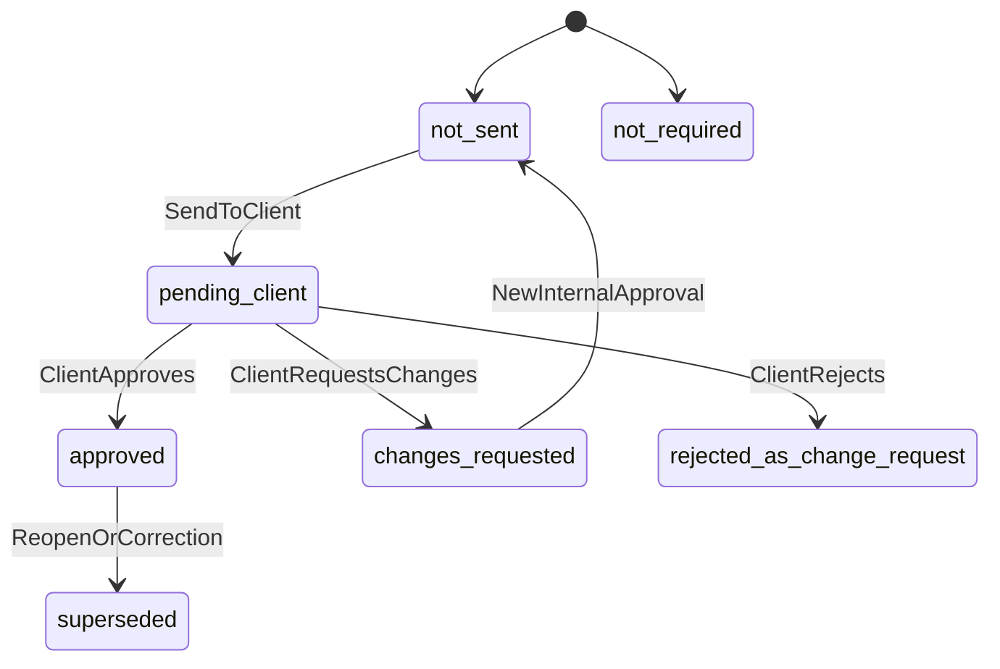

| From | To | Command | Actor/Permission | Preconditions | Invariants | Side Effects | Events | Audit | SLA | Package | Notification | Invalid Behavior |
| --- | --- | --- | --- | --- | --- | --- | --- | --- | --- | --- | --- | --- |
| not_sent | pending_client | SendToClient | PERM.APPROVAL.SEND_CLIENT | internal approval | version sent | client can view | DeliverableSentToClient | Yes | paused waiting client | none | client | Reject internal draft |
| pending_client | approved | ClientApproves | PERM.APPROVAL.CLIENT_GRANT | client approver | same client/version | approval record | ClientApprovalGranted | Yes | waiting ends | none | PM | Reject Client Viewer |
| pending_client | changes_requested | RequestChange | Client Approver | reason | not cancellation | rework | ClientChangesRequested | Yes | resumed | none | team | Reject no reason |
| pending_client | rejected_as_change_request | Reject | Client Approver | reason | no auto cancel | escalation/change | ClientChangesRequested | Yes | resumed/escalated | none | PM | Reject auto cancellation |

## 9. SLA

**الحالات:** not_started، running، at_risk، breached، paused_waiting_client، paused_waiting_internal_decision، completed، cancelled.

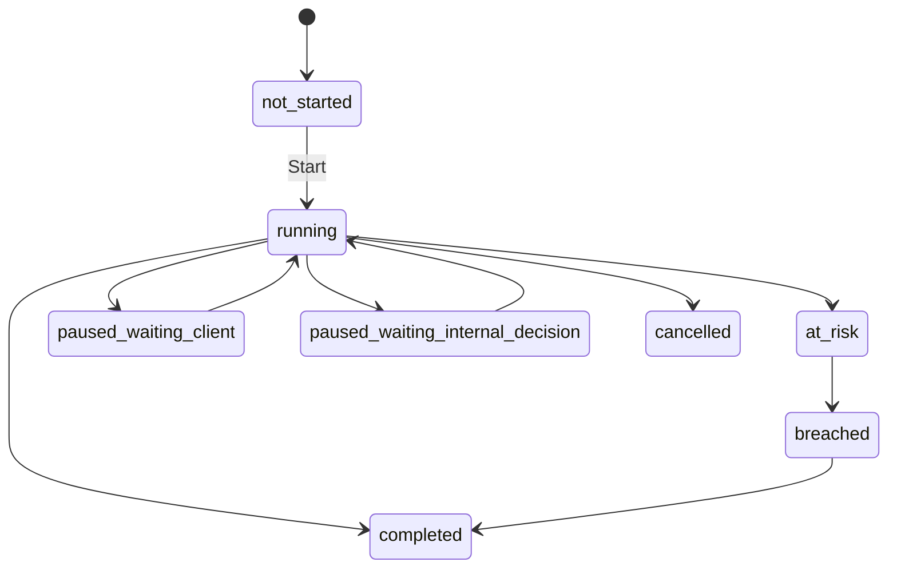

| From | To | Command | Actor/Permission | Preconditions | Invariants | Side Effects | Events | Audit | SLA | Package | Notification | Invalid Behavior |
| --- | --- | --- | --- | --- | --- | --- | --- | --- | --- | --- | --- | --- |
| not_started | running | StartSLA | System/PM | WorkStarted | one active segment | segment starts | SLAStarted | Yes | running | none | optional | Reject already running |
| running | paused_waiting_client | PauseForClient | System | sent to client/input needed | owner=client | pause segment | SLAPaused | Yes | paused | none | optional | Reject no reason |
| paused_waiting_client | running | Resume | System | client responded | previous pause exists | new running segment | SLAResumed | Yes | running | none | team | Reject paused->paused duplicate |
| running/at_risk | breached | MarkBreach | System | target exceeded | client wait excluded | breach record | SLABreached | Yes | breached | none | managers | Reject if only client time |
| any active | completed | Complete | System | deliverable delivered | no open active segment | close timeline | SLACompleted | Yes | completed | none | optional | Reject incomplete delivery |

## 10. Package Reservation / Consumption

**الحالات:** none، reserved، released، consumed، reversed، adjusted.

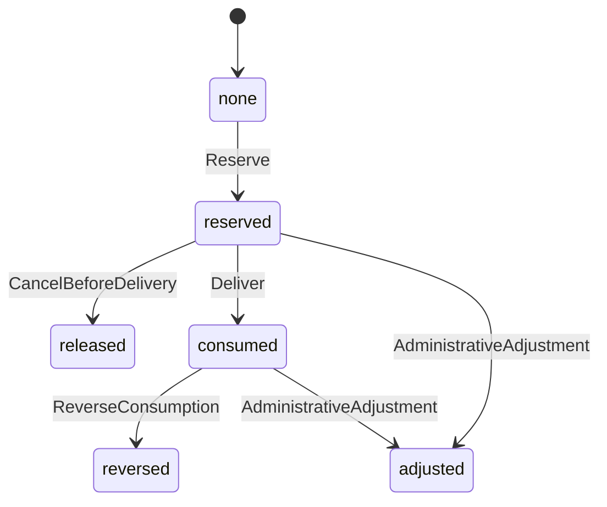

| From | To | Command | Actor/Permission | Preconditions | Invariants | Side Effects | Events | Audit | SLA | Package | Notification | Invalid Behavior |
| --- | --- | --- | --- | --- | --- | --- | --- | --- | --- | --- | --- | --- |
| none | reserved | ReserveQuantity | System/PM | deliverable linked | unit match | reserved entry | PackageQuantityReserved | Yes | none | reserved increases | optional | Reject insufficient balance unless overage |
| reserved | consumed | Consume | System/PM | delivered | no consume before delivery | consumed entry | PackageQuantityConsumed | Yes | none | consumed increases | optional | Reject not delivered |
| reserved | released | Release | System/PM | cancelled before consume | not consumed | release entry | PackageReservationReleased | Yes | none | available restored | optional | Reject consumed->released without reversal |
| consumed | reversed | Reverse | Executive | correction reason | no silent delete | reversal entry | ConsumptionReversed | Yes | may reopen | balance adjusted | managers | Reject no reason |

## 11. File Visibility / Finalization

**الحالات:** internal_only، management_only، client_visible، client_final، restricted، archived.

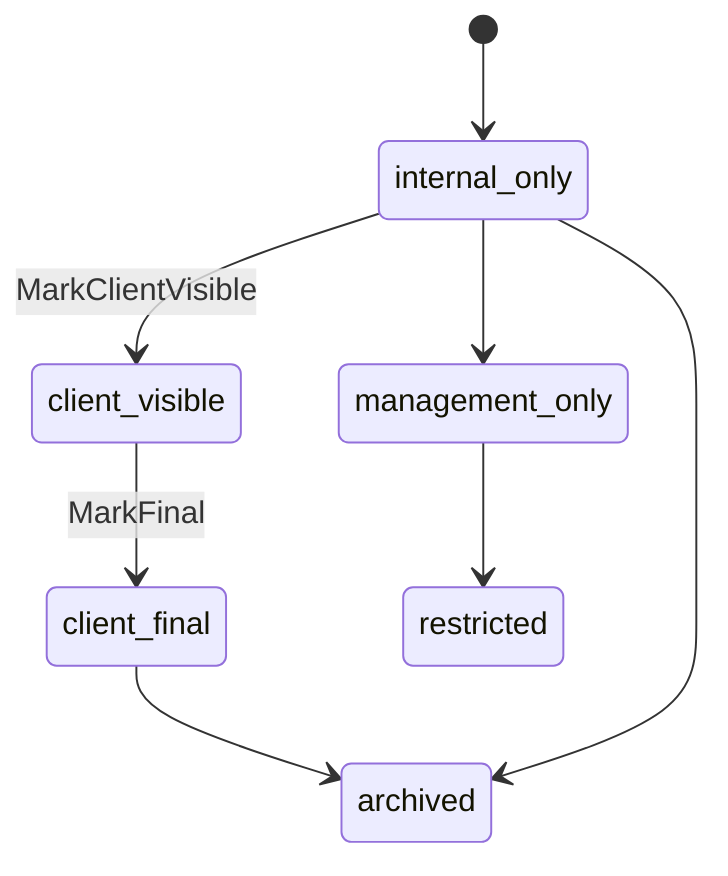

| From | To | Command | Actor/Permission | Preconditions | Invariants | Side Effects | Events | Audit | SLA | Package | Notification | Invalid Behavior |
| --- | --- | --- | --- | --- | --- | --- | --- | --- | --- | --- | --- | --- |
| internal_only | client_visible | ChangeVisibility | PERM.FILE.MARK_CLIENT_VISIBLE | approval/permission | no internal leak | client can view | FileVisibilityChanged | Yes | none | none | client optional | Reject without authorization |
| client_visible | client_final | MarkFinal | PERM.FILE.MARK_FINAL | delivery/approval rules | final version fixed | final asset | FileMarkedFinal | Yes | may support delivery | none | client | Reject internal only -> client final without auth |
| any | archived | ArchiveFile | PM | no active decision dependency or correction policy | audit retained | hidden active lists | FileArchived | Yes | none | none | optional | Reject delete linked approved version |

## 12. Invitation

**الحالات:** created، sent، accepted، expired، revoked.

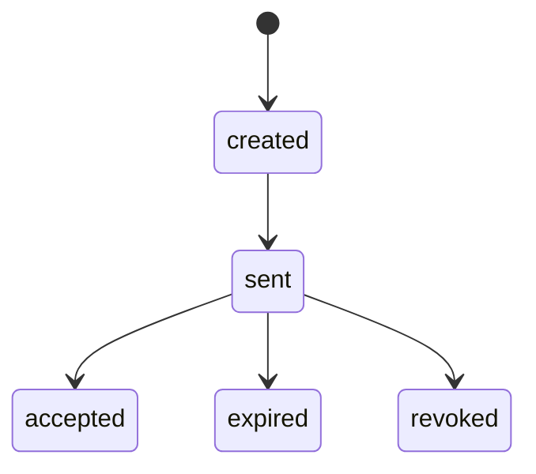

| From | To | Command | Actor/Permission | Preconditions | Invariants | Side Effects | Events | Audit | SLA | Package | Notification | Invalid Behavior |
| --- | --- | --- | --- | --- | --- | --- | --- | --- | --- | --- | --- | --- |
| created | sent | SendInvite | PERM.USR.INVITE | role+scope | no scope-less invite | invite delivered | TenantMembershipInvited | Yes | none | none | invitee | Reject no Client/Tenant scope |
| sent | accepted | AcceptInvite | invitee | valid token | membership scope | membership active | TenantMembershipActivated | Yes | none | none | admins | Reject expired/revoked |
| sent | revoked | RevokeInvite | Admin | reason optional | no permission granted | invite invalid | InvitationRevoked | Yes | none | none | invitee | Reject accepted invite revoke without membership flow |

## 13. Temporary Delegation

**الحالات:** proposed، active، expired، revoked، completed.

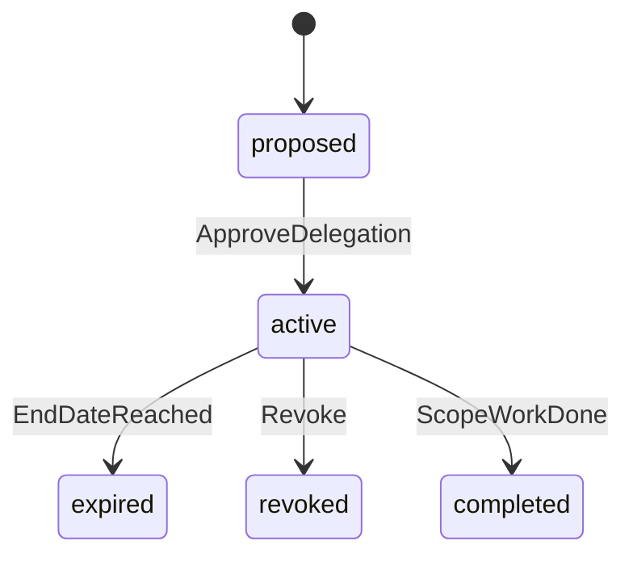

| From | To | Command | Actor/Permission | Preconditions | Invariants | Side Effects | Events | Audit | SLA | Package | Notification | Invalid Behavior |
| --- | --- | --- | --- | --- | --- | --- | --- | --- | --- | --- | --- | --- |
| proposed | active | StartDelegation | PERM.APPROVAL.DELEGATE | scope/date/reason | no wider than original | delegate can act | TemporaryDelegationStarted | Yes | none | none | delegate | Reject open-ended delegation |
| active | revoked | RevokeDelegation | Admin/original approver | reason | history retained | delegate loses power | DelegationRevoked | Yes | none | none | delegate | Reject deleting past uses |
| active | expired | ExpireDelegation | System | end date | no future use | disabled | DelegationExpired | Yes | none | none | delegate/admin | Reject action after expiry |

## 14. Invalid Transition Tests

| الحالة غير الصالحة | السلوك المتوقع |
| --- | --- |
| Delivered -> In Progress دون Reopen | Deny مع طلب أمر Reopen وسبب. |
| Client Approved -> Draft مباشرة | Deny؛ يحتاج Reopen أو Cycle جديد. |
| Paused SLA -> Paused SLA مرة أخرى | Deny أو idempotent no-op مع Audit حسب السياسة. |
| Consumed Quantity -> Released دون Reversal | Deny؛ استخدم Consumption Reversed. |
| Internal Draft -> Sent to Client دون Internal Approval | Deny. |
| Client Viewer -> Approval Granted | Deny. |
| File Internal Only -> Client Final دون Visibility Authorization | Deny. |

