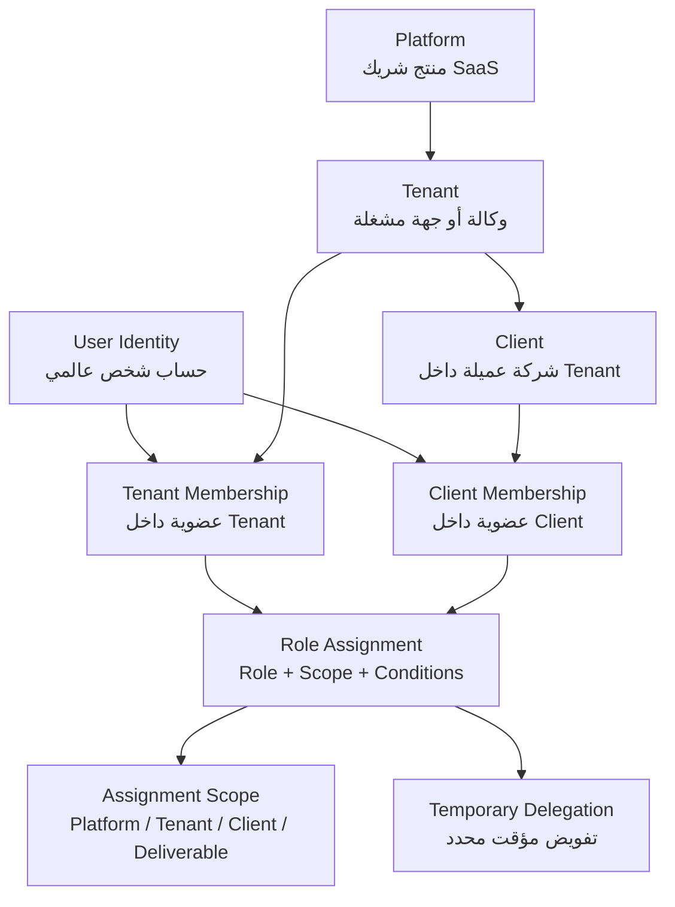

# Tenancy, Identity, and Membership Model: شريك

**المرحلة:** Phase 04 - Core Domain Model, Conceptual Data Model & Business Invariants  
**نوع الوثيقة:** Conceptual Tenancy Model  
**الحالة:** Draft for owner review  
**آخر تحديث:** 2026-06-22  

## 1. الغرض

هذه الوثيقة تفصل بين Platform User Identity وTenant وClient وMembership وRole Assignment. الهدف هو منع تصميم يجعل الدور صفة ثابتة على المستخدم أو يجعل العميل Tenant مستقلا في V1.

## 2. المبادئ

| المبدأ | التصنيف |
| --- | --- |
| شريك SaaS متعدد Tenants. | Confirmed |
| Tenant يمثل الوكالة أو الجهة المشغلة، وسماوة أول Tenant. | Confirmed |
| Client شركة عميلة داخل Tenant وليس Tenant مستقل. | Confirmed |
| User Identity مستقلة عن Membership. | Assumed |
| Role Assignment لا يعمل دون Assignment Scope. | Confirmed |
| مستخدم العميل لا يملك Tenant-wide access. | Confirmed |
| تعطيل Membership لا يحذف Audit History. | Confirmed |

## 3. Conceptual Diagram

## 4. الفصل بين المفاهيم

| المفهوم | ما يملكه | لا يملكه | سبب الفصل |
| --- | --- | --- | --- |
| User Identity | بيانات الحساب العالمية ومؤشر الوجود. | دورا داخل Tenant أو Client. | نفس الشخص قد ينضم لأكثر من Tenant مستقبلا. |
| Tenant Membership | حالة المستخدم داخل Tenant. | صلاحيات Client محددة بالضرورة. | الموظف قد يعمل على Client A دون B. |
| Client Membership | انتماء مستخدم لClient. | Tenant-wide access. | يمنع Client user من رؤية عملاء آخرين. |
| Role Assignment | الدور والنطاق والشروط. | الهوية نفسها. | المستخدم قد يحمل أكثر من دور مختلف. |
| Temporary Delegation | صلاحية مؤقتة محددة. | دور دائم أو توسيع مفتوح. | يدعم الإجازات والطوارئ دون كسر Least Privilege. |

## 5. قواعد العضوية والأدوار

| ID | القاعدة | التصنيف |
| --- | --- | --- |
| BR-TIM-01 | يمكن لهوية مستخدم أن ترتبط بأكثر من Tenant مستقبلًا. | Assumed |
| BR-TIM-02 | عضوية Tenant مستقلة عن حساب المستخدم العالمي. | Confirmed |
| BR-TIM-03 | الدور لا يخزن كصفة ثابتة وحيدة على User Identity. | Confirmed |
| BR-TIM-04 | الصلاحيات تعتمد على Scope وليس Role فقط. | Confirmed |
| BR-TIM-05 | يمكن للمستخدم حمل أكثر من Role Assignment بشرط عدم التعارض. | Assumed |
| BR-TIM-06 | المستخدم قد يحمل دورا مختلفا لكل Client. | Assumed |
| BR-TIM-07 | الموظف قد يعمل على Client A دون Client B. | Confirmed |
| BR-TIM-08 | مستخدم العميل لا يمتلك Tenant-Wide Access. | Confirmed |
| BR-TIM-09 | تعطيل Membership لا يحذف Audit History. | Confirmed |
| BR-TIM-10 | مغادرة موظف تتطلب نقل مسؤولياته قبل الإغلاق. | Confirmed |

## 6. حالات عضوية مفاهيمية

| Membership State | المعنى | ملاحظات |
| --- | --- | --- |
| Invited | تمت الدعوة ولم تقبل بعد. | لا تمنح صلاحية تشغيلية. |
| Active | المستخدم يعمل ضمن Scope. | يخضع لRole Assignments. |
| Suspended | الدخول موقوف مؤقتا. | لا يمحو التاريخ. |
| Removed | العضوية أزيلت من النطاق. | Audit يبقى. |
| Offboarded | مغادرة موظف مع نقل مسؤوليات. | يجب نقل Owner لكل مخرج مفتوح. |

## 7. أمثلة

### 7.1 موظف يعمل على Client A فقط

- User Identity: مصمم داخل سماوة.
- Tenant Membership: Active في Tenant سماوة.
- Role Assignment: `designer` على Client A أو Deliverables محددة.
- النتيجة: لا يرى Client B ما لم يمنح Scope منفصل.

### 7.2 مستخدم عميل مع Approver وViewer

- User Identity: مدير تسويق لدى Client A.
- Client Membership: Active داخل Client A.
- Role Assignments: `client_approver` وربما `client_viewer`.
- النتيجة: يعتمد مخرجات Client A المرسلة له فقط، ولا يرى Client B.

### 7.3 تفويض مؤقت

- PM يغيب ثلاثة أيام.
- Executive أو Tenant Admin يمنح Quality Reviewer تفويض Internal Approval على Client A فقط.
- التفويض له بداية ونهاية وسبب.
- كل قرار أثناء التفويض يسجل Actor الحقيقي والتفويض المستخدم.

## 8. Open Questions

| السؤال | لماذا يؤثر على النموذج؟ | توصية V1 |
| --- | --- | --- |
| هل Platform Owner/Admin أدوار تشغيلية في V1 أم حوكمة فقط؟ | يؤثر على content access. | حوكمة محدودة دون وصول روتيني للمحتوى. |
| هل Client Admin يدير مستخدمي شركته ذاتيا؟ | يؤثر على Client Membership lifecycle. | إدارة محدودة أو طلب دعوة حتى اعتماد المالك. |
| هل يسمح لمستخدم Client بالانتماء لأكثر من Client؟ | يؤثر على cross-client isolation. | Deny في V1 إلا بقرار مالك. |
