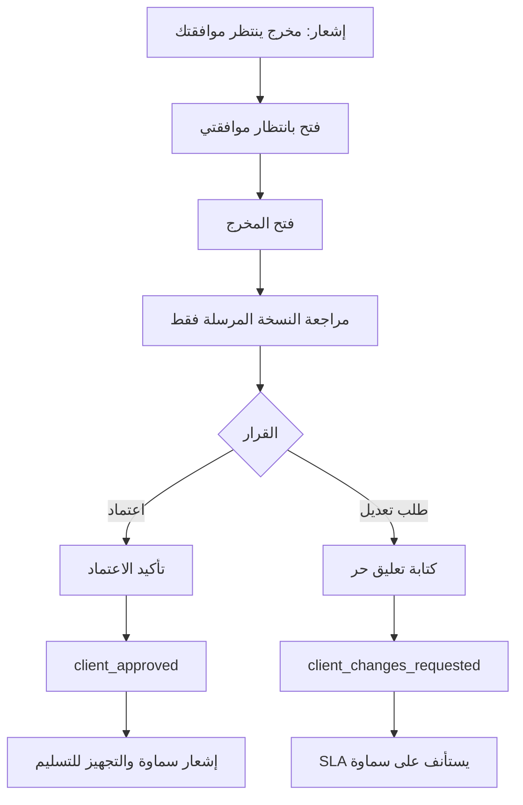

# Client Portal User Flows: شريك

**المرحلة:** Phase 05 - Information Architecture, UX Model & Role-Based User Flows  
**نوع الوثيقة:** Client Portal User Flows  
**الحالة:** Draft for owner review  
**آخر تحديث:** 2026-06-23  

## 1. الغرض

توثيق رحلات العميل في بوابة بسيطة لا تعرض التعقيد الداخلي. العميل يدخل بتسجيل دخول عادي، ويرى نطاق Client فقط.

## 2. Flow: تسجيل دخول العميل

| العنصر | التفاصيل |
| --- | --- |
| Persona | Client Admin / Approver / Reviewer / Viewer |
| Goal | دخول آمن إلى بوابة العميل. |
| Preconditions | دعوة مقبولة أو عضوية نشطة. |
| Entry Point | صفحة تسجيل الدخول. |
| Steps | يدخل البريد وكلمة المرور، يختار إن لزم العميل المرتبط، يصل للرئيسية. |
| Permissions | عضوية Client مفعلة. |
| System Feedback | ترحيب باسم العميل، إظهار ما ينتظر المستخدم. |
| Error Paths | دعوة منتهية، كلمة مرور خطأ، مستخدم بلا Client scope. |
| Recovery | إعادة تعيين كلمة المرور أو إعادة إرسال دعوة. |
| Audit Events | login events لاحقا حسب سياسة الأمن. |
| Success Criterion | يصل المستخدم خلال خطوة واضحة للرئيسية أو "بانتظار موافقتي". |

## 3. Flow: اعتماد مخرج

| العنصر | التفاصيل |
| --- | --- |
| Persona | Client Approver |
| Goal | اتخاذ قرار سريع على نسخة صحيحة. |
| Preconditions | المخرج internally_approved وsent_to_client. |
| Entry Point | إشعار أو Tab "بانتظار موافقتي". |
| Decisions | اعتماد أو طلب تعديل. |
| Screens | CP-03, CP-05, CP-06, CP-07 |
| Permissions | PERM.APPROVAL.CLIENT_GRANT / CHANGE_REQUEST |
| System Feedback | "تم اعتماد المخرج" أو "وصل طلب التعديل للفريق". |
| Error Paths | القرار سبق اكتماله، النسخة Superseded، المستخدم Viewer. |
| Recovery | تحديث الشاشة، إظهار النسخة الحالية، أو طلب صلاحية. |
| SLA Effect | ينتظر العميل أثناء pending، ويستأنف عند طلب التعديل. |
| Package Effect | لا يستهلك إلا عند التسليم. |
| Audit Events | client_approval_granted أو client_change_requested. |
| Success Criterion | القرار محفوظ بالاسم والوقت والنسخة. |

## 4. Flow: Bulk Approval

| العنصر | التفاصيل |
| --- | --- |
| Persona | Client Approver |
| Goal | اعتماد عدة مخرجات جاهزة بطريقة آمنة. |
| Preconditions | كل المخرجات المحددة بانتظار اعتماد العميل، من نفس Client، وليست Superseded. |
| Entry Point | زر تحديد في "بانتظار موافقتي". |
| Steps | تحديد عناصر، مراجعة قائمة مختصرة، تأكيد جماعي، إظهار نتيجة لكل عنصر. |
| Decisions | اعتماد المحدد أو إلغاء. |
| System Feedback | "تم اعتماد 5 من 5" أو "تم اعتماد 4، وتعذر 1 بسبب تحديث النسخة". |
| Error Paths | مخرج يحتاج تعليق، مخرج تغيرت نسخته، صلاحية ناقصة. |
| Recovery | إزالة العناصر غير الصالحة وإتاحة مراجعتها فرديا. |
| Audit Events | client_approval_granted لكل مخرج، مع batch reference لاحقا. |
| Success Criterion | لا اعتماد جماعي دون معرفة عدد النسخ والعميل. |

## 5. Flow: طلب تعديل بتعليق حر

| العنصر | التفاصيل |
| --- | --- |
| Persona | Client Approver |
| Goal | توضيح المطلوب للفريق بدون قائمة طويلة. |
| Preconditions | مخرج pending_client. |
| Entry Point | زر "طلب تعديل". |
| Steps | كتابة تعليق حر، مراجعة موجزة، إرسال. |
| Decisions | إرسال أو حفظ كمسودة/إلغاء. |
| System Feedback | "وصلت ملاحظتك للفريق، وبنرجع لك بعد التحديث." |
| Error Paths | تعليق فارغ، انقطاع اتصال، نسخة تغيرت. |
| Recovery | حفظ النص واستعادة عند الرجوع. |
| SLA Effect | Resume على سماوة. |
| Audit Events | client_change_requested, sla_resumed. |

## 6. Flow: فتح تقرير جديد من الملفات

| العنصر | التفاصيل |
| --- | --- |
| Persona | Client Admin / Approver / Viewer |
| Goal | الوصول لتقرير أضافه فريق العمل. |
| Preconditions | ملف report_file أو client_visible ضمن Client scope. |
| Entry Point | إشعار داخل التطبيق: "تمت إضافة تقرير جديد". |
| Steps | فتح الإشعار، الانتقال لتفاصيل الملف، معاينة أو تنزيل. |
| Screens | CP-09, CP-10, CP-12 |
| System Feedback | يوضح تاريخ الإضافة، المخرج المرتبط إن وجد، ومن أضافه. |
| Error Paths | لا يدعم المعاينة، الملف لم يعد متاحا، صلاحية مفقودة. |
| Recovery | زر تنزيل، رسالة دعم، العودة للملفات. |
| Audit Events | file_downloaded لاحقا حسب سياسة التنزيل. |

## 7. Flow: متابعة العقد والمتبقي

| العنصر | التفاصيل |
| --- | --- |
| Persona | Client roles |
| Goal | معرفة المنجز والمتبقي بصورة مبسطة. |
| Entry Point | Tab العقد والمتابعة أو الرئيسية. |
| Content | إجمالي المتفق، المنجز، بانتظار الموافقة، المتبقي، ملفات نهائية مرتبطة. |
| ممنوع | Ledger كامل، تفاصيل مالية حساسة، delay owner الداخلي. |
| Empty | "ما فيه عقد نشط ظاهر لك حاليا." |

## 8. Flow: طلب متابعة بعد التسليم

| العنصر | التفاصيل |
| --- | --- |
| Persona | Client Approver/Admin |
| Goal | طلب تعديل أو متابعة بعد التسليم دون إعادة فتح ذاتية. |
| Preconditions | المخرج delivered. |
| Entry Point | تفاصيل المخرج المسلم. |
| Steps | زر "طلب متابعة"، كتابة سبب، إرسال للإدارة. |
| System Feedback | "وصل طلبك للفريق، وبيتم تقييمه هل هو تصحيح أو مخرج جديد." |
| SLA Effect | لا يفتح SLA تلقائيا حتى قرار الإدارة. |
| Package Effect | لا يغير الرصيد تلقائيا. |
| Audit Events | follow_up_requested لاحقا أو client_comment_added. |

## 9. حالات أمنية إلزامية

| الحالة | UX |
| --- | --- |
| Client A يحاول فتح رابط Client B | Permission denied عام بدون كشف اسم Client B. |
| Client Viewer يفتح مخرج بانتظار اعتماد | يرى محتوى مسموحا، ولا يرى أزرار القرار الرسمي. |
| تعليق داخلي موجود | لا يظهر ولا يترك فراغا يدل عليه. |
| نسخة داخلية غير مرسلة | لا تظهر في قائمة النسخ للعميل. |
