# Information Architecture: شريك

**المرحلة:** Phase 05 - Information Architecture, UX Model & Role-Based User Flows  
**نوع الوثيقة:** Information Architecture  
**الحالة:** Draft for owner review  
**آخر تحديث:** 2026-06-23  

## 1. الغرض

تصميم IA مستقل لكل تجربة: بوابة العميل، مساحة الفريق، لوحة الإدارة، وإدارة المنصة عند الحاجة، مع منع جعل كل خصائص النظام ظاهرة في Sidebar.

## 2. Sitemap عام

```mermaid
flowchart TD
  Root["شريك"]
  Root --> CP["بوابة العميل"]
  Root --> TW["مساحة الفريق"]
  Root --> MC["لوحة الإدارة"]
  Root --> PA["إدارة المنصة"]

  CP --> CP1["الرئيسية"]
  CP --> CP2["بانتظار موافقتي"]
  CP --> CP3["العقد والمتابعة"]
  CP --> CP4["الملفات"]
  CP --> CP5["الإعدادات"]

  TW --> TW1["مهامي"]
  TW --> TW2["لوحة العمل"]
  TW --> TW3["المخرجات"]
  TW --> TW4["الملفات"]
  TW --> TW5["الإشعارات"]
  TW --> TWS["بحث عام"]

  MC --> MC1["نظرة عامة"]
  MC --> MC2["العملاء"]
  MC --> MC3["المخرجات"]
  MC --> MC4["لوحات العمل"]
  MC --> MC5["SLA والجودة"]
  MC --> MC6["الفريق"]
  MC --> MC7["العقود والباقات"]
  MC --> MC8["الملفات"]
  MC --> MC9["التقارير"]
  MC --> MC10["الإعدادات"]
  MC --> MCS["بحث عام"]

  PA --> PA1["Tenants"]
  PA --> PA2["Platform Users"]
  PA --> PA3["Platform Health"]
  PA --> PA4["Support Sessions"]
```

## 3. Client Portal IA

| القسم | المحتوى الظاهر | المحتوى الممنوع | الإجراءات الأساسية | الصلاحيات | نقطة الدخول | بحث/فلاتر | Empty State |
| --- | --- | --- | --- | --- | --- | --- | --- |
| الرئيسية | ملخص المتبقي، بانتظارك، آخر ملفات/تقارير، حالة مبسطة | Kanban، تعليقات داخلية، delay owner الداخلي | فتح الموافقات، فتح الملفات، فتح المتابعة | كل أدوار العميل ضمن Client scope | بعد تسجيل الدخول | بحث محدود | "كل شيء ماشي، ما عندك موافقات حاليا." |
| بانتظار موافقتي | النسخ المرسلة للاعتماد، قرار، تعليق حر، bulk select | النسخ الداخلية، Checklist | اعتماد، طلب تعديل، تحديد متعدد | client_approver فقط للقرار | إشعار أو تاب | نوع/تاريخ/حالة | "ما فيه مخرجات تنتظر موافقتك." |
| العقد والمتابعة | كميات متفق/منجز/متبقي، تقدم مبسط | Ledger كامل، مالية حساسة | فتح مخرج/ملف نهائي | client roles | Sidebar | نوع مخرج/فترة | "ما فيه عقد نشط ظاهر لك." |
| الملفات | ملفات نهائية، تقارير، مرفوعات العميل، ملفات العقد | internal_only | معاينة، تنزيل، رفع عميل إذا سمح | كل عميل حسب الرؤية | إشعار تقرير جديد | نوع/بحث/تاريخ | "ما فيه ملفات في هذا التصنيف." |
| الإعدادات | الملف الشخصي، إشعارات، مستخدمو العميل إذا Client Admin | إعدادات Tenant | دعوة/طلب دعوة، ضبط إشعارات | Client Admin أو الذات | Sidebar | لا يحتاج غالبا | "ما عندك صلاحية لإدارة الإعدادات." |

### قرار التقارير

| السؤال | القرار | التصنيف |
| --- | --- | --- |
| هل التقارير Tab مستقل؟ | لا في V1؛ التقارير داخل الملفات كتصنيف واضح مع إشعار داخل التطبيق عند الإضافة. | Confirmed |

## 4. Team Workspace IA

| القسم | المحتوى | الإجراءات | الصلاحيات | ملاحظات UX |
| --- | --- | --- | --- | --- |
| مهامي | المخرجات/المهام المسندة، SLA، موعد داخلي | بدء، رفع، تعليق، إرسال للمراجعة | owner/contributor | Mobile-supported. |
| لوحة العمل | Kanban داخلي scoped | نقل كارت، فتح Drawer | الفريق حسب assignment | لا يتجاوز قواعد المخرج. |
| المخرجات | جدول/قائمة قابلة للبحث | فلترة، فتح Drawer | assigned client/deliverable | بديل accessible للـ drag. |
| الملفات | أصول العمل، مرفوعات العميل، النسخ | رفع داخلي، معاينة، تنزيل | حسب الرؤية | لا تحويل للعميل إلا مخول. |
| الإشعارات | تعديلات، مراجعات، SLA، تعيينات | فتح السياق، تعليم كمقروء | المستخدم | مهم جدا على الجوال. |
| البحث العام | بحث في المخرجات والملفات المصرح بها | فتح نتيجة | حسب scope | لا يكشف نتائج خارج النطاق. |

## 5. Management Console IA

| القسم | المحتوى | الإجراءات | الصلاحيات | ملاحظات UX |
| --- | --- | --- | --- | --- |
| نظرة عامة | مؤشرات العملاء، مراجعة داخلية، انتظار العميل، SLA | فتح قوائم مركزة | إدارة | لا تكون Marketing hero. |
| العملاء | 4 عملاء بداية ثم Portfolio | فتح عميل، إضافة عميل | PM/Tenant Admin | يعرض صحة الباقة. |
| المخرجات | كل المخرجات المصرح بها | إنشاء، تعيين، فلترة، فتح Drawer | PM/MM/AM | Bulk creation خارج V1. |
| لوحات العمل | Kanban عابر أو حسب عميل | نقل، مراجعة | إدارة | يحترم transitions. |
| SLA والجودة | at-risk/overdue/waiting client | تصعيد، إعادة إسناد، تفسير | PM/MM/Executive | delay owner داخلي. |
| الفريق | ضغط العمل والأداء | إعادة إسناد، نقل مسؤوليات | PM/Admin | لا يعرض للعميل. |
| العقود والباقات | Commitments، المتبقي، الاستثناءات | تعديل/تجاوز بصلاحية | PM/Executive | لا Ledger كامل للعميل. |
| الملفات | كل الملفات حسب النطاق | تحويل رؤية، Mark Final | PM/MM/AM conditional | إجراء حساس. |
| التقارير | تقارير إدارية تشغيلية | فلاتر/تصدير لاحق | Management | غير تقارير العميل داخل الملفات. |
| الإعدادات | أدوار، دعوات، إشعارات، Tenant | إدارة | Tenant Admin/Owner | White Label لاحق. |

## 6. Platform Administration IA

تبقى في V1 كحوكمة محدودة لأن المالك طلب الإبقاء عليها.

| القسم | الهدف | قيود الرؤية |
| --- | --- | --- |
| Tenants | إدارة سماوة وأي Tenant تجريبي لاحق | لا content access روتيني. |
| Platform Users | إدارة مالكي المنصة والدعم | لا صلاحيات عميل تلقائية. |
| Platform Health | مؤشرات تقنية عامة لاحقا | بدون محتوى ملفات أو تعليقات. |
| Support Sessions | دعم مقيد ومؤقت | سبب، مدة، موافقة، Audit. |

## 7. Deep Links وBreadcrumbs

| السياق | Deep Link | Breadcrumb |
| --- | --- | --- |
| مخرج عميل | `/client/deliverables/{id}` مفاهيميا | الرئيسية > بانتظار موافقتي > المخرج |
| ملف تقرير | `/client/files/{id}` | الملفات > التقارير > التقرير |
| مخرج فريق | `/team/deliverables/{id}` | لوحة العمل > المخرج |
| مخرج إدارة | `/management/clients/{client}/deliverables/{id}` | العملاء > العميل > المخرج |

## 8. مبادئ البحث والفلاتر

| التجربة | البحث | الفلاتر |
| --- | --- | --- |
| العميل | داخل مخرجاته وملفاته فقط | نوع ملف، نوع مخرج، حالة مبسطة |
| الفريق | Global Search داخل scope | عميل، نوع، حالة، SLA، مالك |
| الإدارة | Global Search عابر للعملاء المصرح بهم | عميل، فريق، حالة، SLA، باقة، تاريخ |
| المنصة | بحث Tenants/Users | حالة Tenant، دعم |

## 9. حالات الرجوع

- Drawer يغلق ويعيد المستخدم لنفس القائمة أو اللوحة.
- Back من Deep Link يعيد لأقرب شاشة دورية متاحة.
- عند Permission Denied لا يذكر اسم المورد المحمي.
- عند انتهاء الجلسة تحفظ مسودة التعليق أو طلب التعديل محليا كمفهوم UX.
