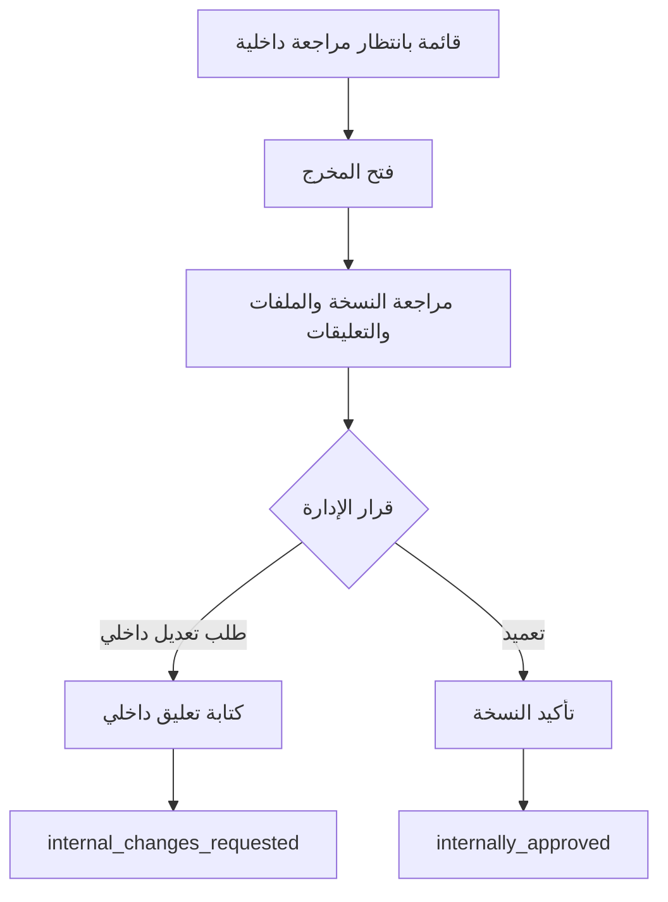

# Management Console User Flows: شريك

**المرحلة:** Phase 05 - Information Architecture, UX Model & Role-Based User Flows  
**نوع الوثيقة:** Management Console User Flows  
**الحالة:** Draft for owner review  
**آخر تحديث:** 2026-06-23  

## 1. الغرض

توثيق رحلات الإدارة ومدير المشروع ومدير التسويق ومدير الحساب، خصوصا التعميد، الإرسال، SLA، العقود، وإعادة الإسناد.

## 2. Flow: إضافة عميل

| العنصر | التفاصيل |
| --- | --- |
| Persona | PM / Tenant Admin |
| Goal | إنشاء عميل جديد داخل Tenant سماوة. |
| Preconditions | صلاحية إنشاء عميل. |
| Entry Point | العملاء > إضافة عميل. |
| Steps | بيانات أساسية، جهة اتصال، أدوار عميل أولية، حفظ. |
| Permissions | PERM.CLIENT.CREATE |
| Audit Events | client_created |
| Success Criterion | Client scope جاهز ولا يرى عملاء آخرين. |

## 3. Flow: إضافة عقد وباقة

| العنصر | التفاصيل |
| --- | --- |
| Persona | PM / Executive |
| Goal | ربط العميل بنطاق اتفاق واضح. |
| Steps | اختيار العميل، فترة العقد، بنود الباقة، كميات، حفظ. |
| Permissions | PERM.CONTRACT.MANAGE |
| Package Effect | Commitment Added. |
| Audit Events | contract_or_package_created |
| UX Note | لا تعرض تفاصيل فوترة متقدمة للعميل في V1. |

## 4. Flow: إنشاء مخرج فردي

| العنصر | التفاصيل |
| --- | --- |
| Persona | PM / AM conditional |
| Goal | إنشاء مخرج متفق عليه. |
| Preconditions | Client active، owner، نوع، مواعيد، ربط باقة أو سبب خارج الباقة. |
| Entry Point | المخرجات > إنشاء مخرج أو من تفاصيل العميل. |
| Steps | اختيار العميل، نوع المخرج، الباقة، المسؤولين، SLA، هل يحتاج اعتماد عميل، حفظ. |
| Permissions | PERM.DELIV.CREATE |
| Package Effect | Reservation عند الربط بباقة. |
| Audit Events | deliverable_created, package_credit_reserved |
| Out of Scope | Bulk Deliverable Creation غير مطلوب في V1. |

## 5. Flow: مراجعة وتعميد داخلي

| العنصر | التفاصيل |
| --- | --- |
| Persona | PM/MM/Quality Reviewer |
| Goal | حماية جودة النسخة قبل العميل. |
| Permissions | PERM.APPROVAL.INTERNAL_GRANT / CHANGE_REQUEST |
| System Feedback | القرار واضح ومربوط بالنسخة. |
| Error Paths | self-approval conflict، missing version. |
| Audit Events | internal_change_requested, internal_approval_granted. |

## 6. Flow: إرسال للعميل

| العنصر | التفاصيل |
| --- | --- |
| Persona | PM/MM أو AM مخول |
| Goal | إرسال نسخة معتمدة داخليا للعميل. |
| Preconditions | internally_approved، requires_client_approval أو اطلاع. |
| Entry Point | Drawer المخرج أو قائمة المعتمد داخليا. |
| Permissions | PERM.APPROVAL.SEND_CLIENT |
| System Feedback | "تم إرسال النسخة للعميل، وSLA متوقف بانتظار موافقته." |
| SLA Effect | paused_waiting_client. |
| Audit Events | deliverable_sent_to_client, sla_paused_waiting_client |
| Invalid | إرسال قبل التعميد يرفض. |

## 7. Flow: اكتشاف مخرج متأخر

| العنصر | التفاصيل |
| --- | --- |
| Persona | PM/MM/Executive |
| Goal | معرفة مصدر التأخير والتدخل. |
| Entry Point | SLA والجودة أو لوحة المؤشرات. |
| Steps | فتح قائمة overdue/at_risk، فلترة العميل/المالك، فتح المخرج، اختيار إجراء. |
| Decisions | تذكير، إعادة إسناد، طلب قرار داخلي، تصعيد. |
| Permissions | PERM.SLA.ALL_CLIENTS_VIEW, PERM.DELIV.OWNER_CHANGE |
| System Feedback | يظهر delay owner للإدارة فقط. |
| Audit Events | owner_changed, sla_escalated حسب الإجراء. |

## 8. Flow: إعادة إسناد مهمة/مخرج

| العنصر | التفاصيل |
| --- | --- |
| Persona | PM / Tenant Admin |
| Goal | نقل العمل عند ضغط أو مغادرة موظف. |
| Preconditions | Owner جديد داخل scope. |
| Entry Point | الفريق أو تفاصيل المخرج. |
| Steps | اختيار مخرج/مهام، اختيار مستخدم جديد، سبب، تأكيد. |
| Permissions | PERM.USR.RESPONSIBILITY_TRANSFER أو PERM.DELIV.OWNER_CHANGE |
| Audit Events | responsibility_transferred, owner_changed |
| Error Paths | لا يوجد Owner بديل، المستخدم خارج النطاق. |

## 9. Flow: إلغاء مخرج وإعادة الحجز

| العنصر | التفاصيل |
| --- | --- |
| Persona | PM/Executive |
| Goal | إلغاء عمل لم يعد مطلوبا. |
| Preconditions | سبب واضح، ليس delivered أو يحتاج سياسة تصحيح. |
| Steps | فتح المخرج، اختيار إلغاء، تحديد السبب، مراجعة أثر الرصيد، تأكيد. |
| Package Effect | Release reservation إذا لم يسلم. |
| Audit Events | deliverable_cancelled, package_credit_released |

## 10. Flow: مخرج إضافي خارج الباقة

| العنصر | التفاصيل |
| --- | --- |
| Persona | Executive/PM |
| Goal | إضافة مخرج لا يوجد له رصيد كاف. |
| Steps | النظام يوضح نفاد الرصيد، الإدارة تختار "خارج الباقة" أو "تجاوز موثق"، سبب، حفظ. |
| Permissions | PERM.PACKAGE.OUT_OF_SCOPE_CREATE / OVERAGE_APPROVE |
| Package Effect | لا يستهلك الباقة تلقائيا. |
| Audit Events | package_overage_approved أو approved_extra_deliverable |

## 11. Flow: إعادة فتح مخرج مسلم

| العنصر | التفاصيل |
| --- | --- |
| Persona | PM/Executive |
| Goal | معالجة تصحيح أو متابعة بعد التسليم. |
| Preconditions | المخرج delivered، سبب واضح. |
| Steps | فتح المخرج، اختيار إعادة فتح، تحديد السبب: خطأ داخلي/طلب جديد/تصحيح، تأكيد. |
| SLA Effect | Open Question: Segment جديد أو مخرج جديد حسب السبب. |
| Package Effect | لا تغيير تلقائي. |
| Audit Events | deliverable_reopened |

## 12. Flow: Activity Feed بفلاتر

| العنصر | التفاصيل |
| --- | --- |
| Persona | Management / AM |
| Goal | مراجعة ما حدث حسب عميل أو مخرج أو فاعل. |
| Filters | عميل، مخرج، نوع حدث، مستخدم، فترة، internal/external. |
| Permissions | PERM.AUDIT.CLIENT_VIEW / DELIVERABLE_VIEW |
| Client Visibility | العميل يرى سجل خارجي مبسط فقط. |
