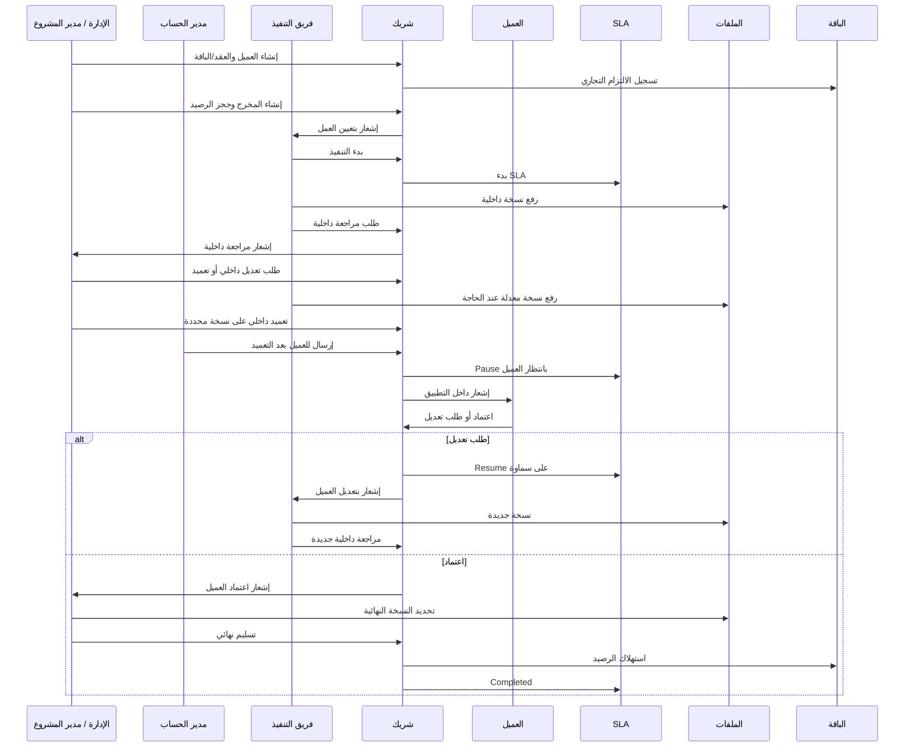

# Service Blueprint: شريك

**المرحلة:** Phase 05 - Information Architecture, UX Model & Role-Based User Flows  
**نوع الوثيقة:** Service Blueprint  
**الحالة:** Draft for owner review  
**آخر تحديث:** 2026-06-23  

## 1. الغرض

يربط هذا المخطط بين العميل، فريق التنفيذ، مدير الحساب، الإدارة، النظام، الإشعارات، الملفات، SLA، الاعتمادات، والعقد/الباقة عبر رحلة مخرج كاملة.

## 2. السيناريو الأساسي

## 3. Journey Table

| المرحلة | Customer Actions | Frontstage Actions | Backstage Actions | System Actions | Notifications | Data Created | SLA Effect | Package Effect | Audit Events | Failure Points |
| --- | --- | --- | --- | --- | --- | --- | --- | --- | --- | --- |
| الاتفاق | لا يستخدم المنصة غالبا | الإدارة تسجل العميل | تجهيز بيانات العقد | إنشاء Client/Contract conceptually | إشعار إداري اختياري | عميل، عقد، باقة | لا يبدأ | Commitment Added | client_created, contract_created | نقص بيانات العميل |
| إنشاء المخرجات | يرى لاحقا ملخص الباقة | مدير مشروع/حساب ينشئ المخرج | تحديد owner ونوع ومواعيد | حجز رصيد | إشعار للفريق | Deliverable, Reservation | not_started | Reserved | deliverable_created, package_credit_reserved | رصيد غير كاف |
| التنفيذ | لا يرى المسودات | لا يظهر شيء للعميل | الفريق يعمل ويرفع ملفات | حفظ ملفات Internal Only | إشعار للفريق عند الإسناد | ملفات داخلية، مهام | Running عند البدء | لا تغيير | work_started, file_uploaded | ملف بلا سياق |
| مراجعة داخلية | لا يرى | الإدارة تراجع | Checklist وتعليقات داخلية | منع ظهور العميل | إشعار مراجع داخلي | Approval Cycle داخلي | Running | لا تغيير | internal_review_requested | تعليق داخلي غير واضح |
| تعديل داخلي | لا يرى | لا يوجد عرض للعميل | الفريق يعالج الملاحظات | حالة internal_changes_requested | إشعار للمالك | تعليق داخلي | Running | لا تغيير | internal_change_requested | تسرب التعليق |
| تعميد داخلي | لا يرى بعد | الإدارة تعتمد نسخة | تثبيت النسخة | internally_approved | إشعار AM/PM | قرار تعميد | Running | لا تغيير | internal_approval_granted | اعتماد نسخة خاطئة |
| إرسال للعميل | يرى المخرج في "بانتظار موافقتي" | مدير حساب/إدارة يرسل | التحقق من الصلاحية | Client Visible للنسخة المرسلة | إشعار داخل التطبيق | إرسال نسخة | paused_waiting_client | لا تغيير | deliverable_sent_to_client | إرسال قبل التعميد |
| قرار العميل | يعتمد أو يطلب تعديل | بوابة العميل تعرض قرارين | الفريق يستقبل القرار | Audit وState Transition | إشعار الفريق/الإدارة | تعليق عميل أو Approval | Resume عند التعديل، انتظار ينتهي عند الاعتماد | لا تغيير | client_approval_granted أو client_change_requested | Viewer يحاول اعتماد |
| التسليم | يرى الملف النهائي | الإدارة تسلم | تحديد Final Asset | delivered | إشعار تسليم | Final Asset | completed | consumed | deliverable_delivered, package_credit_consumed | ملف نهائي غير محدد |
| التقرير | يفتح الملفات | الفريق يضيف تقريرا | التقرير يصنف report_file/client_visible | إشعار داخل التطبيق | "تمت إضافة تقرير جديد" | Report file | لا أثر مباشر | حسب نوع التقرير | file_uploaded | التقرير في تبويب خاطئ |

## 4. طبقات الخدمة

| الطبقة | المسؤولية |
| --- | --- |
| العميل | اتخاذ القرار ومراجعة الملفات المرسلة فقط. |
| مدير الحساب | تنسيق الإرسال والتذكير والمتابعة، وإرسال بعد التعميد إذا مخول. |
| فريق التنفيذ | إنتاج المخرج ورفع النسخ والتعليقات الداخلية. |
| الإدارة | التعميد، الإغلاق، SLA exceptions، وإدارة النطاق. |
| النظام | حفظ الحالة، الرؤية، SLA، الباقة، الإشعارات، وAudit. |

## 5. نقاط التعافي

| الفشل | الرسالة المقترحة | التعافي |
| --- | --- | --- |
| محاولة إرسال قبل التعميد | "ما نقدر نرسل للعميل قبل التعميد الداخلي." | افتح مراجعة داخلية أو اعتمد النسخة. |
| طلب تعديل بدون تعليق | "اكتب ملاحظتك عشان يقدر الفريق ينفذها بوضوح." | حفظ مسودة التعليق. |
| ملف داخلي يتحول للعميل | "تحويل الملف للعميل إجراء حساس." | تأكيد الرؤية والنسخة والسياق. |
| انتهاء دعوة عميل | "انتهت صلاحية الدعوة." | إعادة إرسال الدعوة من المخول. |
| محاولة Cross-client | "ما عندك صلاحية للوصول لهذا المحتوى." | العودة للرئيسية بدون كشف تفاصيل. |

## 6. قرارات UX من المخطط

| القرار | التصنيف |
| --- | --- |
| "بانتظار موافقتي" هو نقطة القرار الرئيسية للعميل. | Confirmed |
| التقارير تظهر في الملفات ويصدر عنها إشعار داخلي. | Confirmed |
| التعميد الداخلي وقرار العميل يفصلان بصريا ووظيفيا. | Confirmed |
| SLA للعميل يعرض بلغة مبسطة، بينما الإدارة ترى مالك التأخير. | Confirmed |
| أي حركة Kanban حساسة تحتاج تحقق قبل حفظها. | Confirmed |
