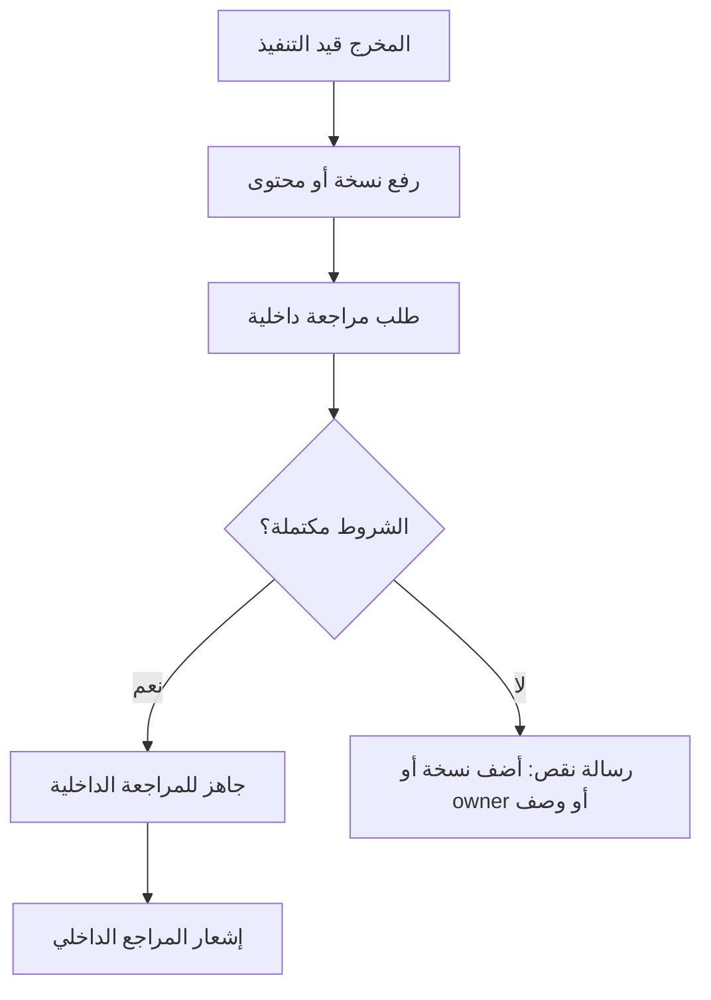

# Team Workspace User Flows: شريك

**المرحلة:** Phase 05 - Information Architecture, UX Model & Role-Based User Flows  
**نوع الوثيقة:** Team Workspace User Flows  
**الحالة:** Draft for owner review  
**آخر تحديث:** 2026-06-23  

## 1. الغرض

توثيق رحلات فريق سماوة اليومية من استلام العمل حتى رفع النسخة وطلب المراجعة، مع فصل كامل بين الداخلي وما يظهر للعميل.

## 2. Flow: بدء يوم العمل من "مهامي"

| العنصر | التفاصيل |
| --- | --- |
| Persona | كاتب محتوى، مصمم، موشن، محلل أداء، أخصائي تسويق |
| Goal | معرفة ما يجب تنفيذه اليوم. |
| Preconditions | المستخدم عضو Tenant وله assigned deliverables/tasks. |
| Entry Point | "مهامي" أو إشعار داخلي. |
| Steps | مراجعة الأولويات، فتح المخرج، قراءة الوصف والملفات، بدء التنفيذ. |
| Permissions | PERM.DELIV.VIEW, PERM.DELIV.START حسب الإسناد. |
| System Feedback | تحديث الحالة وبدء SLA عند بدء التنفيذ. |
| Empty State | "ما عندك مهام نشطة حاليا." |
| Audit Events | work_started عند بدء التنفيذ. |

## 3. Flow: رفع نسخة عمل

| العنصر | التفاصيل |
| --- | --- |
| Persona | عضو فريق أو owner |
| Goal | رفع ملف أو نسخة مرتبطة بمخرج. |
| Preconditions | المخرج ضمن scope، وحالة تسمح بالعمل. |
| Entry Point | Drawer المخرج > الملفات والنسخ. |
| Steps | اختيار الملف، تحديد نوعه، visibility الافتراضية Internal Only، رفع، ربط بالمخرج. |
| Permissions | PERM.FILE.UPLOAD_INTERNAL / UPLOAD_VERSION |
| System Feedback | "تم رفع النسخة داخليا." |
| Error Paths | File too large, unsupported file, upload failed. |
| Recovery | إعادة المحاولة وحفظ بيانات الوصف. |
| Audit Events | file_uploaded, file_version_created. |

## 4. Flow: تعليق داخلي

| العنصر | التفاصيل |
| --- | --- |
| Persona | الفريق والإدارة ومدير الحساب |
| Goal | توثيق ملاحظة تشغيلية لا يراها العميل. |
| Entry Point | Drawer > التعليقات. |
| Steps | كتابة تعليق، اختيار "داخلي" افتراضيا لمستخدمي سماوة، إرسال. |
| Permissions | PERM.COMMENT.INTERNAL_ADD |
| System Feedback | شارة "داخلي - مخفي عن العميل". |
| Error Paths | save failed، mention خارج النطاق. |
| Audit Events | internal_comment_added. |

## 5. Flow: طلب مراجعة داخلية

| العنصر | التفاصيل |
| --- | --- |
| Persona | Owner أو Contributor مخول |
| Goal | نقل العمل للمراجعة الداخلية. |
| Preconditions | وجود نسخة/محتوى قابل للمراجعة. |
| Permissions | PERM.APPROVAL.REQUEST_INTERNAL |
| System Feedback | يظهر في قائمة مراجعة الإدارة. |
| Error Paths | no version, missing owner, invalid state. |
| SLA Effect | يستمر على سماوة. |
| Audit Events | internal_review_requested. |

## 6. Flow: معالجة تعديل داخلي

| العنصر | التفاصيل |
| --- | --- |
| Persona | owner/focused execution user |
| Entry Point | إشعار "تعديل داخلي مطلوب". |
| Steps | فتح المخرج، قراءة تعليق داخلي، تعديل الملف، رفع نسخة جديدة، إعادة للمراجعة. |
| ممنوع | إرسال للعميل مباشرة. |
| SLA Effect | يستمر على سماوة. |
| Audit Events | internal_rework_started, file_version_created. |

## 7. Flow: معالجة تعديل العميل

| العنصر | التفاصيل |
| --- | --- |
| Persona | owner/focused execution user |
| Entry Point | إشعار "طلب العميل تعديل". |
| Steps | فتح تعليق العميل، فهم المطلوب، إضافة تعليق داخلي عند الحاجة، تنفيذ نسخة جديدة، مراجعة داخلية جديدة. |
| Visibility | تعليق العميل مرئي للفريق المصرح، ولا يكشف الداخلي. |
| SLA Effect | SLA مستأنف على سماوة. |
| Audit Events | client_rework_started. |

## 8. Flow: استخدام Kanban

| الحركة | UX Decision |
| --- | --- |
| مرحلة تنفيذية عادية | يسمح مع حفظ وAudit. |
| إلى جاهز للمراجعة | يطلب وجود نسخة أو محتوى. |
| إلى معتمد داخليا | لا يتم بالسحب فقط؛ يحتاج قرار تعميد. |
| إلى بانتظار العميل | ممنوع للفريق، أو مشروط لAM/PM بعد التعميد. |
| إلى تم التسليم | ممنوع للفريق. |
| فشل الحفظ | rollback ورسالة واضحة. |

## 9. Flow: البحث العام للفريق

| العنصر | التفاصيل |
| --- | --- |
| Persona | فريق/مدير حساب |
| Goal | إيجاد مخرج أو ملف أو تعليق ضمن النطاق. |
| Scope | assigned clients/deliverables. |
| Results | مخرجات، ملفات، تعليقات عميل/داخلية حسب الرؤية. |
| Deny | لا تلميح لنتائج خارج النطاق. |

## 10. Mobile Team Support

| الوظيفة | مستوى الدعم |
| --- | --- |
| قراءة المهام والإشعارات | كامل. |
| فتح المخرج والتعليقات | كامل. |
| رفع ملف من الجوال | مطلوب عند الإمكان. |
| تغيير الحالة | مسموح للحالات غير الحساسة حسب الصلاحية. |
| Kanban كامل | يتحول لقائمة مراحل بدل سحب أفقي ثقيل. |
