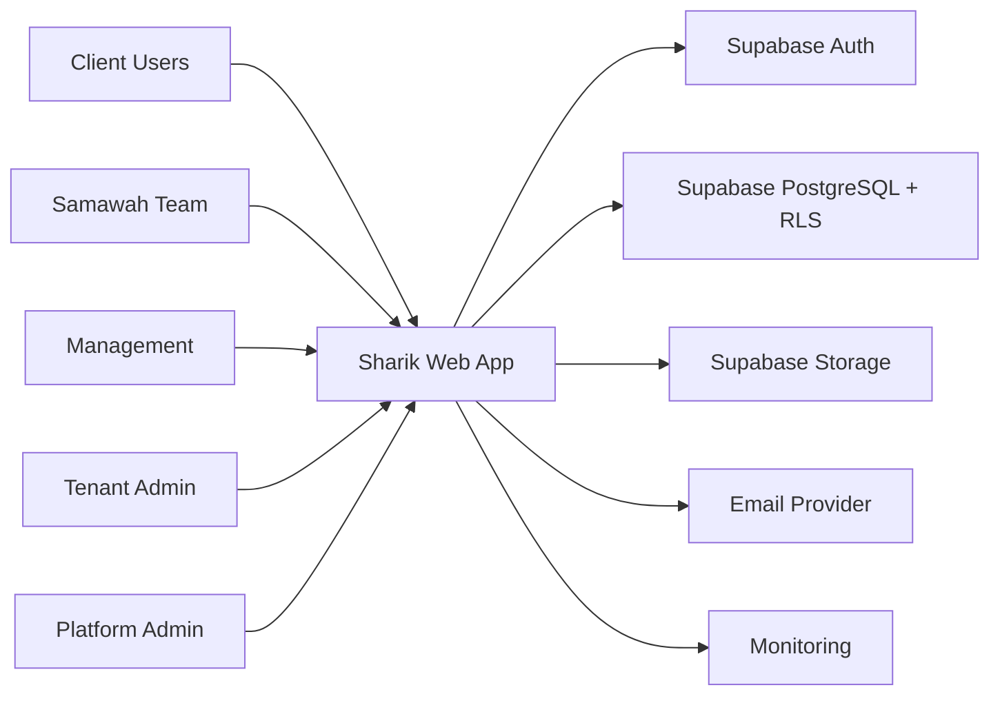

# C4 System Context: شريك

## 1. النظام

شريك منصة SaaS لإدارة المخرجات والتعميدات والملفات وSLA بين وكالة تشغيلية وعملا­ئها.

## 2. الأشخاص والأنظمة

| Actor/System | العلاقة |
| --- | --- |
| Client User | يرى مخرجاته وملفاته وقراراته فقط |
| Client Approver | يعتمد أو يطلب تعديلا على نسخة مرسلة |
| Team Member | ينفذ المهام ويرفع ملفات ويكتب تعليقات داخلية |
| Project/Marketing Manager | يدير المخرجات والتعميد والإرسال |
| Tenant Admin/Owner | يدير المستخدمين والنطاقات والسياسات |
| Platform Admin | حوكمة SaaS دون وصول محتوى افتراضي |
| Supabase Auth | الهوية والجلسات |
| Supabase PostgreSQL | الحالة والمعاملات وRLS |
| Supabase Storage | تخزين الملفات |
| Email Provider | الدعوات والتنبيهات |
| Hosting Platform | تشغيل تطبيق Next.js |
| Monitoring/Backup Tools | مراقبة واسترجاع |

## 3. Mermaid Context

## 4. حدود الثقة

- المتصفح غير موثوق.
- Session claims لا تكفي وحدها للصلاحيات الحساسة.
- قاعدة البيانات تطبق RLS، والخادم يطبق Permission Evaluation.
- Storage لا يعتمد على path فقط؛ metadata في DB هي مصدر قرار الرؤية.

