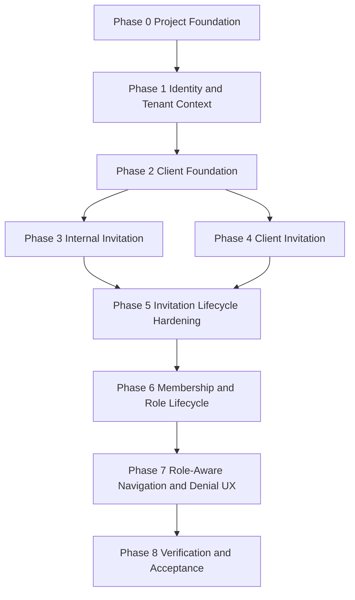

# Tasks: Secure Tenant and Client Onboarding

**Input**: Design documents from `specs/001-secure-tenant-client-onboarding/`

**Prerequisites**: `spec.md`, `checklists/requirements.md`, `plan.md`, `research.md`, `data-model.md`, `contracts/operations.md`, `quickstart.md`, `.specify/memory/constitution.md`, `AGENTS.md`, Agent OS standards, and accepted ADRs in `docs/06-decisions/`.

**Scope Guard**: This file is a future implementation task plan only. It does not create product code, SQL, migrations, RLS policies, Supabase resources, API endpoints, dependencies, or `/speckit.implement` work.

**Tests**: TDD is required for domain/security logic: tenant isolation, client isolation, permission evaluation, invitation lifecycle, membership disabling, session behavior, audit events, enumeration-safe denials, idempotency, and rate limiting.

**Task Format**: `- [ ] T### [P?] [US?] Description with file path; Req/Contract; Verification; Dependencies; Category`

**Categories**: Project Foundation, Shared Security Foundation, F-001 Feature Work, Verification, Documentation.

## Phase 0: Project Foundation

**Purpose**: Establish the implementation shell, configuration, and quality baseline before business behavior.

- [ ] T001 Create Next.js App Router project structure in `app/`, `src/`, and `tests/`; Req: plan Project Structure; Verification: `npm run typecheck` and repository tree review; Dependencies: none; Category: Project Foundation
- [ ] T002 Configure TypeScript strict settings in `tsconfig.json` and project build scripts in `package.json`; Req: Agent OS TypeScript Standards, NFR-005; Verification: strict typecheck fails on implicit unsafe types; Dependencies: T001; Category: Project Foundation
- [ ] T003 Configure Tailwind CSS, shadcn/ui base setup, Radix-compatible theme tokens, and RTL direction defaults in `tailwind.config.ts`, `app/globals.css`, and `src/ui/theme/`; Req: FR-029, UX-001, UX-007, NFR-006; Verification: component smoke test confirms RTL root direction; Dependencies: T001; Category: Project Foundation
- [ ] T004 [P] Define environment schema and safe public/server variable split in `src/server/config/env.ts` and `.env.example`; Req: constitution No Secrets in Repo/Browser; Verification: env validation unit test rejects missing server values and does not expose service-role values to client imports; Dependencies: T001; Category: Project Foundation
- [ ] T005 [P] Configure Vitest, Testing Library, and test aliases in `vitest.config.ts` and `tests/setup/`; Req: NFR-001 through NFR-015; Verification: placeholder test suite runs with zero product behavior; Dependencies: T001; Category: Project Foundation
- [ ] T006 [P] Configure Playwright projects for desktop, mobile, Arabic RTL, and auth storage states in `playwright.config.ts` and `tests/e2e/`; Req: FR-028, FR-029, NFR-005, NFR-007; Verification: Playwright config lists required projects; Dependencies: T001; Category: Project Foundation
- [ ] T007 Configure linting, formatting, and import boundary rules in `eslint.config.*`, `.prettierrc`, and `src/modules/*`; Req: ADR-001, Agent OS standards; Verification: lint rejects client imports from server command internals; Dependencies: T001; Category: Project Foundation
- [ ] T008 Define CI baseline for typecheck, lint, unit, integration, RLS, component, E2E smoke, and secret scan in `.github/workflows/f001-quality.yml`; Req: Quality Gates, NFR-014; Verification: CI dry run or workflow lint; Dependencies: T004, T005, T006, T007; Category: Project Foundation
- [ ] T009 Document local Supabase development strategy and no-real-data fixture rules in `docs/07-delivery/f001-local-dev.md`; Req: quickstart Preconditions, SR-010; Verification: doc review confirms no production secrets or real client data; Dependencies: T004; Category: Documentation
- [ ] T010 Record `TECH-DEBT-001` for Agent OS context update hook on Windows PowerShell in `docs/07-delivery/technical-debt.md`; Req: user request preflight; Verification: debt item includes impact, owner decision needed, non-blocking status; Dependencies: none; Category: Documentation

**Checkpoint 0**: Project shell can run quality commands without implementing F-001 business logic. Evidence: typecheck/lint/test harness output, no secrets, no product SQL.

## Phase 1: Identity and Tenant Context

**Purpose**: Build shared identity, tenant context, permission, audit, and denial foundations that block all user stories.

- [ ] T011 [P] Write failing unit tests for tenant context derivation from active membership in `tests/unit/auth/tenant-context.test.ts`; Req: SR-001, FR-027; Contract: C-001; Verification: test fails before resolver exists; Dependencies: T005; Category: Shared Security Foundation
- [ ] T012 [P] Write failing unit tests for permission evaluator deny-by-default behavior in `tests/unit/authorization/permission-evaluator.test.ts`; Req: FR-014, FR-027, SR-008; Contracts: C-002 through C-015; Verification: missing membership/role/scope denies; Dependencies: T005; Category: Shared Security Foundation
- [ ] T013 [P] Write failing unit tests for enumeration-safe error mapping in `tests/unit/errors/safe-errors.test.ts`; Req: FR-021, FR-022, SR-010; Contracts: shared error codes; Verification: unauthorized ids map to safe Arabic copy keys; Dependencies: T005; Category: Shared Security Foundation
- [ ] T014 [P] Write failing audit append contract tests in `tests/integration/audit/audit-required.test.ts`; Req: FR-025, FR-026, NFR-004; Contract: C-015; Verification: sensitive command without audit fails closed; Dependencies: T005; Category: Shared Security Foundation
- [ ] T015 [P] Write failing RLS design tests for cross-tenant denial in `tests/rls/tenant-isolation.test.ts`; Req: SR-003, NFR-002; Contracts: C-001, C-013, C-015; Verification: Tenant A cannot read Tenant B rows; Dependencies: T005; Category: Shared Security Foundation
- [ ] T016 Define conceptual database migration task for identity, tenant, membership, role, permission, invitation, and audit tables in `supabase/migrations/*_f001_identity_onboarding.sql`; Req: all 13 entities; Verification: migration review confirms tenant/client scope columns and no executable work before implementation; Dependencies: T011-T015; Category: F-001 Feature Work
- [ ] T017 Define RLS helper function task for active tenant membership, client membership, internal assignment, and management scope checks in `supabase/migrations/*_f001_rls_helpers.sql`; Req: SR-001 through SR-005; Verification: helper tests cover stale session and disabled membership; Dependencies: T016; Category: F-001 Feature Work
- [ ] T018 Define RLS policy task for tenants, clients, memberships, role assignments, invitations, and audit events in `supabase/migrations/*_f001_rls_policies.sql`; Req: SR-001 through SR-010; Verification: RLS tests T015 and later story RLS tests pass; Dependencies: T017; Category: F-001 Feature Work
- [ ] T019 Implement Auth session adapter in `src/modules/auth/session.ts`; Req: FR-014, SR-001; Contract: C-001; Verification: T011 and C-001 integration tests pass; Dependencies: T016; Category: Shared Security Foundation
- [ ] T020 Implement tenant context resolver in `src/modules/auth/tenant-context.ts`; Req: SR-001, FR-027; Contract: C-001; Verification: T011 passes and cross-tenant attempts deny safely; Dependencies: T019; Category: Shared Security Foundation
- [ ] T021 Implement client scope resolver in `src/modules/auth/client-scope.ts`; Req: SR-002, FR-017, FR-018; Contracts: C-013, C-014; Verification: assigned/unassigned client fixtures resolve correctly; Dependencies: T020; Category: Shared Security Foundation
- [ ] T022 Implement permission catalog and role-permission mapping in `src/modules/authorization/permission-catalog.ts`; Req: Permission Coverage table, FR-014, FR-015; Verification: catalog unit tests cover all listed permission IDs; Dependencies: T012; Category: Shared Security Foundation
- [ ] T023 Implement server-side permission evaluator in `src/modules/authorization/evaluator.ts`; Req: FR-027, SR-008; Contracts: C-002 through C-015; Verification: T012 passes for missing state, wrong scope, disabled membership, and role mismatch; Dependencies: T020, T021, T022; Category: Shared Security Foundation
- [ ] T024 Implement shared safe error classes and Arabic copy keys in `src/modules/errors/safe-errors.ts` and `src/ui/copy/ar-SA/errors.ts`; Req: FR-021, FR-022, SR-010, UX-001; Verification: T013 passes and no raw SQL/Auth messages are exposed; Dependencies: T013; Category: Shared Security Foundation
- [ ] T025 Implement audit append service interface and transaction guard in `src/modules/audit/audit-service.ts`; Req: FR-025, FR-026, NFR-004; Contract: C-015; Verification: T014 passes and sensitive command tests fail closed on audit failure; Dependencies: T016, T023; Category: Shared Security Foundation
- [ ] T026 [P] Build test fixture factory for Tenant A/B, Client A/B, users, memberships, roles, and invitations in `tests/fixtures/f001-fixtures.ts`; Req: quickstart Test Accounts; Verification: fixture smoke tests create isolated data; Dependencies: T016; Category: Verification
- [ ] T027 [P] Build Arabic RTL shell and safe auth entry layout in `app/(auth)/layout.tsx` and `app/(management)/layout.tsx`; Req: FR-019, FR-022, UX-001, UX-007; Verification: component tests confirm RTL and no unauthorized nav items by default; Dependencies: T003, T024; Category: F-001 Feature Work

**Checkpoint 1**: Security foundation is ready for story work. Evidence: tenant/client resolvers, permission evaluator, audit service, RLS policy tasks, and failing-first tests for core invariants.

## Phase 2: Client Foundation

**Goal**: Tenant admin can create and view scoped clients under Samawah tenant.

**Independent Test**: Sign in as `tenant_administrator`, create Client A, see it in management list, verify `ClientCreated` audit, and verify unauthorized actor cannot create or infer clients.

- [ ] T028 [P] [US1] Write failing integration test for `client.create` and `client.update` allow/deny/audit in `tests/integration/clients/client-management.test.ts`; Req: FR-001, FR-002, FR-025, FR-026; Contracts: C-002, C-003; Verification: unauthorized actor creates/updates no client and authorized update records `ClientUpdated`; Dependencies: T025, T026; Category: Verification
- [ ] T029 [P] [US1] Write failing RLS test for authorized client basics and cross-tenant/client denial in `tests/rls/client-access.test.ts`; Req: SR-001 through SR-004; Contracts: C-002, C-013; Verification: Client A user cannot read Client B; Dependencies: T018, T026; Category: Verification
- [ ] T030 [P] [US1] Write failing E2E test for empty client list and create-client flow in `tests/e2e/management/create-client.spec.ts`; Req: AC-001, AC-003, UX-003; Contract: C-002; Verification: Arabic empty state and create action are visible only when permitted; Dependencies: T006, T026; Category: Verification
- [ ] T031 [US1] Implement client entity repository with tenant-scoped reads/create/update operations in `src/modules/clients/client-repository.ts`; Req: Client entity, FR-001, FR-002; Contracts: C-002, C-003; Verification: T028/T029 pass without browser-supplied tenant trust; Dependencies: T018, T023; Category: F-001 Feature Work
- [ ] T032 [US1] Implement create-client and update-client commands with Zod validation, idempotency/revision checks, permission checks, transaction, and audit in `src/server/commands/clients/create-client.ts` and `src/server/commands/clients/update-client.ts`; Req: FR-001, FR-002, FR-025, FR-026, NFR-015; Contracts: C-002, C-003; Verification: T028 passes; Dependencies: T024, T025, T031; Category: F-001 Feature Work
- [ ] T033 [US1] Implement authorized client listing query in `src/modules/clients/list-assigned-clients.ts`; Req: FR-017, FR-018, SR-002, SR-004; Contract: C-013; Verification: T029 passes for admin, assigned internal, client user, and unassigned user; Dependencies: T021, T031; Category: F-001 Feature Work
- [ ] T034 [US1] Implement management client pages and create/update form in `app/(management)/clients/page.tsx`, `app/(management)/clients/new/page.tsx`, `app/(management)/clients/[clientId]/edit/page.tsx`, and `src/ui/management/client-form.tsx`; Req: FR-019, FR-022, UX-001, UX-003; Contracts: C-002, C-003, C-013; Verification: T030 passes and form preserves safe values on recoverable failure; Dependencies: T032, T033; Category: F-001 Feature Work
- [ ] T035 [P] [US1] Write component tests for client form validation, empty state, loading state, denied state, and RTL labels in `tests/component/clients/client-form.test.tsx`; Req: FR-022, FR-029, UX-003, UX-007; Contract: C-002; Verification: invalid fields show Arabic field errors; Dependencies: T034; Category: Verification
- [ ] T036 [US1] Update quickstart evidence notes for client creation/update validation in `specs/001-secure-tenant-client-onboarding/quickstart.md`; Req: SC-001, SC-004; Verification: evidence points to tests and audit record names; Dependencies: T028-T035; Category: Documentation

**Checkpoint 2**: Client foundation demo works. Evidence: Client A creation, no unauthorized creation, audit event, isolation tests, empty/loading/denied states. Out of scope remains: invitations and membership changes.

## Phase 3: Internal Member Invitation

**Goal**: Tenant admin invites internal team members with least-privilege client scope and internal users accept into assigned-client access only.

**Independent Test**: Invite `internal-a@example.test` to Client A, accept within 7 days, verify Client A access, Client B denial, and audit events.

- [ ] T037 [P] [US2] Write failing unit tests for internal invitation role/scope validation in `tests/unit/invitations/internal-invitation-rules.test.ts`; Req: FR-003, FR-006, FR-016, FR-018; Contract: C-004; Verification: cross-tenant client scope and empty role/scope deny; Dependencies: T022, T026; Category: Verification
- [ ] T038 [P] [US2] Write failing integration test for internal invite creation and audit intent in `tests/integration/invitations/invite-internal.test.ts`; Req: FR-003, FR-006, FR-025, FR-026; Contract: C-004; Verification: pending invitation with tenant and optional client scope; Dependencies: T025, T026; Category: Verification
- [ ] T039 [P] [US2] Write failing E2E test for internal invite acceptance and assigned-client navigation in `tests/e2e/invitations/internal-invite.spec.ts`; Req: AC-002, AC-003, AC-013, AC-017; Contracts: C-004, C-008, C-013, C-014; Verification: internal user sees Client A only before Client B assignment; Dependencies: T006, T026; Category: Verification
- [ ] T040 [P] [US2] Write failing RLS test for assigned internal users in `tests/rls/internal-assigned-clients.test.ts`; Req: FR-016, FR-018, SR-002, SR-004; Contract: C-013; Verification: internal Client A assignment cannot read Client B; Dependencies: T018, T026; Category: Verification
- [ ] T041 [US2] Implement invitation domain rules for internal member invitations in `src/modules/invitations/internal-invitation-rules.ts`; Req: FR-003, FR-006, FR-016, FR-018; Contract: C-004; Verification: T037 passes; Dependencies: T023; Category: F-001 Feature Work
- [ ] T042 [US2] Implement invite-internal-member command with validation, permission check, role intent, outbox/delivery state, idempotency, and audit in `src/server/commands/invitations/invite-internal-member.ts`; Req: FR-003, FR-006, FR-025, FR-026, NFR-012, NFR-015; Contract: C-004; Verification: T038 passes; Dependencies: T025, T041; Category: F-001 Feature Work
- [ ] T043 [US2] Implement invitation email dispatch adapter abstraction in `src/modules/invitations/email-dispatcher.ts`; Req: research Decision 10, FR-006; Contract: C-004; Verification: integration test uses local capture and never real secrets; Dependencies: T004, T042; Category: F-001 Feature Work
- [ ] T044 [US2] Implement accept-internal-invitation path for tenant membership activation and role assignment in `src/server/commands/invitations/accept-invitation.ts`; Req: FR-011, FR-012, FR-014, FR-016, FR-025; Contract: C-008; Verification: T039 passes for existing user path; Dependencies: T042; Category: F-001 Feature Work
- [ ] T045 [US2] Implement assigned internal client listing and portfolio surface in `app/(management)/portfolio/page.tsx` and `src/ui/management/assigned-clients.tsx`; Req: FR-016, FR-018, FR-019, FR-022; Contracts: C-013, C-014; Verification: T039/T040 pass; Dependencies: T033, T044; Category: F-001 Feature Work
- [ ] T046 [P] [US2] Add component tests for internal invite form role selector, scope selector, save failure, loading, and no-invitations state in `tests/component/invitations/internal-invite-form.test.tsx`; Req: FR-022, UX-002, UX-003, UX-007; Contract: C-004; Verification: Arabic copy and focus order pass; Dependencies: T042; Category: Verification
- [ ] T047 [US2] Update traceability evidence for internal invitation in `specs/001-secure-tenant-client-onboarding/quickstart.md`; Req: AC-002, AC-003, AC-013, AC-017; Verification: evidence includes audit events and isolation assertions; Dependencies: T037-T046; Category: Documentation

**Checkpoint 3**: Internal invitation sub-slice works. Evidence: pending invite, acceptance, assigned Client A access, Client B denial, audit events. Out of scope remains: client member invitations and hardening states beyond valid acceptance.

## Phase 4: Client Member Invitation

**Goal**: Tenant owner/admin invites client users to exactly one client scope; client users enter client-facing surfaces only.

**Independent Test**: Invite `client-viewer-a@example.test`, accept as existing/new user, verify only Client A portal surfaces and no tenant-wide list or admin actions.

- [ ] T048 [P] [US3] Write failing unit tests for client invitation rules in `tests/unit/invitations/client-invitation-rules.test.ts`; Req: FR-004, FR-005, FR-007, FR-011, FR-017; Contract: C-005; Verification: `client_admin` invite denies/absent and multi-client client invite denies; Dependencies: T026; Category: Verification
- [ ] T049 [P] [US3] Write failing integration tests for client invite creation, new-user acceptance, existing-user acceptance, and audit in `tests/integration/invitations/invite-client-member.test.ts`; Req: FR-004, FR-007, FR-011, FR-012, FR-025; Contracts: C-005, C-008; Verification: role/scope exactly matches invitation; Dependencies: T025, T026; Category: Verification
- [ ] T050 [P] [US3] Write failing RLS tests for client user limitations in `tests/rls/client-member-isolation.test.ts`; Req: FR-017, SR-002, SR-005, SR-006; Contracts: C-013, C-015; Verification: client role cannot read tenant-wide list or internal audit; Dependencies: T018, T026; Category: Verification
- [ ] T051 [P] [US3] Write failing E2E tests for client viewer acceptance, portal entry, Client B denial, and viewer admin-action denial in `tests/e2e/invitations/client-invite.spec.ts`; Req: AC-004, AC-005, AC-006, AC-011, AC-018; Contracts: C-005, C-008, C-014; Verification: no Client B or admin data leaks; Dependencies: T006, T026; Category: Verification
- [ ] T052 [US3] Implement client invitation domain rules in `src/modules/invitations/client-invitation-rules.ts`; Req: FR-004, FR-005, FR-007, FR-017; Contract: C-005; Verification: T048 passes; Dependencies: T023; Category: F-001 Feature Work
- [ ] T053 [US3] Implement invite-client-member command with exact client scope, client role validation, idempotency, delivery state, and audit in `src/server/commands/invitations/invite-client-member.ts`; Req: FR-004, FR-005, FR-007, FR-025, FR-026; Contract: C-005; Verification: T049 passes; Dependencies: T025, T052; Category: F-001 Feature Work
- [ ] T054 [US3] Extend accept-invitation command for client membership activation and scoped client role assignment in `src/server/commands/invitations/accept-invitation.ts`; Req: FR-011, FR-012, FR-017; Contract: C-008; Verification: T049/T051 pass for existing and new users; Dependencies: T044, T053; Category: F-001 Feature Work
- [ ] T055 [US3] Implement client portal shell and first-entry surface in `app/(client)/layout.tsx`, `app/(client)/page.tsx`, and `src/ui/client/client-home.tsx`; Req: FR-017, FR-019, FR-022, FR-028; Contracts: C-013, C-014; Verification: client user sees only Client A role-scoped surfaces; Dependencies: T054; Category: F-001 Feature Work
- [ ] T056 [P] [US3] Add component tests for client invite form, client portal empty state, denied state, and mobile RTL acceptance in `tests/component/client/client-onboarding.test.tsx`; Req: FR-022, FR-028, FR-029, UX-002 through UX-007; Contracts: C-005, C-014; Verification: mobile viewport keeps primary action reachable; Dependencies: T055; Category: Verification
- [ ] T057 [US3] Update quickstart evidence for client member invitation and client isolation in `specs/001-secure-tenant-client-onboarding/quickstart.md`; Req: SC-001, SC-005, SC-007; Verification: evidence includes client user no tenant-wide list; Dependencies: T048-T056; Category: Documentation

**Checkpoint 4**: Client invitation sub-slice works. Evidence: client invite, existing/new user acceptance, Client A-only portal, no tenant-wide list, no internal audit, denial audit. Out of scope remains: lifecycle hardening and role/membership management.

## Phase 5: Invitation Lifecycle Hardening

**Goal**: Enforce 7-day expiry, revocation, resend/supersession, single-use, email matching, replay protection, enumeration-safe errors, rate limiting, and idempotency.

**Independent Test**: Valid, expired, revoked, superseded, already-used, and email-mismatch invitation links never grant unauthorized access and produce safe UX/audit.

- [ ] T058 [P] [US4] Write failing unit tests for invitation expiry boundary and authoritative timestamp in `tests/unit/invitations/invitation-expiry.test.ts`; Req: FR-008, FR-013, Edge Case expiry boundary; Contract: C-008; Verification: exact-boundary decision is deterministic; Dependencies: T026; Category: Verification
- [ ] T059 [P] [US4] Write failing unit tests for single-use, replay, and idempotent accept in `tests/unit/invitations/invitation-idempotency.test.ts`; Req: FR-009, FR-013, NFR-009, NFR-015; Contract: C-008; Verification: repeated acceptance creates no duplicate membership/role/audit side effects; Dependencies: T026; Category: Verification
- [ ] T060 [P] [US4] Write failing integration tests for revoke and revoked-link acceptance in `tests/integration/invitations/revoke-invitation.test.ts`; Req: FR-013, FR-025; Contract: C-007; Verification: revoked invitation creates no membership and records safe denial; Dependencies: T025, T026; Category: Verification
- [ ] T061 [P] [US4] Write failing integration tests for resend supersession and old-link denial in `tests/integration/invitations/resend-invitation.test.ts`; Req: FR-010, FR-013, FR-025; Contract: C-006; Verification: old pending invitation is superseded before replacement grants access; Dependencies: T025, T026; Category: Verification
- [ ] T062 [P] [US4] Write failing integration tests for email mismatch and invitation-not-found safe responses in `tests/integration/invitations/email-mismatch.test.ts`; Req: FR-011, FR-013, FR-021, SR-010; Contract: C-008; Verification: no scope data leaks in invalid token/email cases; Dependencies: T024, T026; Category: Verification
- [ ] T063 [P] [US4] Write failing rate-limit and brute-force tests in `tests/integration/security/invitation-rate-limit.test.ts`; Req: NFR-012, SR-010; Contracts: C-004 through C-008; Verification: create/resend/accept throttle returns safe Arabic copy; Dependencies: T026; Category: Verification
- [ ] T064 [P] [US4] Write failing E2E tests for expired, revoked, superseded, already-used, and email-mismatch UX states in `tests/e2e/invitations/invitation-lifecycle.spec.ts`; Req: AC-007 through AC-010, UX-002; Contract: C-008; Verification: each state has safe Arabic UI and no membership activation; Dependencies: T006, T026; Category: Verification
- [ ] T065 [US4] Implement invitation state machine in `src/modules/invitations/invitation-state-machine.ts`; Req: FR-008 through FR-013, FR-027; Contract: C-008; Verification: T058/T059 pass; Dependencies: T052, T054; Category: F-001 Feature Work
- [ ] T066 [US4] Implement revoke invitation command in `src/server/commands/invitations/revoke-invitation.ts`; Req: FR-013, FR-025, FR-026; Contract: C-007; Verification: T060 passes; Dependencies: T025, T065; Category: F-001 Feature Work
- [ ] T067 [US4] Implement resend invitation command with supersession transaction and email dispatch in `src/server/commands/invitations/resend-invitation.ts`; Req: FR-010, FR-013, FR-025, NFR-015; Contract: C-006; Verification: T061 passes; Dependencies: T043, T065; Category: F-001 Feature Work
- [ ] T068 [US4] Harden accept-invitation command for expiry, revoked, superseded, already-used, email mismatch, idempotency, and replay in `src/server/commands/invitations/accept-invitation.ts`; Req: FR-008 through FR-013, SR-006, SR-007; Contract: C-008; Verification: T058/T059/T062/T064 pass; Dependencies: T065; Category: F-001 Feature Work
- [ ] T069 [US4] Implement invitation rate limiter abstraction and command integration in `src/modules/security/rate-limit.ts`; Req: NFR-012, SR-010; Contracts: C-004 through C-008; Verification: T063 passes without leaking token/email state; Dependencies: T024, T068; Category: Shared Security Foundation
- [ ] T070 [US4] Implement invitation lifecycle UI states in `app/(auth)/invite/[token]/page.tsx` and `src/ui/invitations/invitation-status.tsx`; Req: FR-022, FR-028, FR-029, UX-002; Contract: C-008; Verification: T064 passes across mobile and desktop; Dependencies: T068; Category: F-001 Feature Work
- [ ] T071 [US4] Add audit assertions for expired/revoked/superseded/used/email-mismatch denials in `tests/integration/audit/invitation-denial-audit.test.ts`; Req: FR-025, FR-026, SR-009; Contract: C-008; Verification: each sensitive denial is audit eligible with safe metadata; Dependencies: T068; Category: Verification

**Checkpoint 5**: Invitation lifecycle is hardened. Evidence: all invalid states deny safely, single-use and idempotency hold, resend supersedes, rate limits exist, audit is complete. Safe to move to role and membership lifecycle.

## Phase 6: Membership and Role Lifecycle

**Goal**: Tenant admin can change roles/scopes, remove client scope, revoke invitations, disable memberships, and maintain auditability/offboarding safeguards.

**Independent Test**: Change a scoped member role, remove client scope, disable membership, verify active session denial, pending invitation cancellation, responsibility transfer prerequisite, and audit.

- [ ] T072 [P] [US5] Write failing unit tests for role assignment authority and non-conflicting multiple roles in `tests/unit/authorization/role-assignment.test.ts`; Req: FR-014, FR-015, SR-008; Contracts: C-009, C-010; Verification: actor cannot assign outside authority or cross-tenant scope; Dependencies: T023, T026; Category: Verification
- [ ] T073 [P] [US5] Write failing integration tests for role assignment and role update audit in `tests/integration/roles/role-lifecycle.test.ts`; Req: FR-015, FR-025, FR-026; Contracts: C-009, C-010; Verification: old/new safe state and reason recorded; Dependencies: T025, T026; Category: Verification
- [ ] T074 [P] [US5] Write failing integration tests for remove client scope in `tests/integration/memberships/remove-client-scope.test.ts`; Req: FR-016, FR-018, FR-023, FR-025; Contract: C-011; Verification: removed scope denies future Client A access while preserving audit; Dependencies: T025, T026; Category: Verification
- [ ] T075 [P] [US5] Write failing integration tests for membership disabling and pending invitation cancellation in `tests/integration/memberships/disable-membership.test.ts`; Req: FR-023, FR-024, FR-025; Contract: C-012; Verification: disabled membership cannot access protected command with active session; Dependencies: T025, T026; Category: Verification
- [ ] T076 [P] [US5] Write failing E2E test for role change, disablement, and current-session denial in `tests/e2e/management/member-lifecycle.spec.ts`; Req: AC-014, AC-015, AC-016, AC-020; Contracts: C-009, C-010, C-012; Verification: user sees membership-disabled safe state after disablement; Dependencies: T006, T026; Category: Verification
- [ ] T077 [US5] Implement role assignment command in `src/server/commands/roles/assign-role.ts`; Req: FR-014, FR-015, FR-025, FR-026; Contract: C-009; Verification: T072/T073 pass; Dependencies: T023, T025; Category: F-001 Feature Work
- [ ] T078 [US5] Implement change role assignment command in `src/server/commands/roles/change-role-assignment.ts`; Req: FR-014, FR-015, FR-025, FR-026; Contract: C-010; Verification: T073 passes for update/revoke/replace behavior; Dependencies: T077; Category: F-001 Feature Work
- [ ] T079 [US5] Implement remove client scope command in `src/server/commands/memberships/remove-client-scope.ts`; Req: FR-018, FR-023, FR-025; Contract: C-011; Verification: T074 passes; Dependencies: T078; Category: F-001 Feature Work
- [ ] T080 [US5] Implement disable membership command with active responsibility guard and pending invitation cancellation in `src/server/commands/memberships/disable-membership.ts`; Req: FR-023, FR-024, FR-025, FR-026; Contract: C-012; Verification: T075/T076 pass; Dependencies: T066, T079; Category: F-001 Feature Work
- [ ] T081 [US5] Implement management members and invitations lifecycle UI in `app/(management)/members/page.tsx`, `src/ui/management/member-list.tsx`, and `src/ui/management/invitation-list.tsx`; Req: FR-019, FR-022, UX-003, UX-005; Contracts: C-006, C-007, C-009 through C-012; Verification: T076 passes with Arabic denial and disabled states; Dependencies: T067, T080; Category: F-001 Feature Work
- [ ] T082 [P] [US5] Add component tests for role selector, revoke/resend controls, disabled membership state, and responsibility-transfer blocked state in `tests/component/management/member-lifecycle.test.tsx`; Req: FR-022, FR-024, UX-003, UX-005; Contracts: C-006, C-007, C-009 through C-012; Verification: blocked disablement is visible without implying delivery-domain implementation; Dependencies: T081; Category: Verification
- [ ] T083 [US5] Update documentation note that delivery-domain responsibility transfer remains prerequisite for later deliverables in `docs/07-delivery/f001-offboarding-prerequisite.md`; Req: FR-024; Verification: doc states F-001 blocks/records when responsibilities are out of scope; Dependencies: T080; Category: Documentation

**Checkpoint 6**: Role and membership lifecycle is operational. Evidence: role/scope updates, disablement, pending invite cancellation, active-session denial, audit. Out of scope remains: deliverable responsibility transfer implementation.

## Phase 7: Role-Aware Navigation and Denial UX

**Goal**: Every onboarded user sees navigation, empty states, denial states, and direct URL behavior matching role and scope across Arabic RTL, mobile, and accessibility expectations.

**Independent Test**: Log in as each role, inspect visible navigation, attempt forbidden direct URLs, and verify safe denied/not-found states with no resource enumeration.

- [ ] T084 [P] [US6] Write failing unit tests for navigation resolver across tenant admin, assigned internal, client viewer, client approver, and no-client states in `tests/unit/navigation/navigation-resolver.test.ts`; Req: FR-019, FR-022; Contract: C-014; Verification: navigation never grants authorization and hides out-of-scope actions; Dependencies: T023, T026; Category: Verification
- [ ] T085 [P] [US6] Write failing component tests for denied/not-found/no-assigned-client states in `tests/component/navigation/denial-states.test.tsx`; Req: FR-021, FR-022, UX-003, UX-004; Contract: C-014; Verification: states do not name unauthorized client/tenant; Dependencies: T024; Category: Verification
- [ ] T086 [P] [US6] Write failing E2E tests for direct URL tampering, Client B URL denial, tenant denial, viewer admin-action denial, and no-client state in `tests/e2e/security/denial-ux.spec.ts`; Req: AC-011, AC-012, AC-018, AC-019; Contracts: C-013, C-014; Verification: no IDOR or enumeration leakage; Dependencies: T006, T026; Category: Verification
- [ ] T087 [P] [US6] Write failing accessibility and mobile tests for invitation acceptance, navigation, forms, dialogs, and denial states in `tests/e2e/accessibility/rtl-mobile.spec.ts`; Req: FR-028, FR-029, NFR-005, NFR-006, NFR-007; Contract: C-014; Verification: keyboard access, visible focus, labels, and mobile primary action pass; Dependencies: T006; Category: Verification
- [ ] T088 [US6] Implement role-aware navigation resolver in `src/modules/navigation/navigation-resolver.ts`; Req: FR-019, FR-020, FR-022; Contract: C-014; Verification: T084 passes and direct URL tests still require server auth; Dependencies: T023; Category: F-001 Feature Work
- [ ] T089 [US6] Implement route guards and server loaders for management/client route groups in `app/(management)/layout.tsx`, `app/(client)/layout.tsx`, and `src/server/navigation/route-guards.ts`; Req: FR-020, FR-021, SR-003, SR-004, SR-010; Contract: C-014; Verification: T086 passes; Dependencies: T088; Category: Shared Security Foundation
- [ ] T090 [US6] Implement shared denial, not-found, no-assigned-client, session-expired, and membership-disabled UI components in `src/ui/shared/access-states.tsx`; Req: FR-021, FR-022, UX-003, UX-004; Contract: C-014; Verification: T085/T086 pass; Dependencies: T024; Category: F-001 Feature Work
- [ ] T091 [US6] Implement navigation UI for management, team portfolio, and client portal in `src/ui/navigation/role-aware-nav.tsx`; Req: FR-019, UX-005, UX-007; Contract: C-014; Verification: T084/T087 pass; Dependencies: T088, T090; Category: F-001 Feature Work
- [ ] T092 [P] [US6] Add Arabic Saudi copy catalog for loading, empty, pending, accepted, expired, revoked, superseded, mismatch, permission denied, session expired, save failure, network failure, membership disabled, and no assigned clients in `src/ui/copy/ar-SA/f001.ts`; Req: FR-022, UX-001, UX-002, UX-003; Verification: copy coverage test maps every required state; Dependencies: T024; Category: F-001 Feature Work
- [ ] T093 [US6] Update UX validation checklist for RTL, mobile, and accessibility evidence in `specs/001-secure-tenant-client-onboarding/quickstart.md`; Req: SC-008; Verification: quickstart includes direct evidence locations for UX/a11y; Dependencies: T084-T092; Category: Documentation

**Checkpoint 7**: Role-aware UX is complete. Evidence: role nav, denial UX, direct URL protection, no enumeration, Arabic RTL, mobile, accessibility. Safe to run final verification.

## Phase 8: Verification and Acceptance

**Purpose**: Prove F-001 is ready for build acceptance without expanding scope.

- [ ] T094 [P] Run full unit test suite for invitation rules, permission evaluation, navigation, and safe errors using `tests/unit/`; Req: NFR-001, NFR-009, NFR-015; Verification: all unit tests pass; Dependencies: T011-T013, T037, T048, T058, T059, T072, T084; Category: Verification
- [ ] T095 [P] Run full integration test suite for clients, invitations, roles, memberships, audit, rate limiting, and disabled sessions using `tests/integration/`; Req: all FRs, NFR-004, NFR-012; Verification: all integration tests pass; Dependencies: T028, T038, T049, T060-T063, T071, T073-T075; Category: Verification
- [ ] T096 [P] Run full RLS test suite for tenant isolation, client isolation, assigned internal access, client limitations, and audit privacy using `tests/rls/`; Req: SR-001 through SR-010; Verification: RLS tests pass against local/development Supabase; Dependencies: T015, T029, T040, T050; Category: Verification
- [ ] T097 [P] Run full component test suite for forms, lists, lifecycle controls, denial states, copy, RTL, and loading/empty states using `tests/component/`; Req: FR-022, FR-029, UX-001 through UX-007; Verification: Testing Library output passes; Dependencies: T035, T046, T056, T082, T085; Category: Verification
- [ ] T098 Run Playwright E2E suite for quickstart paths, cross-tenant/client denial, IDOR, replay, membership disablement, and mobile acceptance using `tests/e2e/`; Req: AC-001 through AC-020; Verification: desktop/mobile E2E pass with screenshots/traces retained; Dependencies: T030, T039, T051, T064, T076, T086, T087; Category: Verification
- [ ] T099 Run security review checklist for privilege escalation, mass assignment, service-role exposure, secret leakage, enumeration, rate limits, and audit failure behavior in `docs/06-security/f001-security-review.md`; Req: SR-001 through SR-010, constitution; Verification: no critical/high security gaps remain; Dependencies: T094-T098; Category: Verification
- [ ] T100 Run quickstart validation and capture acceptance evidence in `specs/001-secure-tenant-client-onboarding/quickstart.md`; Req: SC-001 through SC-008; Verification: all quickstart steps have pass/fail evidence and audit names; Dependencies: T094-T099; Category: Verification
- [ ] T101 [P] Update implementation notes and out-of-scope confirmations in `docs/07-delivery/f001-acceptance-evidence.md`; Req: FR-030, SC-003; Verification: confirms no deliverables/contracts/packages/Kanban/files/comments/SLA/approvals/billing/social scheduling implemented; Dependencies: T100; Category: Documentation
- [ ] T102 [P] Update traceability table from requirements to tasks/tests in `specs/001-secure-tenant-client-onboarding/tasks.md`; Req: constitution Traceability Requirement to Test; Verification: every FR/SR/contract/AC/entity maps to at least one task/test; Dependencies: T001-T101; Category: Documentation
- [ ] T103 Prepare Ready for Build review package in `docs/07-delivery/f001-ready-for-build.md`; Req: Quality Gates, AGENTS.md section 20; Verification: owner can approve first sub-slice without reading implementation diffs; Dependencies: T099-T102; Category: Documentation

**Checkpoint 8**: Ready for Build evidence package exists. Required result: zero CRITICAL/HIGH analysis findings, no product scope expansion, no untested security invariant.

## Traceability Tables

### Requirement -> Tasks -> Tests

| Requirement | Primary Tasks | Verification Tasks |
|---|---|---|
| FR-001 | T031, T032, T034 | T028, T030, T095, T098 |
| FR-002 | T023, T032 | T028, T095 |
| FR-003 | T041, T042 | T037, T038, T039 |
| FR-004 | T052, T053 | T048, T049, T051 |
| FR-005 | T052, T053 | T048, T051 |
| FR-006 | T016, T042, T043 | T038, T095 |
| FR-007 | T052, T053 | T048, T049 |
| FR-008 | T065, T068 | T058, T064 |
| FR-009 | T065, T068 | T059, T064 |
| FR-010 | T067, T068 | T061, T064 |
| FR-011 | T068 | T062, T049 |
| FR-012 | T044, T054, T068 | T039, T049, T051 |
| FR-013 | T065, T066, T067, T068 | T060, T061, T062, T064 |
| FR-014 | T022, T023, T077, T078 | T012, T072, T073 |
| FR-015 | T077, T078 | T072, T073 |
| FR-016 | T041, T044, T045 | T039, T040 |
| FR-017 | T052, T054, T055 | T050, T051 |
| FR-018 | T021, T033, T045, T079 | T040, T074, T086 |
| FR-019 | T088, T091 | T084, T086, T087 |
| FR-020 | T089 | T086, T098 |
| FR-021 | T024, T089, T090 | T013, T085, T086 |
| FR-022 | T024, T070, T090, T092 | T013, T064, T085, T097 |
| FR-023 | T080, T089 | T075, T076 |
| FR-024 | T080, T083 | T075, T082 |
| FR-025 | T025, story commands T032/T042/T053/T066/T067/T068/T077/T078/T079/T080 | T014, T071, T095 |
| FR-026 | T025, story commands T032/T042/T053/T066/T067/T068/T077/T078/T079/T080 | T014, T073, T095 |
| FR-027 | T020, T023, T065 | T011, T012, T058 |
| FR-028 | T055, T070 | T051, T064, T087 |
| FR-029 | T003, T027, T091, T092 | T035, T056, T087 |
| FR-030 | T101 | T099, T100 |
| SR-001-SR-010 | T017, T018, T020, T021, T023, T024, T025, T068, T069, T089 | T011-T015, T029, T040, T050, T086, T096, T099 |
| NFR-001-NFR-015 | T004-T008, T011-T015, T058-T069, T087, T094-T100 | T094-T100 |

### Contract -> Tasks -> Tests

| Contract | Primary Tasks | Verification Tasks |
|---|---|---|
| C-001 Authenticate User | T019, T020 | T011, T075, T086 |
| C-002 Create Client | T031, T032, T034 | T028, T030 |
| C-003 Update Client | T028, T031, T032, T034 | T028, T095, T099 |
| C-004 Invite Internal Member | T041, T042, T043 | T037, T038, T039, T046 |
| C-005 Invite Client Member | T052, T053 | T048, T049, T051 |
| C-006 Resend Invitation | T067, T081 | T061, T064 |
| C-007 Revoke Invitation | T066, T081 | T060, T064 |
| C-008 Accept Invitation | T044, T054, T065, T068, T070 | T049, T058, T059, T062, T064 |
| C-009 Assign Role | T077 | T072, T073 |
| C-010 Change Role Assignment | T078 | T073, T076 |
| C-011 Remove Client Scope | T079 | T074 |
| C-012 Disable Membership | T080 | T075, T076 |
| C-013 List Assigned Clients | T033, T045, T055 | T029, T040, T050 |
| C-014 Resolve Role-Aware Navigation | T088, T089, T090, T091 | T084, T085, T086, T087 |
| C-015 Read Authorized Audit Events | T025, audit read coverage in T081 | T014, T050, T071, T099 |

### Acceptance Scenario -> Tasks -> Evidence

| AC | Tasks | Evidence |
|---|---|---|
| AC-001 | T028, T030, T032, T034 | E2E create client and `ClientCreated` audit |
| AC-002 | T038, T042 | pending internal invitation audit |
| AC-003 | T039, T044, T045 | internal member Client A-only workspace |
| AC-004 | T049, T053 | pending client invitation audit |
| AC-005 | T049, T054, T055 | existing account client portal entry |
| AC-006 | T049, T054 | new account acceptance path |
| AC-007 | T058, T064, T068 | expired invitation safe denial |
| AC-008 | T060, T064, T066 | revoked invitation safe denial |
| AC-009 | T059, T064, T068 | already-used no duplicate side effects |
| AC-010 | T061, T064, T067 | resend supersedes old link |
| AC-011 | T050, T051, T086 | Client A user denied Client B |
| AC-012 | T015, T086, T096 | Tenant A user denied Tenant B |
| AC-013 | T039, T040, T045 | unassigned internal denied |
| AC-014 | T073, T077, T078 | role assignment/update audit |
| AC-015 | T075, T080 | disabled membership and transfer guard |
| AC-016 | T072, T073 | multiple non-conflicting roles |
| AC-017 | T039, T040, T045 | internal Client A+B portfolio after assignment |
| AC-018 | T048, T051, T086 | client viewer admin action denial |
| AC-019 | T086, T089, T090 | valid resource id denied without enumeration |
| AC-020 | T014, T025, T071, T099 | sensitive action audit coverage |

### Entity -> Migration/RLS/Authorization/Test Tasks

| Entity | Migration/Model Tasks | RLS/Auth Tasks | Verification |
|---|---|---|---|
| Auth User Reference | T016, T019 | T020, T044, T054, T068 | T011, T049, T075 |
| User Profile | T016 | T019, T024 | T049, T097 |
| Tenant | T016 | T017, T018, T020 | T015, T086, T096 |
| Tenant Membership | T016 | T017, T018, T020, T080 | T011, T075 |
| Client | T016, T031 | T018, T021, T033 | T028, T029 |
| Client Membership | T016 | T017, T018, T021, T054 | T040, T050 |
| Role | T016, T022 | T023 | T012, T072 |
| Permission Reference | T016, T022 | T023 | T012 |
| Role Assignment | T016, T077, T078 | T017, T018, T023 | T072, T073 |
| Assignment Scope | T016, T021 | T017, T018, T023 | T040, T050 |
| Invitation | T016, T065-T068 | T018, T023, T069 | T058-T064 |
| Invitation Lifecycle Event | T016, T043, T067 | T025 | T061, T071 |
| Audit Event | T016, T025 | T018, T025 | T014, T050, T071 |

### Audit Event Coverage

| Audit/Event | Tasks |
|---|---|
| `ClientCreated`, `ClientUpdated` | T028, T032, T099 |
| `TenantMembershipInvited`, `ClientMemberInvited` | T042, T053 |
| `TenantMembershipActivated`, `ClientMembershipActivated`, `InvitationAccepted` | T044, T054, T068 |
| `InvitationRevoked`, `InvitationSuperseded`, `InvitationResent` | T066, T067 |
| `RoleAssigned`, `RoleUpdated`, `RoleRevoked` | T077, T078 |
| `ClientScopeRemoved`, `MembershipSuspended` | T079, T080 |
| `AccessDeniedCrossTenant`, `AccessDeniedCrossClient`, admin-action denial, replay/mismatch denial | T071, T086, T099 |

## Dependencies & Execution Order

### Phase Dependencies

- Phase 0 must complete before Phase 1.
- Phase 1 blocks all user-story phases.
- Phase 2 is the first recommended implementation sub-slice.
- Phase 3 depends on Phase 2 client foundation.
- Phase 4 depends on Phase 2 and shared invitation acceptance primitives from Phase 3.
- Phase 5 depends on Phase 3 and Phase 4 invitation paths.
- Phase 6 depends on Phase 5 lifecycle controls and audit foundation.
- Phase 7 depends on all role/scope states being available.
- Phase 8 depends on all selected implementation phases.

### Critical Path

### Security Gates

- Gate A after Phase 1: tenant/client context, permission evaluator, RLS design, safe errors, audit guard.
- Gate B after Phase 2: Client A creation cannot cross tenant/client boundaries.
- Gate C after Phase 4: client users cannot receive tenant-wide access.
- Gate D after Phase 5: invitation links cannot be replayed, superseded, mismatched, brute-forced, or reused.
- Gate E after Phase 8: zero CRITICAL/HIGH findings and full quickstart evidence.

### Parallel Opportunities

- T004-T007 can run in parallel after T001.
- T011-T015 can run in parallel after test setup.
- T026 and T027 can run in parallel with resolver implementation once shared paths exist.
- Test-writing tasks at the start of each phase marked `[P]` can run in parallel because they target different files.
- Component tests and documentation updates marked `[P]` can run while command implementation is stabilizing, after their dependencies are met.
- Do not parallelize tasks that touch `accept-invitation.ts`, invitation state machine, authorization evaluator, audit transaction guard, RLS policies, or the same command file.

## Implementation Strategy

### MVP First

1. Complete Phase 0 and Phase 1.
2. Implement Phase 2 only: authenticated tenant admin creates Client A with audit and isolation tests.
3. Stop and demo Client Foundation before invitations.

### Recommended First Sub-Slice

F-001A: T001-T036. This establishes authenticated tenant admin, tenant context resolver, permission evaluator, create/update client, audit, and RLS/client isolation evidence.

### Incremental Delivery

1. F-001A: Client foundation.
2. F-001B: Internal invitation and scoped internal membership.
3. F-001C: Client invitation and client membership.
4. F-001D: Invitation lifecycle hardening.
5. F-001E: Role-aware navigation, denial UX, and verification.

## Notes

- `[P]` means different files and no dependency on another incomplete task.
- Tests for sensitive behavior must be written first and observed failing before implementation.
- No Product Code, SQL, migrations, RLS policies, Supabase resources, APIs, or dependencies are created by this planning task file.
- `/speckit.implement` remains forbidden until owner approval after `/speckit.analyze`.
