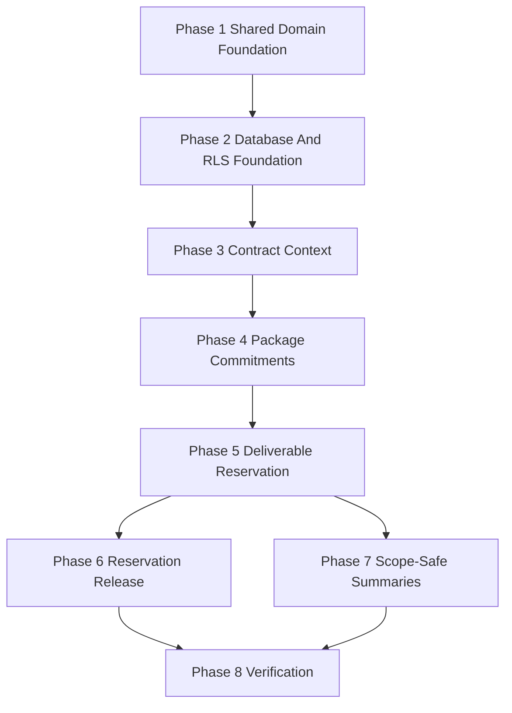

# Tasks: Deliverables Core

**Input**: Design documents from `specs/002-deliverables-core/`

**Prerequisites**: `spec.md`, `checklists/requirements.md`, `plan.md`, `research.md`, `data-model.md`, `contracts/operations.md`, `quickstart.md`, `.specify/memory/constitution.md`, `AGENTS.md`, accepted ADRs in `docs/06-decisions/`, and F-001/F-001B merged baseline.

**Scope Guard**: F-002 implements Cycle 2 contract/package/deliverable start only. It must not implement Kanban, task execution, files, comments, internal approval, client approval, final delivery, package consumption, full SLA timeline processing, billing, invoicing, social scheduling, production Supabase changes, or real client data.

**Tests**: TDD is required for package ledger math, reservation/release behavior, tenant/client isolation, permission denial, audit requirements, idempotency, and client-safe summaries.

**Task Format**: `- [ ] T### [P?] [US?] Description with file path; Req/Contract; Verification; Dependencies; Category`

**Categories**: Shared Domain Foundation, Database/RLS Foundation, F-002 Feature Work, Verification, Documentation.

## Phase 1: Shared Domain Foundation

**Purpose**: Establish pure domain rules and test fixtures before database, server command, or UI work.

- [x] T001 [P] Write failing unit tests for package ledger balance projection in `tests/unit/packages/package-ledger.test.ts`; Req: FR-006, FR-007, SR-003; Contracts: C-002, C-003, C-004, C-006; Verification: commitment/reservation/release/adjustment math and negative availability denial fail before implementation; Dependencies: none; Category: Verification
- [x] T002 [P] Write failing unit tests for deliverable status/progress, approved-extra, and cancellation eligibility in `tests/unit/deliverables/deliverable-rules.test.ts`; Req: FR-010, FR-013, FR-014; Contracts: C-004, C-005, C-006; Verification: `not_started` maps to `0%`, approved extras do not reserve, progressed cancellation denies; Dependencies: none; Category: Verification
- [x] T003 [P] Write failing unit tests for F-002 permission catalog additions in `tests/unit/authorization/f002-permissions.test.ts`; Req: Permission Coverage, SR-001, SR-002; Contracts: C-001 through C-008; Verification: role/permission coverage includes every F-002 permission and denies by default; Dependencies: none; Category: Verification
- [x] T004 [P] Build synthetic F-002 fixture factory in `tests/fixtures/f002-fixtures.ts`; Req: quickstart Test Accounts, NFR-002; Verification: fixtures represent Tenant A, Client A/B, package lines, and scoped actors with no real data; Dependencies: none; Category: Verification
- [x] T005 Implement package ledger projection domain in `src/modules/packages/package-ledger.ts`; Req: FR-006, FR-007, SR-003; Contracts: C-002, C-003, C-004, C-006; Verification: T001 passes; Dependencies: T001; Category: Shared Domain Foundation
- [x] T006 Implement deliverable lifecycle/domain rules in `src/modules/deliverables/deliverable-rules.ts`; Req: FR-010, FR-013, FR-014; Contracts: C-004, C-005, C-006; Verification: T002 passes; Dependencies: T002; Category: Shared Domain Foundation
- [x] T007 Extend permission catalog in `src/modules/authorization/permission-catalog.ts` for `PERM.CONTRACT.*`, `PERM.PACKAGE.*`, `PERM.DELIVERABLE.*`, and `PERM.LEDGER.VIEW_SUMMARY`; Req: Permission Coverage; Verification: T003 and existing authorization tests pass; Dependencies: T003; Category: Shared Domain Foundation

**Checkpoint 1**: Domain rules for balance, deliverable start, approved extras, cancellation eligibility, and permission names are executable without Supabase changes.

## Phase 2: Database And RLS Foundation

**Purpose**: Add tenant/client-scoped tables, append-only ledger/audit protections, explicit grants, and RLS tests.

- [x] T008 [P] Write failing pgTAP/RLS tests for F-002 table RLS, append-only ledger, direct-write denial, and cross-client denial in `supabase/tests/database/f002_deliverables_core.test.sql`; Req: SR-001 through SR-006, NFR-002; Contracts: C-001 through C-008; Verification: `npm run test:rls:db` fails before migration; Dependencies: T004; Category: Verification
- [x] T009 [P] Write failing RLS simulator tests for client-safe commercial summaries in `tests/rls/f002-commercial-access.test.ts`; Req: FR-016, FR-017, FR-018; Contracts: C-007, C-008; Verification: Client A cannot infer Client B and cannot read internal ledger reasons; Dependencies: T004; Category: Verification
- [x] T010 Create migration `supabase/migrations/*_f002_deliverables_core.sql` for contracts, contract amendments, packages, package lines, package ledger entries, deliverables, and deliverable allocations; Req: Key Entities, FR-001 through FR-015; Verification: migration review confirms tenant_id/client_id on every business table and no mutable package balance counter; Dependencies: T005-T006, T008; Category: Database/RLS Foundation
- [x] T011 Add F-002 RLS helper functions and policies in the F-002 migration for management, assigned internal, and client-safe read access; Req: SR-001, SR-002, SR-004; Contracts: C-007, C-008; Verification: T008/T009 pass for cross-client denial and safe summaries; Dependencies: T010; Category: Database/RLS Foundation
- [ ] T012 Add restricted database RPC/function layer for atomic audited writes where required by local architecture in the F-002 migration; Req: FR-019, SR-003, SR-006; Contracts: C-001 through C-006; Verification: pgTAP confirms direct writes deny and audited write paths create required ledger/audit side effects; Dependencies: T010-T011; Category: Database/RLS Foundation
- [ ] T013 Extend synthetic seed data in `supabase/seed.sql` only if needed for non-production F-002 local/staging fixtures; Req: quickstart Preconditions; Verification: test data uses `.example.test` and no real client details; Dependencies: T010; Category: Verification

**Checkpoint 2**: Database schema, RLS, append-only ledger, direct-write denial, and synthetic fixtures are ready before server command work.

**Phase 2 Evidence Note - 2026-06-28**: T009 passed with `npm run test:rls:simulator` (6 files / 19 tests). T008 pgTAP file and T010-T011 migration were added, but `npm run test:rls:db` could not connect because Docker Desktop/local Supabase is unavailable in this environment. This is a local tooling blocker; no hosted or production Supabase was used.

## Phase 3: User Story 1 - Create Client Contract Context (Priority: P1)

**Goal**: Authorized management users create tenant/client-scoped contract context with audit; unauthorized scoped users are denied safely.

**Independent Test**: Create Client A contract as tenant admin/PM, verify audit and Client A scope; Client A-only actor cannot create Client B contract.

- [ ] T014 [P] [US1] Write failing integration tests for `contract.create` allow/deny/audit in `tests/integration/contracts/contract-management.test.ts`; Req: FR-001, FR-002, FR-003, FR-019; Contract: C-001; Verification: unauthorized actor creates no contract and sees safe denial; Dependencies: T004, T012; Category: Verification
- [ ] T015 [P] [US1] Write failing component tests for Arabic RTL contract form and safe denial states in `tests/component/contracts/contract-form.test.tsx`; Req: UX-001, UX-006; Contract: C-001; Verification: required fields, focus order, loading, and denied states pass; Dependencies: T014; Category: Verification
- [ ] T016 [US1] Implement contract repository and safe summary mapper in `src/modules/contracts/contract-repository.ts`; Req: FR-001, FR-003, FR-016; Contracts: C-001, C-007; Verification: T014 passes through repository boundary; Dependencies: T010-T012; Category: F-002 Feature Work
- [ ] T017 [US1] Implement create-contract server command with Zod validation, permission check, idempotency key, transaction, and audit in `src/server/commands/contracts/create-contract.ts`; Req: FR-001, FR-002, FR-019; Contract: C-001; Verification: T014 passes and audit fails closed; Dependencies: T007, T016; Category: F-002 Feature Work
- [ ] T018 [US1] Add server action and form-state mapper for contract creation in `src/server/actions/contracts.ts` and `src/modules/contracts/contract-form-state.ts`; Req: FR-001, UX-001, SR-007; Contract: C-001; Verification: integration and component tests use safe Arabic errors; Dependencies: T017; Category: F-002 Feature Work
- [ ] T019 [US1] Implement management contract list/create UI in `src/app/(management)/clients/[clientId]/contracts/page.tsx`, `src/app/(management)/clients/[clientId]/contracts/new/page.tsx`, and `src/ui/management/contract-form.tsx`; Req: UX-001, UX-006; Contract: C-001; Verification: T015 passes and no unauthorized client ids render; Dependencies: T018; Category: F-002 Feature Work

**Checkpoint 3**: Contract context can be created and audited independently without package or deliverable flows.

## Phase 4: User Story 2 - Define Package Commitments (Priority: P1)

**Goal**: Authorized management users define package lines under a client contract, derive balances from ledger entries, and adjust commitments without rewriting history.

**Independent Test**: Create Client A package with lines, verify commitment ledger entries and summary; adjust with reason and verify amendment/adjustment entry.

- [ ] T020 [P] [US2] Write failing integration tests for `package.create` and `package.adjust` in `tests/integration/packages/package-management.test.ts`; Req: FR-004 through FR-007, FR-019; Contracts: C-002, C-003; Verification: package lines create commitment entries and adjustment requires reason; Dependencies: T004, T012; Category: Verification
- [ ] T021 [P] [US2] Write failing component tests for Arabic RTL package/package-line form and balance summary in `tests/component/packages/package-form.test.tsx`; Req: UX-002, UX-006; Contracts: C-002, C-003; Verification: invalid quantity and missing line show Arabic errors; Dependencies: T020; Category: Verification
- [ ] T022 [US2] Implement package repository and balance summary mapper in `src/modules/packages/package-repository.ts`; Req: FR-004, FR-005, FR-006, FR-016; Contracts: C-002, C-003, C-007; Verification: T020 passes through repository boundary; Dependencies: T005, T010-T012; Category: F-002 Feature Work
- [ ] T023 [US2] Implement create-package command with package lines, commitment ledger entries, idempotency, and audit in `src/server/commands/packages/create-package.ts`; Req: FR-004, FR-005, FR-007, FR-019; Contract: C-002; Verification: T020 passes for commitment ledger; Dependencies: T007, T022; Category: F-002 Feature Work
- [ ] T024 [US2] Implement adjust-package command with reason, amendment/adjustment ledger entry, capacity guard, and audit in `src/server/commands/packages/adjust-package.ts`; Req: FR-007, SR-003, FR-019; Contract: C-003; Verification: T020 passes and historical entries are not mutated; Dependencies: T023; Category: F-002 Feature Work
- [ ] T025 [US2] Add package server actions/form mappers in `src/server/actions/packages.ts` and `src/modules/packages/package-form-state.ts`; Req: UX-002, SR-007; Contracts: C-002, C-003; Verification: T020/T021 pass with safe errors; Dependencies: T023-T024; Category: F-002 Feature Work
- [ ] T026 [US2] Implement management package pages and forms in `src/app/(management)/clients/[clientId]/contracts/[contractId]/packages/page.tsx`, `src/app/(management)/clients/[clientId]/contracts/[contractId]/packages/new/page.tsx`, and `src/ui/management/package-form.tsx`; Req: UX-002, UX-006; Contracts: C-002, C-003; Verification: T021 passes and package balance is derived, not edited; Dependencies: T025; Category: F-002 Feature Work

**Checkpoint 4**: Package commitments and adjustments work through append-only ledger entries.

## Phase 5: User Story 3 - Create Agreed Deliverables (Priority: P1)

**Goal**: Authorized users create normal in-package deliverables with reservation ledger entries, and create approved extras only through explicit authority.

**Independent Test**: Create a Client A deliverable from available package capacity, verify `not_started`/`0%`, reservation ledger, insufficient capacity denial, and approved-extra behavior.

- [x] T027 [P] [US3] Write failing integration tests for normal deliverable creation, over-capacity denial, approved extra, audit, and idempotency in `tests/integration/deliverables/deliverable-creation.test.ts`; Req: FR-008 through FR-013, FR-015, FR-019; Contracts: C-004, C-005; Verification: duplicate retries do not duplicate deliverables or ledger entries; Dependencies: T004, T012; Category: Verification
- [x] T028 [P] [US3] Write failing component tests for Arabic RTL deliverable form and reservation impact preview in `tests/component/deliverables/deliverable-form.test.tsx`; Req: UX-003, UX-004, UX-006; Contracts: C-004, C-005; Verification: insufficient capacity recovery actions are visible; Dependencies: T027; Category: Verification
- [x] T029 [US3] Implement deliverable repository and summary mapper in `src/modules/deliverables/deliverable-repository.ts`; Req: FR-008, FR-009, FR-016, FR-017; Contracts: C-004, C-005, C-008; Verification: T027 passes through repository boundary; Dependencies: T006, T010-T012; Category: F-002 Feature Work
- [x] T030 [US3] Implement create-deliverable command with capacity check, allocation, reservation ledger entry, idempotency, and audit in `src/server/commands/deliverables/create-deliverable.ts`; Req: FR-008 through FR-012, FR-015, FR-019; Contract: C-004; Verification: T027 passes for normal reservations and over-capacity denial; Dependencies: T005-T007, T029; Category: F-002 Feature Work
- [x] T031 [US3] Implement create-approved-extra-deliverable command with explicit reason/approval, no package reservation by default, idempotency, and audit in `src/server/commands/deliverables/create-approved-extra-deliverable.ts`; Req: FR-013, FR-015, FR-019; Contract: C-005; Verification: T027 passes for approved extra no-reservation behavior; Dependencies: T029-T030; Category: F-002 Feature Work
- [x] T032 [US3] Add deliverable server actions/form mappers in `src/server/actions/deliverables.ts` and `src/modules/deliverables/deliverable-form-state.ts`; Req: UX-003, UX-004, SR-007; Contracts: C-004, C-005; Verification: T027/T028 pass with safe Arabic errors; Dependencies: T030-T031; Category: F-002 Feature Work
- [x] T033 [US3] Implement management deliverable create/list UI in `src/app/(management)/clients/[clientId]/deliverables/page.tsx`, `src/app/(management)/clients/[clientId]/deliverables/new/page.tsx`, and `src/ui/management/deliverable-form.tsx`; Req: UX-003, UX-004, UX-006; Contracts: C-004, C-005; Verification: T028 passes and no Kanban/workflow actions appear; Dependencies: T032; Category: F-002 Feature Work

**Checkpoint 5**: Deliverable creation reserves capacity safely and starts at `not_started` / `0%`.

## Phase 6: User Story 4 - Release Reservations Before Work Progresses (Priority: P2)

**Goal**: Authorized users cancel eligible not-started deliverables and release reservations through ledger entries without duplicates.

**Independent Test**: Cancel a reserved not-started deliverable, verify `reservation_released`, restored balance, audit, and idempotent retry.

- [X] T034 [P] [US4] Write failing integration tests for not-started cancellation, duplicate retry, and progressed cancellation denial in `tests/integration/deliverables/deliverable-cancellation.test.ts`; Req: FR-014, FR-015, FR-019; Contract: C-006; Verification: no duplicate release ledger entry on retry; Dependencies: T027; Category: Verification
- [X] T035 [P] [US4] Write failing component tests for cancellation dialog and safe denial copy in `tests/component/deliverables/deliverable-cancellation.test.tsx`; Req: UX-004, UX-006; Contract: C-006; Verification: reason required and denial copy avoids internal leakage; Dependencies: T034; Category: Verification
- [X] T036 [US4] Implement cancel-not-started-deliverable command with expected state/revision, release ledger entry, idempotency, and audit in `src/server/commands/deliverables/cancel-not-started-deliverable.ts`; Req: FR-014, FR-015, FR-019; Contract: C-006; Verification: T034 passes; Dependencies: T006, T029-T030; Category: F-002 Feature Work
- [X] T037 [US4] Add cancellation server action and form-state mapper in `src/server/actions/deliverable-cancellations.ts`; Req: FR-014, SR-007; Contract: C-006; Verification: T034/T035 pass with safe errors; Dependencies: T036; Category: F-002 Feature Work
- [X] T038 [US4] Add management cancellation UI control only for eligible not-started deliverables in `src/ui/management/deliverable-actions.tsx`; Req: UX-004; Contract: C-006; Verification: T035 passes and progressed items do not show release action; Dependencies: T037; Category: F-002 Feature Work

**Checkpoint 6**: Not-started cancellation restores available capacity through ledger release entries.

## Phase 7: User Story 5 - Maintain Scope-Safe Summaries (Priority: P3)

**Goal**: Management and client users can read role-filtered summaries without internal leakage or resource enumeration.

**Independent Test**: Compare Client A management and client summaries; Client A user cannot infer Client B contract/package/deliverable identifiers.

- [X] T039 [P] [US5] Write failing integration tests for management and client commercial summaries in `tests/integration/commercial/commercial-summary.test.ts`; Req: FR-016, FR-017, FR-018; Contracts: C-007, C-008; Verification: client summaries omit internal audit/ledger reasons and other-client references; Dependencies: T004, T030; Category: Verification
- [X] T040 [P] [US5] Write failing E2E tests for management/client summary navigation and direct URL tampering in `tests/e2e/commercial/commercial-summary.spec.ts`; Req: AC-007, AC-008, SC-003, SC-004; Contracts: C-007, C-008; Verification: desktop/mobile client summary hides internal fields; Dependencies: T006, T039; Category: Verification
- [X] T041 [P] [US5] Write failing component tests for management and client summary cards in `tests/component/commercial/commercial-summary.test.tsx`; Req: UX-002, UX-005, UX-006; Contracts: C-007, C-008; Verification: no internal terminology appears in client view; Dependencies: T039; Category: Verification
- [X] T042 [US5] Implement commercial summary read model in `src/modules/commercial/commercial-summary.ts`; Req: FR-016, FR-017, FR-018; Contract: C-007; Verification: T039/T041 pass; Dependencies: T016, T022, T029; Category: F-002 Feature Work
- [X] T043 [US5] Implement deliverable safe summary read model in `src/modules/deliverables/deliverable-summary.ts`; Req: FR-016, FR-017, FR-018; Contract: C-008; Verification: T039/T041 pass; Dependencies: T029; Category: F-002 Feature Work
- [X] T044 [US5] Implement management/client summary pages in `src/app/(management)/clients/[clientId]/commercial/page.tsx`, `src/app/(client)/client/commercial/page.tsx`, and `src/ui/client/commercial-summary.tsx`; Req: UX-002, UX-005, UX-006; Contracts: C-007, C-008; Verification: T040/T041 pass in desktop/mobile; Dependencies: T042-T043; Category: F-002 Feature Work

**Checkpoint 7**: Scope-safe summaries are visible and usable without exposing internal details.

## Phase 8: Verification And Evidence

**Purpose**: Prove F-002 is reviewable without scope expansion or production data.

- [ ] T045 [P] Run unit tests for package ledger, deliverable rules, permissions, and fixtures with `npm run test:unit`; Req: SC-002, SC-005, SC-006; Verification: all unit tests pass; Dependencies: T001-T007; Category: Verification
- [ ] T046 [P] Run integration tests for contracts, packages, deliverables, cancellation, summaries, and audit/idempotency with `npm run test:integration`; Req: SC-001, SC-005, SC-006; Verification: all integration tests pass; Dependencies: T014, T020, T027, T034, T039; Category: Verification
- [ ] T047 [P] Run RLS simulator and pgTAP database tests with `npm run test:rls`; Req: SC-003, NFR-002; Verification: cross-client and client-safe summary tests pass; Dependencies: T008-T013; Category: Verification
- [ ] T048 [P] Run component tests for contract, package, deliverable, cancellation, and summary surfaces with `npm run test:component`; Req: UX-001 through UX-006; Verification: Arabic RTL, focus, loading, empty, and denied states pass; Dependencies: T015, T021, T028, T035, T041; Category: Verification
- [ ] T049 Run Playwright E2E suite for F-002 quickstart scenarios with `npm run test:e2e`; Req: AC-001 through AC-010, SC-001 through SC-007; Verification: management/client summaries and direct URL denial pass; Dependencies: T040; Category: Verification
- [ ] T050 Run quality gate `npm run typecheck`, `npm run lint`, `npm run secret:scan`, and `npm audit --audit-level=high`; Req: AGENTS.md Quality Gates, constitution No Secrets; Verification: zero type/lint/secret/high audit blockers; Dependencies: T045-T049; Category: Verification
- [ ] T051 Update `specs/002-deliverables-core/quickstart.md` with local/staging evidence commands and pass/fail notes; Req: SC-001 through SC-007; Verification: evidence uses synthetic data only and no production Supabase; Dependencies: T045-T050; Category: Documentation
- [ ] T052 [P] Add F-002 security/evidence review in `specs/002-deliverables-core/evidence/f002-security-review.md`; Req: SR-001 through SR-007; Verification: no CRITICAL/HIGH issues remain and no internal client leakage; Dependencies: T047, T050; Category: Documentation
- [ ] T053 [P] Update traceability in this `specs/002-deliverables-core/tasks.md`; Req: constitution Traceability Requirement to Test; Verification: every FR/SR/contract/AC/entity maps to task/test/evidence; Dependencies: T001-T052; Category: Documentation

**Checkpoint 8**: F-002 is ready for review. Required result: all quality gates pass, no production usage, no real client data, no Kanban/files/comments/approvals/delivery/SLA engine/billing/social scheduling scope expansion.

## Dependencies & Execution Order

### Phase Dependencies

- Phase 1 blocks all F-002 implementation.
- Phase 2 depends on Phase 1 and blocks server command/UI work.
- Phase 3 is the first user-story sub-slice and can be demoed independently.
- Phase 4 depends on contract context from Phase 3.
- Phase 5 depends on package commitments from Phase 4.
- Phase 6 depends on deliverable creation from Phase 5.
- Phase 7 depends on summaries from Phases 3-6.
- Phase 8 depends on all selected implementation phases.

### Critical Path

### Security Gates

- Gate A after Phase 1: ledger/progress/permission domain rules pass.
- Gate B after Phase 2: RLS, explicit grants, append-only ledger, direct-write denial pass locally.
- Gate C after Phase 3: contract create is scoped and audited.
- Gate D after Phase 4: package commitments and adjustments are ledger-derived.
- Gate E after Phase 5: deliverable creation cannot overcommit and retries are idempotent.
- Gate F after Phase 7: client summaries hide internal fields and cross-client ids.
- Gate G after Phase 8: zero CRITICAL/HIGH issues and complete evidence.

### Parallel Opportunities

- T001-T004 can run in parallel.
- T008-T009 can run in parallel once fixtures exist.
- Story test tasks marked `[P]` can run in parallel because they target different files.
- Component tests can run alongside command implementation after dependencies are met.
- Do not parallelize tasks touching the same migration, F-002 RPC/function definitions, or the same server command file.

## Implementation Strategy

### MVP First

1. Complete Phase 1 and Phase 2.
2. Implement Phase 3 only: scoped contract creation with audit.
3. Stop and validate before adding package commitments.

### Recommended Sub-Slices

1. F-002A: T001-T019, contract context only.
2. F-002B: T020-T026, package commitments and balance projection.
3. F-002C: T027-T033, deliverable creation and reservation.
4. F-002D: T034-T044, reservation release and safe summaries.
5. F-002E: T045-T053, verification/evidence.

## Notes

- `[P]` means different files and no dependency on another incomplete task.
- Tests for sensitive behavior must be written first and observed failing before implementation.
- No production Supabase, real client data, new dependencies, social scheduling, Kanban, files, comments, approvals, delivery, billing, or full SLA timeline processing are allowed in F-002.
